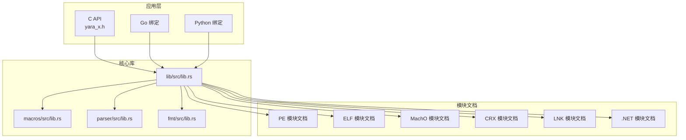
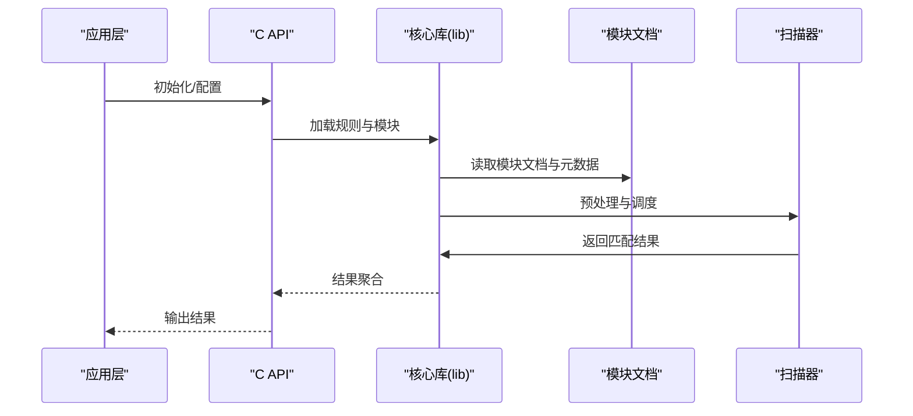
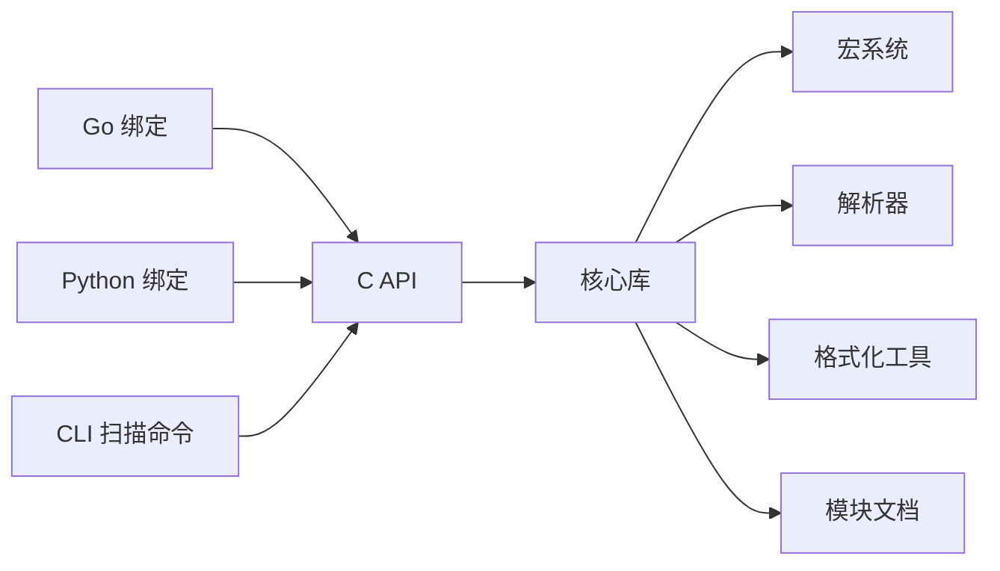

# 文件格式解析模块

<cite>
**本文档引用的文件**
- [yara-x 模块文档 - PE](file://yara-x/site/content/docs/modules/pe.md)
- [yara-x 模块文档 - ELF](file://yara-x/site/content/docs/modules/elf.md)
- [yara-x 模块文档 - MachO](file://yara-x/site/content/docs/modules/macho.md)
- [yara-x 模块文档 - CRX](file://yara-x/site/content/docs/modules/crx.md)
- [yara-x 模块文档 - LNK](file://yara-x/site/content/docs/modules/lnk.md)
- [yara-x 模块文档 - DotNet](file://yara-x/site/content/docs/modules/dotnet.md)
- [yara-x 模块文档 - 模块索引](file://yara-x/site/content/docs/modules/_index.md)
- [yara-x C API 头文件](file://yara-x/capi/include/yara_x.h)
- [yara-x C API 实现](file://yara-x/capi/src/lib.rs)
- [yara-x 核心库入口](file://yara-x/lib/src/lib.rs)
- [yara-x 宏系统](file://yara-x/macros/src/lib.rs)
- [yara-x 解析器](file://yara-x/parser/src/lib.rs)
- [yara-x 格式化工具](file://yara-x/fmt/src/lib.rs)
- [yara-x CLI 扫描命令](file://yara-x/cli/src/commands/scan.rs)
- [yara-x Go 绑定](file://yara-x/go/main.go)
- [yara-x Python 绑定](file://yara-x/py/src/lib.rs)
</cite>

## 目录
1. [简介](#简介)
2. [项目结构](#项目结构)
3. [核心组件](#核心组件)
4. [架构总览](#架构总览)
5. [详细组件分析](#详细组件分析)
6. [依赖关系分析](#依赖关系分析)
7. [性能考虑](#性能考虑)
8. [故障排除指南](#故障排除指南)
9. [结论](#结论)

## 简介
本文件格式解析模块文档系统性地介绍了 yara-x 中对多种二进制与容器文件格式的支持能力，涵盖 PE（Windows）、ELF（类 Unix/Linux）、Mach-O（macOS）、CRX（Chrome 扩展包）、LNK（Windows 快捷方式）以及 .NET（程序集）等格式。文档从技术原理、实现细节、API 接口、使用场景、性能特征与限制等方面进行全面阐述，帮助开发者在不同平台上高效集成与扩展文件格式解析功能。

## 项目结构
yara-x 的文件格式解析能力由多层模块协同实现：上层通过 C API、Go、Python 等语言绑定提供统一调用入口；核心库负责规则编译与扫描；解析器与宏系统为模块开发提供基础设施；站点文档提供各模块的使用说明与参考。

**图表来源**
- [yara-x C API 头文件](file://yara-x/capi/include/yara_x.h)
- [yara-x C API 实现](file://yara-x/capi/src/lib.rs)
- [yara-x 核心库入口](file://yara-x/lib/src/lib.rs)
- [yara-x 宏系统](file://yara-x/macros/src/lib.rs)
- [yara-x 解析器](file://yara-x/parser/src/lib.rs)
- [yara-x 格式化工具](file://yara-x/fmt/src/lib.rs)
- [yara-x 模块文档 - PE](file://yara-x/site/content/docs/modules/pe.md)
- [yara-x 模块文档 - ELF](file://yara-x/site/content/docs/modules/elf.md)
- [yara-x 模块文档 - MachO](file://yara-x/site/content/docs/modules/macho.md)
- [yara-x 模块文档 - CRX](file://yara-x/site/content/docs/modules/crx.md)
- [yara-x 模块文档 - LNK](file://yara-x/site/content/docs/modules/lnk.md)
- [yara-x 模块文档 - DotNet](file://yara-x/site/content/docs/modules/dotnet.md)

**章节来源**
- [yara-x C API 头文件](file://yara-x/capi/include/yara_x.h)
- [yara-x C API 实现](file://yara-x/capi/src/lib.rs)
- [yara-x 核心库入口](file://yara-x/lib/src/lib.rs)
- [yara-x 模块文档 - 模块索引](file://yara-x/site/content/docs/modules/_index.md)

## 核心组件
- C API 层：提供跨语言统一接口，封装编译、扫描、元数据查询等能力，便于在 C/C++、Go、Python 等环境中直接使用。
- 核心库（lib）：规则引擎与扫描器的主入口，协调模块加载、规则执行与结果输出。
- 宏系统（macros）：为模块开发提供导出宏、错误处理与模块主流程模板，降低模块实现复杂度。
- 解析器（parser）：负责将规则文本转换为可执行的内部表示，支持语法检查与错误定位。
- 格式化工具（fmt）：提供规则格式化能力，确保规则风格一致。
- 模块文档（site/docs/modules）：各文件格式模块的官方使用说明与 API 参考。

**章节来源**
- [yara-x C API 实现](file://yara-x/capi/src/lib.rs)
- [yara-x 核心库入口](file://yara-x/lib/src/lib.rs)
- [yara-x 宏系统](file://yara-x/macros/src/lib.rs)
- [yara-x 解析器](file://yara-x/parser/src/lib.rs)
- [yara-x 格式化工具](file://yara-x/fmt/src/lib.rs)

## 架构总览
下图展示了从应用层到核心库与模块文档的整体交互关系，以及文件格式解析在扫描流程中的位置。

**图表来源**
- [yara-x C API 实现](file://yara-x/capi/src/lib.rs)
- [yara-x 核心库入口](file://yara-x/lib/src/lib.rs)
- [yara-x 模块文档 - PE](file://yara-x/site/content/docs/modules/pe.md)
- [yara-x 模块文档 - ELF](file://yara-x/site/content/docs/modules/elf.md)
- [yara-x 模块文档 - MachO](file://yara-x/site/content/docs/modules/macho.md)
- [yara-x 模块文档 - CRX](file://yara-x/site/content/docs/modules/crx.md)
- [yara-x 模块文档 - LNK](file://yara-x/site/content/docs/modules/lnk.md)
- [yara-x 模块文档 - DotNet](file://yara-x/site/content/docs/modules/dotnet.md)

## 详细组件分析

### PE（Portable Executable，Windows）
- 技术原理：PE 是 Windows 平台的标准可执行文件格式，包含 DOS 头、NT 头、节表等结构。解析时需验证 DOS/MZ 魔数、NT 头签名，读取标准字段与可选头，再遍历节表以提取导入表、资源、调试信息等。
- 关键元数据：文件头版本、机器类型、时间戳、节数量、目录表（如导入、导出、资源、TLS、安全等）。
- API 参考（基于模块文档）：模块提供访问 PE 头部、节、导入/导出表、字符串、数字签名等字段的能力；支持按名称或索引访问；返回类型通常为可选值或集合，便于安全处理缺失字段。
- 使用示例：在规则中通过模块标识符访问 PE 字段，结合条件表达式进行匹配。
- 适用场景：Windows 可执行文件、DLL、驱动等静态分析与威胁情报匹配。
- 性能特点：线性扫描，时间复杂度 O(N)（N 为节数），内存占用低；大文件分段读取可进一步优化。
- 限制条件：仅支持标准 PE 结构，不包含自定义扩展时可能无法解析某些字段。

**章节来源**
- [yara-x 模块文档 - PE](file://yara-x/site/content/docs/modules/pe.md)

### ELF（Executable and Linkable Format，类 Unix/Linux）
- 技术原理：ELF 是类 Unix/Linux 的标准可执行文件格式，包含文件头、程序头表、节头表、字符串表等。解析时先验证 ELF 魔数与架构，再读取程序头与节头，提取段属性、符号表、重定位信息等。
- 关键元数据：魔数、位数（32/64）、字节序、操作系统与ABI、入口点、程序头数量与大小、节头数量与大小、节名字符串表等。
- API 参考（基于模块文档）：提供访问 ELF 头、程序头、节、符号、动态信息等的能力；支持按名称或索引访问节与符号。
- 使用示例：在规则中读取 ELF 入口点、节属性、动态标签等字段进行匹配。
- 适用场景：Linux 可执行文件、共享库、内核模块、嵌入式目标文件。
- 性能特点：顺序扫描，O(N) 复杂度；对超大文件建议分块读取与缓存常用头部。
- 限制条件：对压缩节或自定义扩展支持有限。

**章节来源**
- [yara-x 模块文档 - ELF](file://yara-x/site/content/docs/modules/elf.md)

### Mach-O（Mac OS X Object Format，macOS/iOS）
- 技术原理：Mach-O 是 macOS/iOS 的标准可执行文件格式，包含文件头、负载命令、段与节等。解析时验证魔数与架构，遍历负载命令以定位代码签名、动态库、字符串表等。
- 关键元数据：魔数、CPU 类型与子类型、文件类型、标志、负载命令数量、段与节信息、代码签名等。
- API 参考（基于模块文档）：提供访问 Mach-O 头、负载命令、段、节、符号、字符串、代码签名等的能力；支持按命令类型或名称访问。
- 使用示例：在规则中读取架构、签名状态、段属性等进行匹配。
- 适用场景：macOS/iOS 应用、框架、内核扩展、动态库。
- 性能特点：O(N) 扫描，代码签名验证可能带来额外开销；建议缓存常用字段。
- 限制条件：对加密壳或自定义扩展支持有限。

**章节来源**
- [yara-x 模块文档 - MachO](file://yara-x/site/content/docs/modules/macho.md)

### CRX（Chrome Extension，浏览器扩展包）
- 技术原理：CRX 是 Chrome 扩展的打包格式，常见为 CRX3，包含头部、证书链、签名与 ZIP 包体。解析时验证头部与签名，解包并提取清单文件与资源。
- 关键元数据：CRX 版本、扩展 ID、公钥、证书链、签名、ZIP 资源、清单文件（manifest.json）等。
- API 参考（基于模块文档）：提供访问 CRX 头、证书、签名、资源列表与清单字段的能力；支持读取 ZIP 内容与校验完整性。
- 使用示例：在规则中匹配扩展 ID、版本、权限声明、脚本注入点等。
- 适用场景：浏览器扩展分析、恶意扩展检测、供应链攻击排查。
- 性能特点：解包与校验带来额外成本；建议延迟解包与按需读取。
- 限制条件：仅支持标准 CRX3；对自定义变种支持有限。

**章节来源**
- [yara-x 模块文档 - CRX](file://yara-x/site/content/docs/modules/crx.md)

### LNK（Windows Shell Link，快捷方式）
- 技术原理：LNK 是 Windows 快捷方式文件，包含固定头部、位置信息、环境变量、图标索引、目标路径等。解析时验证头部魔数与版本，提取基本路径与扩展块。
- 关键元数据：头部版本、位置（本地/网络）、目标路径、工作目录、命令行参数、图标索引、相对路径、本地路径等。
- API 参考（基于模块文档）：提供访问 LNK 头、位置信息、环境块、图标块、字符串等的能力；支持解析 Unicode 与 ANSI 字符串。
- 使用示例：在规则中匹配目标路径、工作目录、图标索引等字段。
- 适用场景：恶意快捷方式检测、钓鱼与持久化分析。
- 性能特点：线性解析，O(1) 复杂度；注意编码转换与路径规范化。
- 限制条件：对非标准扩展块支持有限。

**章节来源**
- [yara-x 模块文档 - LNK](file://yara-x/site/content/docs/modules/lnk.md)

### DotNet（.NET 程序集）
- 技术原理：.NET 程序集包含元数据区（如模块表、类型表、方法表、字符串表、GUID 表等）与 IL 代码。解析时验证 PE 头与 .NET 标记，读取元数据表与资源。
- 关键元数据：CLR 版本、托管标记、元数据表集合、字符串表、GUID 表、资源、入口点等。
- API 参考（基于模块文档）：提供访问 .NET 头、元数据表、类型、方法、字符串、资源等的能力；支持按索引与名称访问。
- 使用示例：在规则中匹配程序集版本、类型名称、方法签名、资源名称等。
- 适用场景：.NET 恶意软件分析、反编译辅助、合规审计。
- 性能特点：元数据扫描 O(N)；IL 解析需要额外处理。
- 限制条件：对非标准元数据或混淆程序集支持有限。

**章节来源**
- [yara-x 模块文档 - DotNet](file://yara-x/site/content/docs/modules/dotnet.md)

## 依赖关系分析
- 语言绑定依赖：C API 作为统一入口，Go 与 Python 绑定分别通过各自运行时调用 C API；CLI 基于 C API 实现扫描命令。
- 核心库依赖：核心库依赖宏系统与解析器，用于模块导出与规则解析；格式化工具用于规则格式化。
- 模块文档依赖：各模块文档独立维护，核心库在运行时读取模块元数据与字段定义。

**图表来源**
- [yara-x C API 实现](file://yara-x/capi/src/lib.rs)
- [yara-x 核心库入口](file://yara-x/lib/src/lib.rs)
- [yara-x 宏系统](file://yara-x/macros/src/lib.rs)
- [yara-x 解析器](file://yara-x/parser/src/lib.rs)
- [yara-x 格式化工具](file://yara-x/fmt/src/lib.rs)
- [yara-x Go 绑定](file://yara-x/go/main.go)
- [yara-x Python 绑定](file://yara-x/py/src/lib.rs)
- [yara-x CLI 扫描命令](file://yara-x/cli/src/commands/scan.rs)

**章节来源**
- [yara-x C API 实现](file://yara-x/capi/src/lib.rs)
- [yara-x 核心库入口](file://yara-x/lib/src/lib.rs)
- [yara-x 宏系统](file://yara-x/macros/src/lib.rs)
- [yara-x 解析器](file://yara-x/parser/src/lib.rs)
- [yara-x 格式化工具](file://yara-x/fmt/src/lib.rs)
- [yara-x Go 绑定](file://yara-x/go/main.go)
- [yara-x Python 绑定](file://yara-x/py/src/lib.rs)
- [yara-x CLI 扫描命令](file://yara-x/cli/src/commands/scan.rs)

## 性能考虑
- I/O 与内存：文件格式解析通常为顺序扫描，I/O 成本占主导；建议采用流式读取与最小必要缓存策略。
- 大文件优化：对超大文件（如大型 PE 或 ELF）可采用分段读取与按需解析，避免一次性加载整个文件。
- 并发与批处理：在批量扫描场景中，合理设置并发度与任务切分，减少锁竞争与上下文切换。
- 编码与字符串处理：LNK 与 CRX 等涉及多编码字符串，应避免重复转换，优先使用惰性解码策略。
- 模块化设计：通过模块文档与 API 抽象，减少重复解析逻辑，提升整体吞吐量。

## 故障排除指南
- 文件格式不匹配：若解析失败，检查魔数与架构字段是否符合预期；确认目标文件未被损坏或被加壳。
- 权限与路径问题：在扫描 LNK 或 CRX 时，注意路径解析与权限限制；确保工作目录与目标路径有效。
- 编码异常：LNK 字符串可能包含 Unicode 与 ANSI 混合，需根据头部标志正确解码。
- 大文件超时：对超大文件建议分块处理与进度回调，避免长时间阻塞。
- 规则语法错误：使用解析器与格式化工具先行验证规则语法，减少运行时错误。

## 结论
yara-x 的文件格式解析模块通过清晰的架构与完善的模块文档，为多平台二进制与容器文件提供了统一的解析能力。开发者可根据目标平台与文件类型选择合适的模块，结合 C API 与语言绑定快速构建扫描与分析系统。在实际部署中，应关注 I/O 优化、编码处理与规则质量，以获得最佳性能与稳定性。