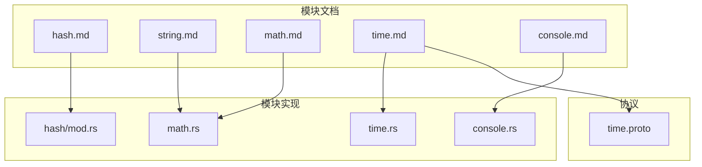
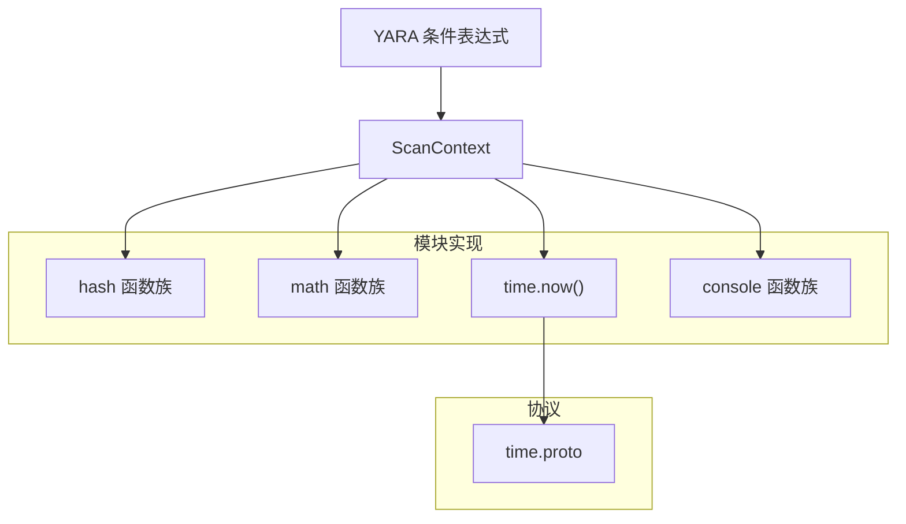
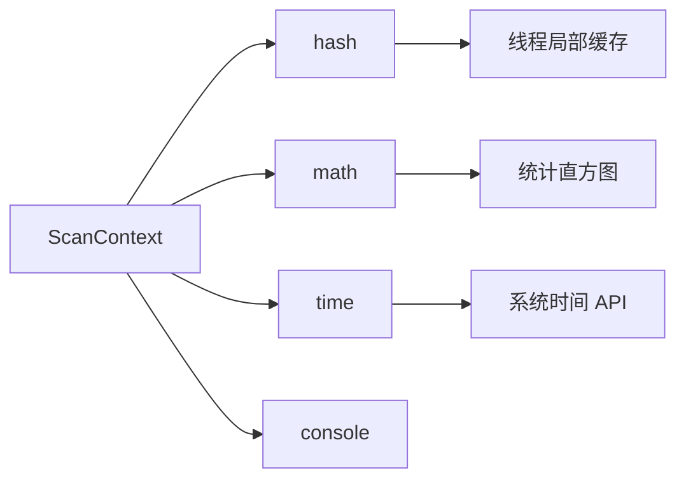

# 通用功能模块

<cite>
**本文引用的文件**
- [hash.md](file://yara-x/site/content/docs/modules/hash.md)
- [string.md](file://yara-x/site/content/docs/modules/string.md)
- [math.md](file://yara-x/site/content/docs/modules/math.md)
- [time.md](file://yara-x/site/content/docs/modules/time.md)
- [console.md](file://yara-x/site/content/docs/modules/console.md)
- [hash 模块实现](file://yara-x/lib/src/modules/hash/mod.rs)
- [math 模块实现](file://yara-x/lib/src/modules/math.rs)
- [time 模块实现](file://yara-x/lib/src/modules/time.rs)
- [console 模块实现](file://yara-x/lib/src/modules/console.rs)
- [time.proto](file://yara-x/lib/src/modules/protos/time.proto)
</cite>

## 目录
1. [简介](#简介)
2. [项目结构](#项目结构)
3. [核心组件](#核心组件)
4. [架构总览](#架构总览)
5. [详细组件分析](#详细组件分析)
6. [依赖关系分析](#依赖关系分析)
7. [性能考量](#性能考量)
8. [故障排查指南](#故障排查指南)
9. [结论](#结论)
10. [附录：YARA 规则示例路径](#附录yara-规则示例路径)

## 简介
本文件系统性梳理 yara-x 中的通用功能模块，包括 hash、string、math、time、console。内容覆盖各模块提供的函数接口、参数与返回值类型、典型使用场景与最佳实践，并结合源码实现对行为进行验证与补充说明。同时给出性能与常见陷阱提示，以及在 YARA 规则中可直接参考的示例路径。

## 项目结构
通用模块位于 lib/src/modules 下，每个模块由两部分组成：
- 文档：位于 site/content/docs/modules/*.md，描述接口与用法
- 实现：位于 lib/src/modules/<name>/mod.rs 或 <name>.rs，定义导出函数与运行时行为
- 协议：位于 lib/src/modules/protos/<name>.proto，声明模块元数据与根消息

图表来源
- [hash.md:1-85](file://yara-x/site/content/docs/modules/hash.md#L1-L85)
- [string.md:1-62](file://yara-x/site/content/docs/modules/string.md#L1-L62)
- [math.md:1-200](file://yara-x/site/content/docs/modules/math.md#L1-L200)
- [time.md:1-32](file://yara-x/site/content/docs/modules/time.md#L1-L32)
- [console.md:1-99](file://yara-x/site/content/docs/modules/console.md#L1-L99)
- [hash 模块实现:1-240](file://yara-x/lib/src/modules/hash/mod.rs#L1-L240)
- [math 模块实现:1-298](file://yara-x/lib/src/modules/math.rs#L1-L298)
- [time 模块实现:1-30](file://yara-x/lib/src/modules/time.rs#L1-L30)
- [console 模块实现:1-111](file://yara-x/lib/src/modules/console.rs#L1-L111)
- [time.proto:1-15](file://yara-x/lib/src/modules/protos/time.proto#L1-L15)

章节来源
- [hash.md:1-85](file://yara-x/site/content/docs/modules/hash.md#L1-L85)
- [string.md:1-62](file://yara-x/site/content/docs/modules/string.md#L1-L62)
- [math.md:1-200](file://yara-x/site/content/docs/modules/math.md#L1-L200)
- [time.md:1-32](file://yara-x/site/content/docs/modules/time.md#L1-L32)
- [console.md:1-99](file://yara-x/site/content/docs/modules/console.md#L1-L99)

## 核心组件
- hash 模块：提供 md5、sha1、sha256、checksum32、crc32 计算，支持对文件片段或字符串计算；返回值为小写十六进制字符串（除特定整数型返回值外）。
- string 模块：提供 to_int、length 等字符串工具函数，支持多进制解析与长度统计。
- math 模块：提供熵、均值、标准相关、蒙特卡洛 π 偏差、最大/最小、绝对值、范围判断、整数转字符串、布尔转数字、字节计数与占比、众数等统计与转换函数。
- time 模块：提供 now() 返回 Unix 时间戳。
- console 模块：提供日志输出与十六进制打印，所有函数在条件评估中返回 true，需通过逻辑“与”组合使用。

章节来源
- [hash.md:27-85](file://yara-x/site/content/docs/modules/hash.md#L27-L85)
- [string.md:26-62](file://yara-x/site/content/docs/modules/string.md#L26-L62)
- [math.md:26-200](file://yara-x/site/content/docs/modules/math.md#L26-L200)
- [time.md:25-32](file://yara-x/site/content/docs/modules/time.md#L25-L32)
- [console.md:21-99](file://yara-x/site/content/docs/modules/console.md#L21-L99)

## 架构总览
模块以“文档 + 实现 + 协议”的方式组织，扫描上下文通过 ScanContext 提供数据访问与日志输出能力。模块导出函数在运行时被 YARA 条件表达式调用。

图表来源
- [hash 模块实现:31-240](file://yara-x/lib/src/modules/hash/mod.rs#L31-L240)
- [math 模块实现:10-298](file://yara-x/lib/src/modules/math.rs#L10-L298)
- [time 模块实现:5-14](file://yara-x/lib/src/modules/time.rs#L5-L14)
- [console 模块实现:4-84](file://yara-x/lib/src/modules/console.rs#L4-L84)
- [time.proto:6-11](file://yara-x/lib/src/modules/protos/time.proto#L6-L11)

## 详细组件分析

### hash 模块
- 功能概览
  - 支持对文件片段与字符串进行哈希与校验计算：md5、sha1、sha256、checksum32、crc32。
  - 返回值统一为小写十六进制字符串（除特定整数型返回值外）。
- 接口与参数
  - md5(offset, size)：从偏移开始读取 size 字节；进程扫描时 offset 为虚拟地址。
  - md5(string)：对字符串进行哈希。
  - sha1(...) / sha256(...)：同上，分别计算对应哈希。
  - checksum32(offset, size) / checksum32(string)：无符号字节求和。
  - crc32(offset, size) / crc32(string)：CRC32 校验。
- 行为与实现要点
  - 文件片段模式下，内部会缓存计算结果以提升重复扫描效率。
  - 字符串模式下，直接对输入字节序列计算。
- 使用建议
  - 对大文件分段计算哈希时，注意 offset 与 size 的边界与有效性。
  - 若多次在同一区间计算相同哈希，优先复用已缓存结果。
- 示例路径
  - [hash.md 示例:35-85](file://yara-x/site/content/docs/modules/hash.md#L35-L85)

章节来源
- [hash.md:27-85](file://yara-x/site/content/docs/modules/hash.md#L27-L85)
- [hash 模块实现:31-240](file://yara-x/lib/src/modules/hash/mod.rs#L31-L240)

### string 模块
- 功能概览
  - to_int：将字符串解析为有符号整数，支持 0x 前缀（16 进制）、0 前缀（8 进制），以及显式正负号。
  - to_int(string, base)：指定进制解析，base 必须为 0 或 2~36；0 表示自动识别 0x/0 前缀。
  - length：返回字节长度（含空字节）。
- 使用建议
  - 解析前确保字符串格式合法，避免因非法字符导致解析失败。
  - 多进制解析时明确 base，避免歧义。
- 示例路径
  - [string.md 示例:28-62](file://yara-x/site/content/docs/modules/string.md#L28-L62)

章节来源
- [string.md:26-62](file://yara-x/site/content/docs/modules/string.md#L26-L62)

### math 模块
- 功能概览
  - 统计与概率：entropy、mean、deviation、serial_correlation、monte_carlo_pi。
  - 数值运算：max、min、abs、in_range、to_number、count、percentage、mode、to_string。
  - 常量：MEAN_BYTES（均匀分布字节的期望均值）。
- 接口与参数
  - entropy(offset,size)/entropy(string)：返回浮点熵值。
  - mean(offset,size)/mean(string)：返回浮点均值。
  - deviation(offset,size,mean)/deviation(string,mean)：返回平均绝对偏差。
  - serial_correlation(...)/monte_carlo_pi(...)：返回浮点相关度或与 π 的偏差百分比。
  - in_range(test,lower,upper)：闭区间判断。
  - count(byte,offset,size)/percentage(...)：统计字节出现次数与比例。
  - mode(offset,size)：返回最频繁字节。
  - to_number(bool)：布尔转 0/1。
  - to_string(int[,base])：整数转字符串，支持 8/10/16 进制。
- 行为与实现要点
  - 所有基于文件片段的函数均通过 ScanContext 获取数据切片。
  - deviation 与 mean 内部维护 256 索引直方图统计。
  - in_range 存在整型与浮点重载版本。
- 使用建议
  - 在规则中组合多个统计特征时，注意数值范围与阈值设置。
  - 使用 to_number 构建加权评分规则时，确保子规则返回布尔值。
- 示例路径
  - [math.md 示例:28-200](file://yara-x/site/content/docs/modules/math.md#L28-L200)

章节来源
- [math.md:26-200](file://yara-x/site/content/docs/modules/math.md#L26-L200)
- [math 模块实现:10-298](file://yara-x/lib/src/modules/math.rs#L10-L298)

### time 模块
- 功能概览
  - now()：返回当前 Unix 时间戳（秒）。
- 使用建议
  - 用于时间窗口判定或过期检查，注意时区与闰秒影响。
- 示例路径
  - [time.md 示例:27-32](file://yara-x/site/content/docs/modules/time.md#L27-L32)

章节来源
- [time.md:25-32](file://yara-x/site/content/docs/modules/time.md#L25-L32)
- [time 模块实现:11-14](file://yara-x/lib/src/modules/time.rs#L11-L14)
- [time.proto:6-11](file://yara-x/lib/src/modules/protos/time.proto#L6-L11)

### console 模块
- 功能概览
  - log：支持字符串、整数、浮点、布尔等多种类型的日志输出；支持带消息前缀的组合输出。
  - hex：以十六进制格式输出整数。
  - 所有函数在条件评估中返回 true，需通过逻辑“与”串联多个日志语句。
- 使用建议
  - 将多个 log 调用用 and 组合，否则可能无法按预期输出。
  - 使用 hex 输出内存地址或数值，便于调试。
- 示例路径
  - [console.md 示例:28-99](file://yara-x/site/content/docs/modules/console.md#L28-L99)

章节来源
- [console.md:21-99](file://yara-x/site/content/docs/modules/console.md#L21-L99)
- [console 模块实现:10-84](file://yara-x/lib/src/modules/console.rs#L10-L84)

## 依赖关系分析
- 模块间无直接耦合，各自通过 ScanContext 访问扫描数据与控制台输出。
- time 模块通过系统时间 API 获取当前时间戳。
- hash 模块内部使用线程局部缓存减少重复计算。
- math 模块内部使用直方图统计与数学常量。

图表来源
- [hash 模块实现:14-29](file://yara-x/lib/src/modules/hash/mod.rs#L14-L29)
- [math 模块实现:226-298](file://yara-x/lib/src/modules/math.rs#L226-L298)
- [time 模块实现:12-14](file://yara-x/lib/src/modules/time.rs#L12-L14)
- [console 模块实现:10-84](file://yara-x/lib/src/modules/console.rs#L10-L84)

章节来源
- [hash 模块实现:14-29](file://yara-x/lib/src/modules/hash/mod.rs#L14-L29)
- [math 模块实现:226-298](file://yara-x/lib/src/modules/math.rs#L226-L298)
- [time 模块实现:12-14](file://yara-x/lib/src/modules/time.rs#L12-L14)
- [console 模块实现:10-84](file://yara-x/lib/src/modules/console.rs#L10-L84)

## 性能考量
- 缓存优化
  - hash 模块对文件片段的哈希与校验结果采用线程局部缓存，避免重复计算。
  - 建议在规则中尽量复用同一区间的数据，减少重复扫描。
- 数据访问
  - 所有基于文件片段的函数通过 ScanContext 获取切片，注意 offset 与 size 的边界，避免越界与空切片。
- 统计计算
  - math 模块的统计函数内部使用固定大小直方图（256 项），对大样本数据具有 O(n) 时间复杂度；在规则中合理设置采样区间可降低开销。
- I/O 与 CPU
  - 哈希与 CRC 计算属于 CPU 密集型操作；在高并发扫描中应关注整体吞吐与 CPU 利用率。

## 故障排查指南
- 哈希结果大小写不一致
  - 文档明确返回值为小写；若期望大写，请在规则中统一转换。
- 哈希缓存未生效
  - 确认同一文件的重复扫描是否使用相同 offset 与 size；不同区间不会命中缓存。
- 统计函数返回空值
  - 当 offset/size 越界或数据为空时，统计函数可能返回 None；请检查区间合法性。
- console 日志未输出
  - 由于所有 console 函数返回 true，需使用 and 组合多个日志调用，确保条件整体为真。
- time.now() 返回负值
  - 系统时间异常或时钟回拨可能导致错误；请检查系统时间配置。

章节来源
- [hash.md:29-33](file://yara-x/site/content/docs/modules/hash.md#L29-L33)
- [hash 模块实现:33-39](file://yara-x/lib/src/modules/hash/mod.rs#L33-L39)
- [math 模块实现:137-143](file://yara-x/lib/src/modules/math.rs#L137-L143)
- [console 模块实现:10-84](file://yara-x/lib/src/modules/console.rs#L10-L84)
- [time 模块实现:12-14](file://yara-x/lib/src/modules/time.rs#L12-L14)

## 结论
通用功能模块为规则编写提供了强大的数据处理与调试能力。通过合理运用 hash、string、math、time、console，可以构建更稳健、可读性更强且具备可观测性的规则。在实践中，应重视缓存与边界检查，结合统计阈值与评分机制，提升规则的准确性与可维护性。

## 附录：YARA 规则示例路径
以下为官方文档中给出的示例路径，可直接用于参考与测试：
- hash.md 示例路径
  - [hash.md 示例:41-47](file://yara-x/site/content/docs/modules/hash.md#L41-L47)
  - [hash.md 示例:55-57](file://yara-x/site/content/docs/modules/hash.md#L55-L57)
  - [hash.md 示例:65-67](file://yara-x/site/content/docs/modules/hash.md#L65-L67)
  - [hash.md 示例:74-77](file://yara-x/site/content/docs/modules/hash.md#L74-L77)
  - [hash.md 示例:83-85](file://yara-x/site/content/docs/modules/hash.md#L83-L85)
- string.md 示例路径
  - [string.md 示例:36-38](file://yara-x/site/content/docs/modules/string.md#L36-L38)
  - [string.md 示例:40-41](file://yara-x/site/content/docs/modules/string.md#L40-L41)
  - [string.md 示例:51-53](file://yara-x/site/content/docs/modules/string.md#L51-L53)
  - [string.md 示例:61-62](file://yara-x/site/content/docs/modules/string.md#L61-L62)
- math.md 示例路径
  - [math.md 示例:36-37](file://yara-x/site/content/docs/modules/math.md#L36-L37)
  - [math.md 示例:55-56](file://yara-x/site/content/docs/modules/math.md#L55-L56)
  - [math.md 示例:70-71](file://yara-x/site/content/docs/modules/math.md#L70-L71)
  - [math.md 示例:101-102](file://yara-x/site/content/docs/modules/math.md#L101-L102)
  - [math.md 示例:114-115](file://yara-x/site/content/docs/modules/math.md#L114-L115)
  - [math.md 示例:130-134](file://yara-x/site/content/docs/modules/math.md#L130-L134)
  - [math.md 示例:141-141](file://yara-x/site/content/docs/modules/math.md#L141-L141)
  - [math.md 示例:165-167](file://yara-x/site/content/docs/modules/math.md#L165-L167)
  - [math.md 示例:178-179](file://yara-x/site/content/docs/modules/math.md#L178-L179)
  - [math.md 示例:188-189](file://yara-x/site/content/docs/modules/math.md#L188-L189)
  - [math.md 示例:198-199](file://yara-x/site/content/docs/modules/math.md#L198-L199)
- time.md 示例路径
  - [time.md 示例:29-31](file://yara-x/site/content/docs/modules/time.md#L29-L31)
- console.md 示例路径
  - [console.md 示例:45-45](file://yara-x/site/content/docs/modules/console.md#L45-L45)
  - [console.md 示例:51-51](file://yara-x/site/content/docs/modules/console.md#L51-L51)
  - [console.md 示例:57-57](file://yara-x/site/content/docs/modules/console.md#L57-L57)
  - [console.md 示例:63-63](file://yara-x/site/content/docs/modules/console.md#L63-L63)
  - [console.md 示例:69-69](file://yara-x/site/content/docs/modules/console.md#L69-L69)
  - [console.md 示例:83-83](file://yara-x/site/content/docs/modules/console.md#L83-L83)
  - [console.md 示例:93-93](file://yara-x/site/content/docs/modules/console.md#L93-L93)
  - [console.md 示例:99-99](file://yara-x/site/content/docs/modules/console.md#L99-L99)