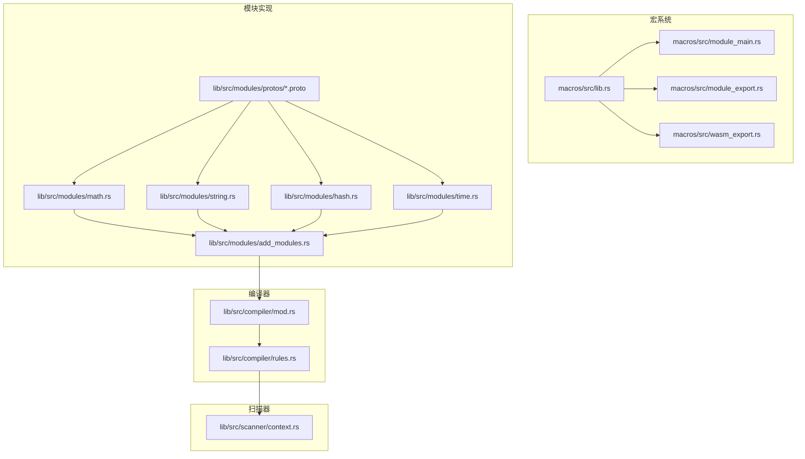
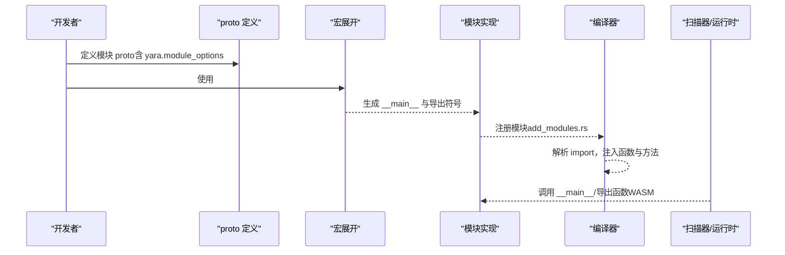
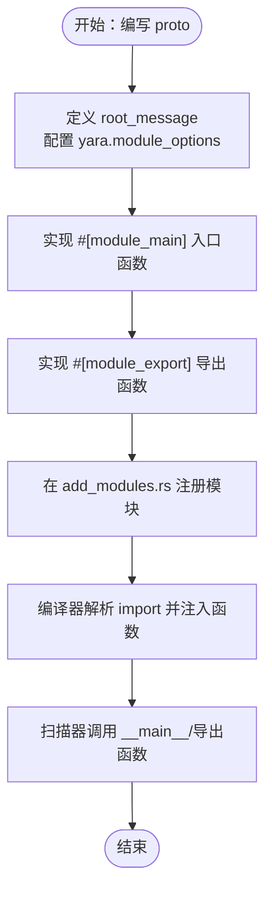
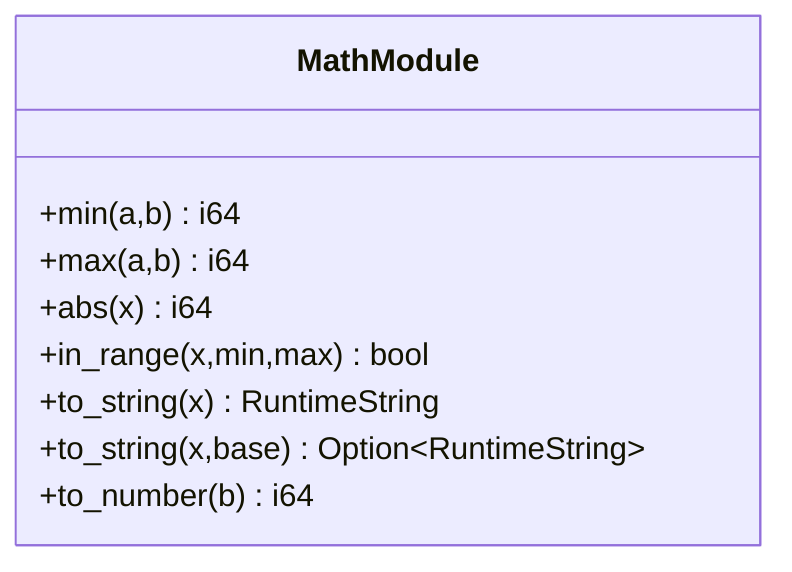
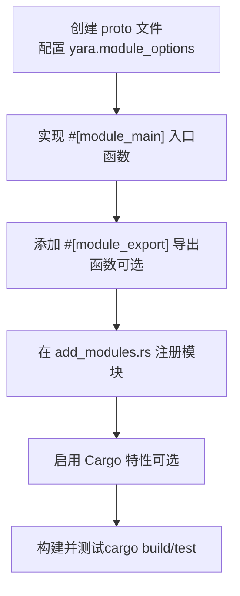
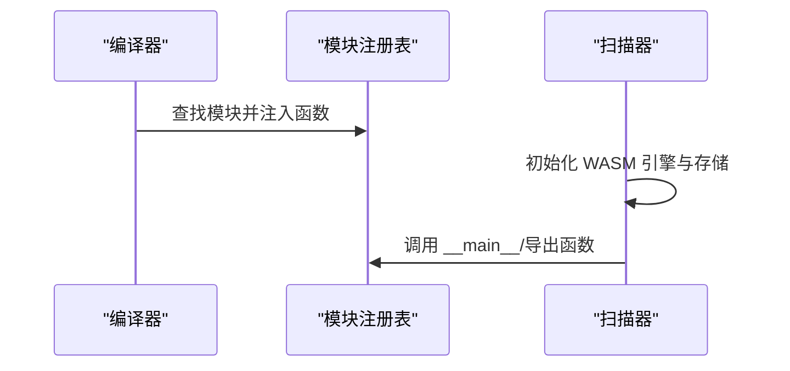
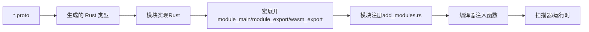

# 模块开发指南

<cite>
**本文引用的文件**
- [ModuleDeveloperGuide.md](file://docs/ModuleDeveloperGuide.md)
- [lib.rs（宏）](file://macros/src/lib.rs)
- [module_export.rs](file://macros/src/module_export.rs)
- [wasm_export.rs](file://macros/src/wasm_export.rs)
- [module_main.rs](file://macros/src/module_main.rs)
- [math 模块](file://lib/src/modules/math.rs)
- [math.proto](file://lib/src/modules/protos/math.proto)
- [string 模块](file://lib/src/modules/string.rs)
- [hash 模块](file://lib/src/modules/hash.rs)
- [time 模块](file://lib/src/modules/time.rs)
- [add_modules.rs](file://lib/src/modules/add_modules.rs)
- [rules.rs（编译器）](file://lib/src/compiler/rules.rs)
- [mod.rs（编译器）](file://lib/src/compiler/mod.rs)
- [context.rs（扫描器上下文）](file://lib/src/scanner/context.rs)
- [modules.md（站点文档）](file://site/content/docs/modules/modules.md)
</cite>

## 目录
1. [简介](#简介)
2. [项目结构](#项目结构)
3. [核心组件](#核心组件)
4. [架构总览](#架构总览)
5. [详细组件分析](#详细组件分析)
6. [依赖关系分析](#依赖关系分析)
7. [性能考量](#性能考量)
8. [故障排查指南](#故障排查指南)
9. [结论](#结论)
10. [附录](#附录)

## 简介
本指南面向希望在 YARA-X 中开发与扩展模块的开发者，系统讲解模块系统的架构设计、接口定义、生命周期管理与错误处理策略，并对内置模块（hash、string、math、time）进行深入剖析。同时提供自定义模块从环境搭建到编译测试的完整流程，涵盖宏系统、WASM 集成、性能优化与模块分发安装的最佳实践。

## 项目结构
YARA-X 的模块系统由“协议缓冲区（proto）定义 + Rust 模块实现 + 宏导出 + 编译器集成 + WASM 运行时”构成。关键目录与职责如下：
- docs：模块开发文档与示例
- macros：模块宏（module_main、module_export、wasm_export）
- lib/src/modules：内置模块与模块注册
- lib/src/modules/protos：模块的 proto 定义
- lib/src/compiler：规则编译器，负责模块导入与函数注入
- lib/src/scanner：扫描执行期上下文与运行时对象存储
- site/content/docs/modules：官方模块介绍

图表来源
- [lib.rs（宏）:146-302](file://macros/src/lib.rs#L146-L302)
- [module_main.rs:7-23](file://macros/src/module_main.rs#L7-L23)
- [module_export.rs:47-111](file://macros/src/module_export.rs#L47-L111)
- [wasm_export.rs:261-319](file://macros/src/wasm_export.rs#L261-L319)
- [math 模块:10-67](file://lib/src/modules/math.rs#L10-L67)
- [add_modules.rs:22-37](file://lib/src/modules/add_modules.rs#L22-L37)
- [rules.rs（编译器）:476-536](file://lib/src/compiler/rules.rs#L476-L536)
- [mod.rs（编译器）:1762-1873](file://lib/src/compiler/mod.rs#L1762-L1873)
- [context.rs（扫描器上下文）:295-377](file://lib/src/scanner/context.rs#L295-L377)

章节来源
- [modules.md（站点文档）:21-31](file://site/content/docs/modules/modules.md#L21-L31)

## 核心组件
- 模块宏系统
  - module_main：标记模块入口函数，生成统一的 __main__ 调用桩，返回动态消息类型
  - module_export：导出函数到规则引擎，内部基于 wasm_export 实现，生成符号表条目
  - wasm_export：解析函数签名，生成带名修饰的导出名称，注册到全局导出切片
- 模块实现层
  - 通过 proto 定义模块根结构与字段；在 Rust 模块中实现 main 函数填充结构，或仅暴露函数
  - 使用 ScanContext 访问扫描数据与模块输出
- 编译器集成
  - 解析 import 声明，查找内置模块映射，注入公共函数与方法到规则类型系统
- 执行期上下文
  - 提供全局变量设置、运行时对象存储、超时控制等能力

章节来源
- [lib.rs（宏）:128-302](file://macros/src/lib.rs#L128-L302)
- [module_main.rs:7-23](file://macros/src/module_main.rs#L7-L23)
- [module_export.rs:47-111](file://macros/src/module_export.rs#L47-L111)
- [wasm_export.rs:261-319](file://macros/src/wasm_export.rs#L261-L319)
- [mod.rs（编译器）:1762-1873](file://lib/src/compiler/mod.rs#L1762-L1873)
- [rules.rs（编译器）:476-536](file://lib/src/compiler/rules.rs#L476-L536)
- [context.rs（扫描器上下文）:295-377](file://lib/src/scanner/context.rs#L295-L377)

## 架构总览
模块开发的端到端流程如下：

图表来源
- [lib.rs（宏）:128-302](file://macros/src/lib.rs#L128-L302)
- [module_main.rs:7-23](file://macros/src/module_main.rs#L7-L23)
- [module_export.rs:47-111](file://macros/src/module_export.rs#L47-L111)
- [wasm_export.rs:261-319](file://macros/src/wasm_export.rs#L261-L319)
- [add_modules.rs:22-37](file://lib/src/modules/add_modules.rs#L22-L37)
- [mod.rs（编译器）:1762-1873](file://lib/src/compiler/mod.rs#L1762-L1873)

## 详细组件分析

### 模块接口与生命周期
- 接口定义
  - 使用 proto2/proto3 定义模块根消息（root_message），并在选项中声明模块名、Rust 模块名与特性开关
  - 可选地为字段配置格式化选项（如十六进制、时间戳）
- 生命周期
  - 编译阶段：编译器根据 import 声明加载模块，注入公共函数与方法到规则类型系统
  - 运行阶段：扫描器调用模块 __main__ 生成模块输出结构；随后按需调用导出函数
- 错误处理
  - 宏与编译器对不合法签名、重复命名、未知模块等进行校验与报错
  - 运行时通过 undefined 值与异常捕获机制处理未初始化字段与异常

图表来源
- [ModuleDeveloperGuide.md:40-194](file://docs/ModuleDeveloperGuide.md#L40-L194)
- [math.proto:1-20](file://lib/src/modules/protos/math.proto#L1-L20)
- [module_main.rs:7-23](file://macros/src/module_main.rs#L7-L23)
- [module_export.rs:47-111](file://macros/src/module_export.rs#L47-L111)
- [add_modules.rs:22-37](file://lib/src/modules/add_modules.rs#L22-L37)
- [mod.rs（编译器）:1762-1873](file://lib/src/compiler/mod.rs#L1762-L1873)

章节来源
- [ModuleDeveloperGuide.md:40-194](file://docs/ModuleDeveloperGuide.md#L40-L194)
- [math.proto:1-20](file://lib/src/modules/protos/math.proto#L1-L20)

### 内置模块深度解析

#### math 模块
- 结构：根消息为空，仅暴露数学函数
- 主要功能：最小值、最大值、绝对值、范围判断、数值与字符串互转、布尔转数字
- 特性：支持整数与浮点重载（同名不同签名）

图表来源
- [math 模块:10-67](file://lib/src/modules/math.rs#L10-L67)
- [math.proto:13-15](file://lib/src/modules/protos/math.proto#L13-L15)

章节来源
- [math 模块:10-67](file://lib/src/modules/math.rs#L10-L67)
- [math.proto:1-20](file://lib/src/modules/protos/math.proto#L1-L20)

#### string 模块
- 功能：字符串处理相关函数（如大小写转换、子串、匹配等）
- 设计：以导出函数为主，无需根消息结构

章节来源
- [string 模块](file://lib/src/modules/string.rs)

#### hash 模块
- 功能：计算哈希摘要（如 MD5、SHA1、SHA256 等）
- 设计：可选择返回结构体或仅导出函数

章节来源
- [hash 模块](file://lib/src/modules/hash.rs)

#### time 模块
- 功能：时间解析、格式化、时区处理等
- 设计：可返回结构体或仅导出函数

章节来源
- [time 模块](file://lib/src/modules/time.rs)

### 自定义模块开发流程

图表来源
- [ModuleDeveloperGuide.md:415-464](file://docs/ModuleDeveloperGuide.md#L415-L464)
- [add_modules.rs:22-37](file://lib/src/modules/add_modules.rs#L22-L37)

章节来源
- [ModuleDeveloperGuide.md:415-464](file://docs/ModuleDeveloperGuide.md#L415-L464)
- [add_modules.rs:22-37](file://lib/src/modules/add_modules.rs#L22-L37)

### 宏系统详解

#### module_main 宏
- 作用：将用户定义的 main 函数包装为统一的 __main__，返回动态消息类型
- 关键点：确保返回类型实现动态消息接口，便于编译器与运行时统一处理

章节来源
- [module_main.rs:7-23](file://macros/src/module_main.rs#L7-L23)
- [lib.rs（宏）:128-152](file://macros/src/lib.rs#L128-L152)

#### module_export 宏
- 作用：导出函数到规则引擎；内部基于 wasm_export，生成带修饰名的导出项
- 关键点：支持显式命名与方法归属（method_of），用于嵌套结构成员函数

章节来源
- [module_export.rs:47-111](file://macros/src/module_export.rs#L47-L111)
- [lib.rs（宏）:290-302](file://macros/src/lib.rs#L290-L302)

#### wasm_export 宏
- 作用：解析函数签名，生成带修饰名的导出标识，注册到全局导出切片
- 关键点：支持 Option<T> 表达 undefined、元组返回、泛型约束（如 FixedLenString、Lowercase）

章节来源
- [wasm_export.rs:261-319](file://macros/src/wasm_export.rs#L261-L319)
- [lib.rs（宏）:146-290](file://macros/src/lib.rs#L146-L290)

### WASM 集成与运行时
- 编译器在解析 import 时，会查找已注册模块，注入公共函数与方法到规则类型系统
- 运行时通过扫描器上下文访问模块输出与扫描数据，支持超时与对象存储

图表来源
- [mod.rs（编译器）:1762-1873](file://lib/src/compiler/mod.rs#L1762-L1873)
- [rules.rs（编译器）:476-536](file://lib/src/compiler/rules.rs#L476-L536)
- [context.rs（扫描器上下文）:295-377](file://lib/src/scanner/context.rs#L295-L377)

章节来源
- [mod.rs（编译器）:1762-1873](file://lib/src/compiler/mod.rs#L1762-L1873)
- [rules.rs（编译器）:476-536](file://lib/src/compiler/rules.rs#L476-L536)
- [context.rs（扫描器上下文）:295-377](file://lib/src/scanner/context.rs#L295-L377)

## 依赖关系分析

图表来源
- [math.proto:1-20](file://lib/src/modules/protos/math.proto#L1-L20)
- [math 模块:10-67](file://lib/src/modules/math.rs#L10-L67)
- [lib.rs（宏）:128-302](file://macros/src/lib.rs#L128-L302)
- [add_modules.rs:22-37](file://lib/src/modules/add_modules.rs#L22-L37)
- [mod.rs（编译器）:1762-1873](file://lib/src/compiler/mod.rs#L1762-L1873)

章节来源
- [add_modules.rs:22-37](file://lib/src/modules/add_modules.rs#L22-L37)
- [mod.rs（编译器）:1762-1873](file://lib/src/compiler/mod.rs#L1762-L1873)

## 性能考量
- 字符串处理
  - 优先使用 RuntimeString::ScannedDataSlice 以避免复制，仅在必要时使用 Rc
- 函数导出
  - 合理使用 Option<T> 表达 undefined，减少不必要的默认值开销
- 模块特性
  - 将非默认模块置于特性开关下，按需启用以减小二进制体积与启动时间
- WASM 序列化
  - 在支持的场景下序列化/反序列化 WASM 模块，降低重复编译成本

## 故障排查指南
- 常见问题
  - 未正确导入预定义：确保模块实现导入模块预定义
  - 未实现 #[module_main] 或重复标注：每个模块只能有一个入口
  - 导出函数签名不合法：首参必须为 &mut Caller<'_, ScanContext> 或 &ScanContext
  - 未知模块：检查 import 名称与模块注册是否一致
- 定位建议
  - 查看编译器对 import 的处理逻辑与错误提示
  - 检查 add_modules.rs 中的模块注册项
  - 使用 CLI 的调试与转储命令验证模块输出

章节来源
- [module_main.rs:7-23](file://macros/src/module_main.rs#L7-L23)
- [module_export.rs:47-111](file://macros/src/module_export.rs#L47-L111)
- [wasm_export.rs:261-319](file://macros/src/wasm_export.rs#L261-L319)
- [mod.rs（编译器）:1762-1873](file://lib/src/compiler/mod.rs#L1762-L1873)

## 结论
YARA-X 的模块系统通过 proto 定义、宏展开与编译器集成，实现了从结构到函数的完整扩展能力。借助 WASM 运行时与扫描器上下文，模块可在规则执行期高效访问扫描数据并返回结构化结果或直接导出函数。遵循本文流程与最佳实践，可快速开发高质量的自定义模块，并将其安全地分发与集成。

## 附录
- 官方模块概览文档
  - [modules.md（站点文档）:21-31](file://site/content/docs/modules/modules.md#L21-L31)