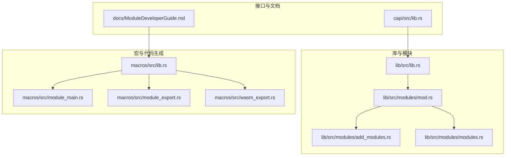
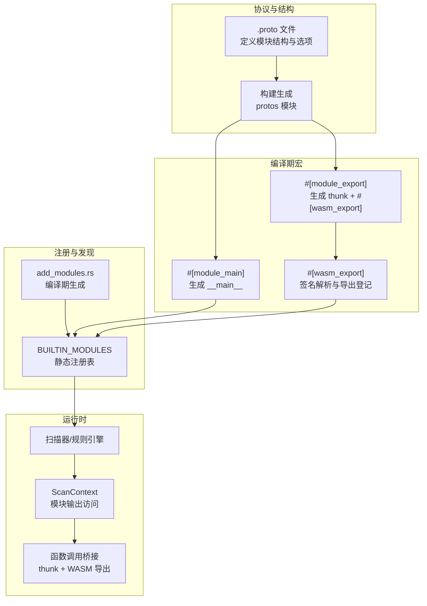
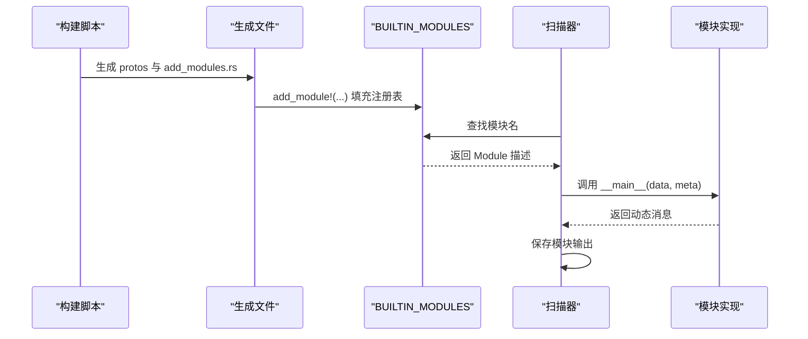
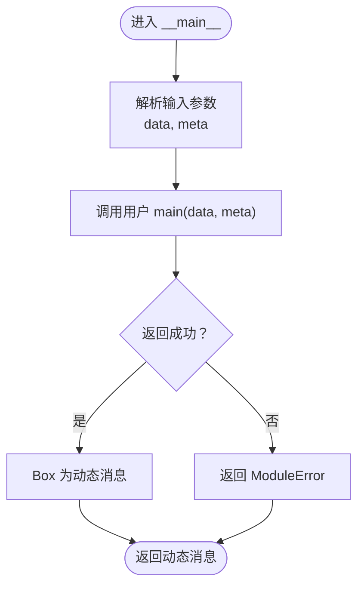
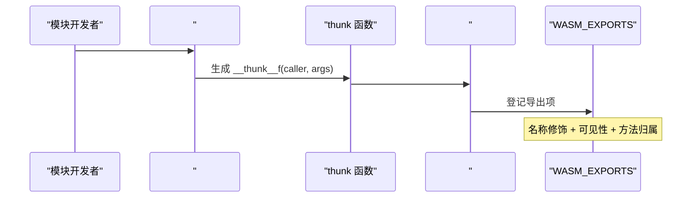
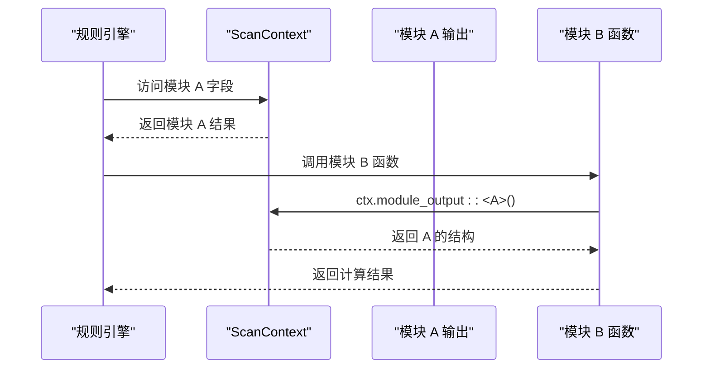
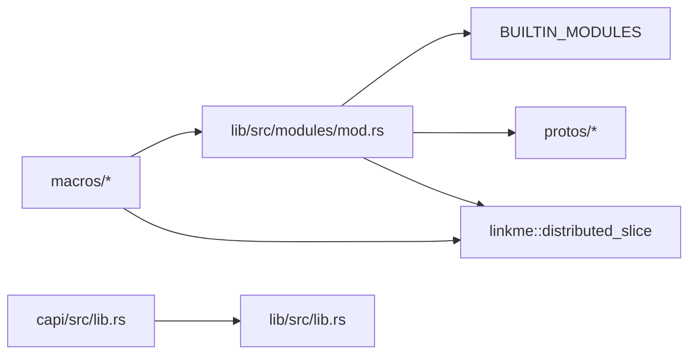

# 模块系统架构

<cite>
**本文引用的文件**
- [lib/src/lib.rs](file://lib/src/lib.rs)
- [lib/src/modules/mod.rs](file://lib/src/modules/mod.rs)
- [lib/src/modules/add_modules.rs](file://lib/src/modules/add_modules.rs)
- [lib/src/modules/modules.rs](file://lib/src/modules/modules.rs)
- [macros/src/lib.rs](file://macros/src/lib.rs)
- [macros/src/module_export.rs](file://macros/src/module_export.rs)
- [macros/src/module_main.rs](file://macros/src/module_main.rs)
- [macros/src/wasm_export.rs](file://macros/src/wasm_export.rs)
- [capi/src/lib.rs](file://capi/src/lib.rs)
- [docs/ModuleDeveloperGuide.md](file://docs/ModuleDeveloperGuide.md)
</cite>

## 目录
1. [引言](#引言)
2. [项目结构](#项目结构)
3. [核心组件](#核心组件)
4. [架构总览](#架构总览)
5. [详细组件分析](#详细组件分析)
6. [依赖分析](#依赖分析)
7. [性能考虑](#性能考虑)
8. [故障排查指南](#故障排查指南)
9. [结论](#结论)
10. [附录：模块开发约束与最佳实践](#附录模块开发约束与最佳实践)

## 引言
本文件系统性阐述 yara-x 的模块系统架构，覆盖模块接口定义、生命周期管理、注册机制与错误处理；详解模块主入口函数的作用、模块导出宏的使用方法，以及模块间（通过规则与扫描上下文）的通信机制。文档同时给出整体架构图与关键流程图，帮助开发者快速理解并高效扩展模块生态。

## 项目结构
yara-x 将模块系统集中在 lib 子工程的 modules 子模块中，并通过一组编译期宏在构建阶段完成模块注册与导出符号的生成。C 接口层提供跨语言调用能力，模块开发指南为开发者提供了从协议定义到函数导出的完整流程。

**图表来源**
- [lib/src/lib.rs:1-178](file://lib/src/lib.rs#L1-L178)
- [lib/src/modules/mod.rs:1-317](file://lib/src/modules/mod.rs#L1-L317)
- [lib/src/modules/add_modules.rs:1-37](file://lib/src/modules/add_modules.rs#L1-L37)
- [lib/src/modules/modules.rs](file://lib/src/modules/modules.rs)
- [macros/src/lib.rs:1-303](file://macros/src/lib.rs#L1-L303)
- [macros/src/module_main.rs:1-24](file://macros/src/module_main.rs#L1-L24)
- [macros/src/module_export.rs:1-112](file://macros/src/module_export.rs#L1-L112)
- [macros/src/wasm_export.rs:1-415](file://macros/src/wasm_export.rs#L1-L415)
- [capi/src/lib.rs:1-269](file://capi/src/lib.rs#L1-L269)
- [docs/ModuleDeveloperGuide.md:1-800](file://docs/ModuleDeveloperGuide.md#L1-L800)

**章节来源**
- [lib/src/lib.rs:1-178](file://lib/src/lib.rs#L1-L178)
- [lib/src/modules/mod.rs:1-317](file://lib/src/modules/mod.rs#L1-L317)
- [lib/src/modules/add_modules.rs:1-37](file://lib/src/modules/add_modules.rs#L1-L37)
- [lib/src/modules/modules.rs](file://lib/src/modules/modules.rs)
- [macros/src/lib.rs:1-303](file://macros/src/lib.rs#L1-L303)
- [macros/src/module_main.rs:1-24](file://macros/src/module_main.rs#L1-L24)
- [macros/src/module_export.rs:1-112](file://macros/src/module_export.rs#L1-L112)
- [macros/src/wasm_export.rs:1-415](file://macros/src/wasm_export.rs#L1-L415)
- [capi/src/lib.rs:1-269](file://capi/src/lib.rs#L1-L269)
- [docs/ModuleDeveloperGuide.md:1-800](file://docs/ModuleDeveloperGuide.md#L1-L800)

## 核心组件
- 模块注册表与描述
  - BUILTIN_MODULES：全局静态映射，键为模块名，值为模块描述（含主入口指针、根消息描述符等）。由构建脚本生成的 add_modules.rs 在编译时填充。
- 模块主入口
  - #[module_main] 宏：将用户实现的 main 函数包装为统一签名的 __main__，返回动态消息类型，供扫描器调用。
- 函数导出
  - #[module_export] 宏：将 Rust 函数转换为可从 YARA 规则调用的形式，内部委托 #[wasm_export] 宏并注入 thunk。
  - #[wasm_export] 宏：解析函数签名，生成带名称修饰的导出条目，登记到全局导出切片，支持重载与可见性控制。
- 扫描上下文与数据访问
  - ScanContext 提供对扫描数据、模块输出等的访问能力，模块函数通过它读取已解析的模块结构。
- 错误处理
  - ModuleError：模块元数据格式错误、内部处理错误等。
  - C 接口层提供线程本地错误存储与查询函数，便于跨语言场景定位问题。

**章节来源**
- [lib/src/modules/mod.rs:1-317](file://lib/src/modules/mod.rs#L1-L317)
- [lib/src/modules/add_modules.rs:1-37](file://lib/src/modules/add_modules.rs#L1-L37)
- [macros/src/module_main.rs:1-24](file://macros/src/module_main.rs#L1-L24)
- [macros/src/module_export.rs:1-112](file://macros/src/module_export.rs#L1-L112)
- [macros/src/wasm_export.rs:1-415](file://macros/src/wasm_export.rs#L1-L415)
- [capi/src/lib.rs:118-179](file://capi/src/lib.rs#L118-L179)

## 架构总览
下图展示了模块系统从协议定义到运行时调用的整体流程，包括宏展开、注册表填充、导出符号生成与扫描器调用链路。

**图表来源**
- [lib/src/modules/mod.rs:101-142](file://lib/src/modules/mod.rs#L101-L142)
- [lib/src/modules/add_modules.rs:1-37](file://lib/src/modules/add_modules.rs#L1-L37)
- [macros/src/module_main.rs:7-23](file://macros/src/module_main.rs#L7-L23)
- [macros/src/module_export.rs:47-111](file://macros/src/module_export.rs#L47-L111)
- [macros/src/wasm_export.rs:261-319](file://macros/src/wasm_export.rs#L261-L319)

## 详细组件分析

### 组件一：模块注册与生命周期
- 注册机制
  - 通过 add_module!(...) 宏在编译期将模块加入 BUILTIN_MODULES 映射，包含模块名、根消息描述符、可选的 Rust 模块名与主入口函数指针。
  - 构建脚本生成 add_modules.rs，按功能特性条件化地添加模块项。
- 生命周期
  - 编译期：协议生成、宏展开、注册表填充。
  - 运行期：扫描器根据导入模块名查找 BUILTIN_MODULES，调用对应 __main__ 解析输入数据，返回动态消息；规则引擎通过 ScanContext 访问模块输出并调用导出函数。

**图表来源**
- [lib/src/modules/mod.rs:101-142](file://lib/src/modules/mod.rs#L101-L142)
- [lib/src/modules/add_modules.rs:1-37](file://lib/src/modules/add_modules.rs#L1-L37)

**章节来源**
- [lib/src/modules/mod.rs:101-142](file://lib/src/modules/mod.rs#L101-L142)
- [lib/src/modules/add_modules.rs:1-37](file://lib/src/modules/add_modules.rs#L1-L37)

### 组件二：模块主入口函数
- 作用
  - 接收扫描数据与可选元数据，返回模块根消息的动态实例，供扫描器统一处理。
- 宏实现要点
  - 将用户函数包装为 __main__，强制统一签名，捕获返回结果并转为动态消息类型。
  - 与模块注册表配合，使扫描器无需关心具体模块实现即可调用。

**图表来源**
- [macros/src/module_main.rs:7-23](file://macros/src/module_main.rs#L7-L23)
- [lib/src/modules/mod.rs:49-51](file://lib/src/modules/mod.rs#L49-L51)

**章节来源**
- [macros/src/module_main.rs:1-24](file://macros/src/module_main.rs#L1-L24)
- [lib/src/modules/mod.rs:49-51](file://lib/src/modules/mod.rs#L49-L51)

### 组件三：模块导出宏与函数签名
- #[module_export]
  - 将 Rust 函数转换为可从 YARA 规则调用的形式，自动生成 thunk，将 &mut Caller<'_, ScanContext> 转换为 &ScanContext。
  - 支持显式命名与嵌套路径（如 name = "some_struct.func"），实现“重载”与成员函数式调用。
- #[wasm_export]
  - 解析函数签名，生成名称修饰字符串，登记到全局导出切片，支持 Option 类型的“未定义”语义。
  - 支持 public 标记决定是否暴露给规则引擎。

**图表来源**
- [macros/src/module_export.rs:47-111](file://macros/src/module_export.rs#L47-L111)
- [macros/src/wasm_export.rs:261-319](file://macros/src/wasm_export.rs#L261-L319)

**章节来源**
- [macros/src/module_export.rs:1-112](file://macros/src/module_export.rs#L1-L112)
- [macros/src/wasm_export.rs:1-415](file://macros/src/wasm_export.rs#L1-L415)

### 组件四：模块间通信机制
- 通过扫描上下文共享状态
  - ScanContext 提供对扫描数据与模块输出的访问，模块函数可通过 ctx.module_output::<T>() 获取其他模块解析出的结构。
- 规则引擎作为中介
  - 规则条件表达式通过模块名与点号访问导出函数或字段，扫描器在执行时解析并调用相应导出项。

**图表来源**
- [docs/ModuleDeveloperGuide.md:700-746](file://docs/ModuleDeveloperGuide.md#L700-L746)

**章节来源**
- [docs/ModuleDeveloperGuide.md:700-746](file://docs/ModuleDeveloperGuide.md#L700-L746)

## 依赖分析
- 内部耦合
  - macros 与 lib/modules 紧密协作：宏负责代码生成与导出登记，模块层负责注册表与运行时调用。
  - capi 仅依赖 lib 公开 API，不直接参与宏逻辑，保证跨语言接口稳定。
- 外部依赖
  - protobuf：用于模块结构定义与序列化。
  - wasmtime/linkme：用于导出符号的集中登记与分发。
  - bstr：用于模块函数中的字节串处理。

**图表来源**
- [lib/src/modules/mod.rs:1-317](file://lib/src/modules/mod.rs#L1-L317)
- [macros/src/lib.rs:1-303](file://macros/src/lib.rs#L1-L303)
- [capi/src/lib.rs:1-269](file://capi/src/lib.rs#L1-L269)

**章节来源**
- [lib/src/modules/mod.rs:1-317](file://lib/src/modules/mod.rs#L1-L317)
- [macros/src/lib.rs:1-303](file://macros/src/lib.rs#L1-L303)
- [capi/src/lib.rs:1-269](file://capi/src/lib.rs#L1-L269)

## 性能考虑
- 动态消息与分发
  - 使用动态消息类型与静态注册表减少运行时反射成本，提升模块调用效率。
- 导出符号集中登记
  - 通过 distributed_slice 集中登记导出项，避免运行时扫描，降低查找开销。
- 字符串与数据切片
  - RuntimeString 支持扫描数据切片，避免不必要的拷贝，提高 I/O 密集场景下的吞吐。

[本节为通用指导，不直接分析具体文件]

## 故障排查指南
- 编译期错误
  - #[module_main] 必须唯一且签名正确；宏会检查并报告错误。
  - #[wasm_export] 对函数签名有严格要求（至少一个 &mut Caller 参数、支持的参数与返回类型）。
- 运行期错误
  - ModuleError：模块元数据格式错误或内部处理错误，需检查协议定义与主函数实现。
  - C 接口错误：通过 yrx_last_error 获取最近错误信息，结合线程本地存储定位问题。
- 常见问题
  - 模块未被构建：确认 feature 标志已在 lib/Cargo.toml 中启用。
  - 导出函数不可见：检查 #[wasm_export(public)] 与 #[module_export] 的可见性设置。

**章节来源**
- [macros/src/module_main.rs:7-23](file://macros/src/module_main.rs#L7-L23)
- [macros/src/wasm_export.rs:261-319](file://macros/src/wasm_export.rs#L261-L319)
- [lib/src/modules/mod.rs:31-47](file://lib/src/modules/mod.rs#L31-L47)
- [capi/src/lib.rs:118-179](file://capi/src/lib.rs#L118-L179)

## 结论
yara-x 的模块系统以协议驱动、宏辅助、静态注册为核心设计，既保证了模块开发的灵活性，又确保了运行时的高性能与稳定性。通过清晰的生命周期管理、完善的导出机制与错误处理策略，开发者可以快速构建高质量的模块并融入规则引擎生态。

[本节为总结性内容，不直接分析具体文件]

## 附录：模块开发约束与最佳实践
- 协议与结构
  - 使用 .proto 定义模块根消息，配置 yara.module_options（name/root_message/rust_module/cargo_feature）。
  - 选择 proto2 或 proto3，注意 undefined 值语义差异。
- 主入口与导出
  - 使用 #[module_main] 实现 main(data, meta) -> RootMessage。
  - 使用 #[module_export] 导出函数，遵循参数与返回类型限制；必要时通过 name/method_of 控制可见性与命名。
- 字符串与数据
  - 使用 RuntimeString 处理字符串；优先利用扫描数据切片避免拷贝。
- 测试与集成
  - 为模块编写测试数据与断言；确认 feature 标志与默认特性配置。
- 文档与示例
  - 参考模块开发指南，按步骤完成协议、实现、构建与验证。

**章节来源**
- [docs/ModuleDeveloperGuide.md:40-800](file://docs/ModuleDeveloperGuide.md#L40-L800)