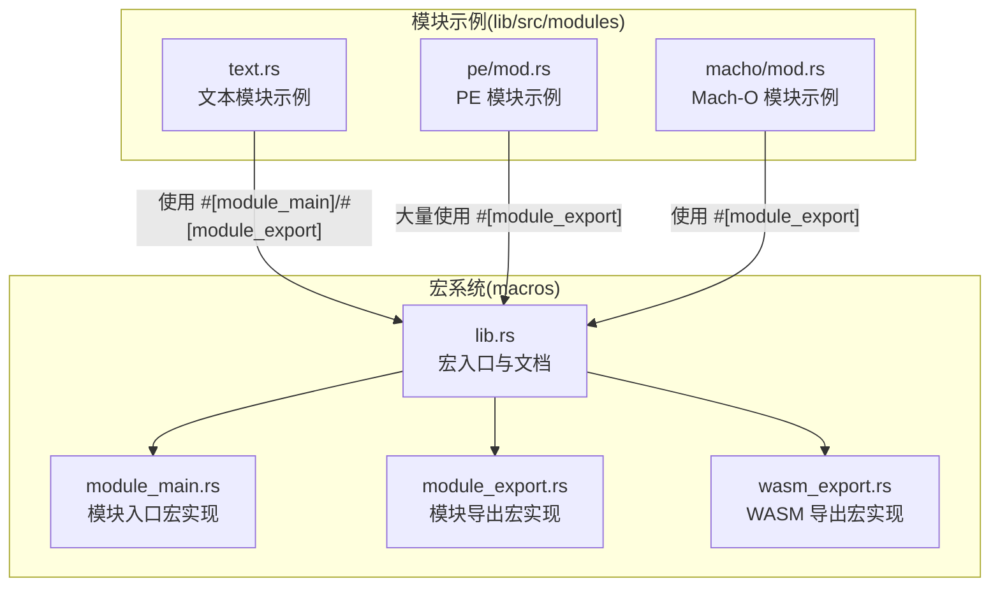
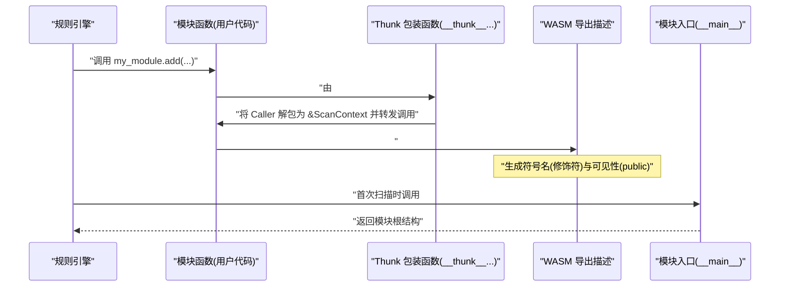
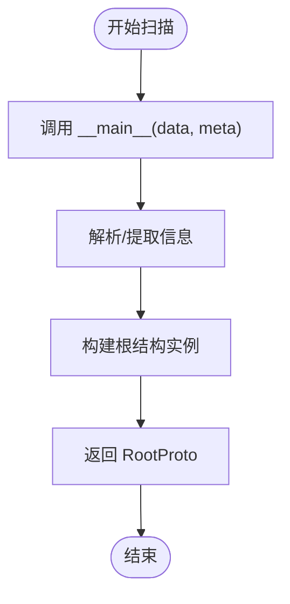
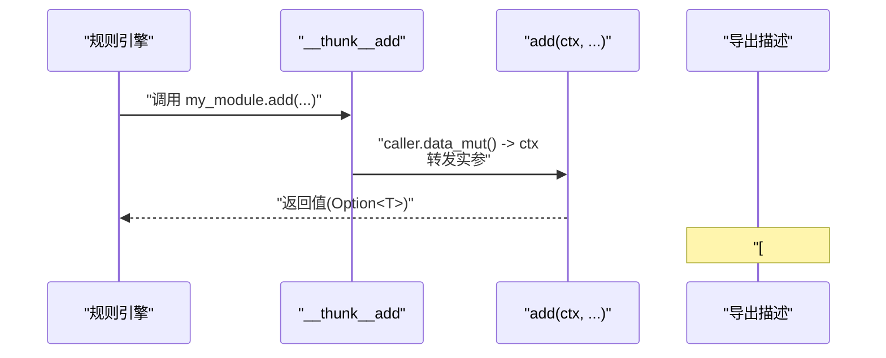
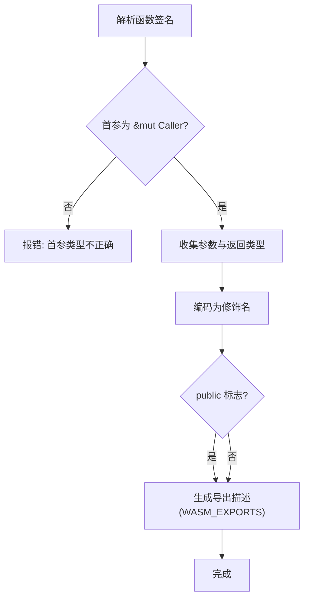
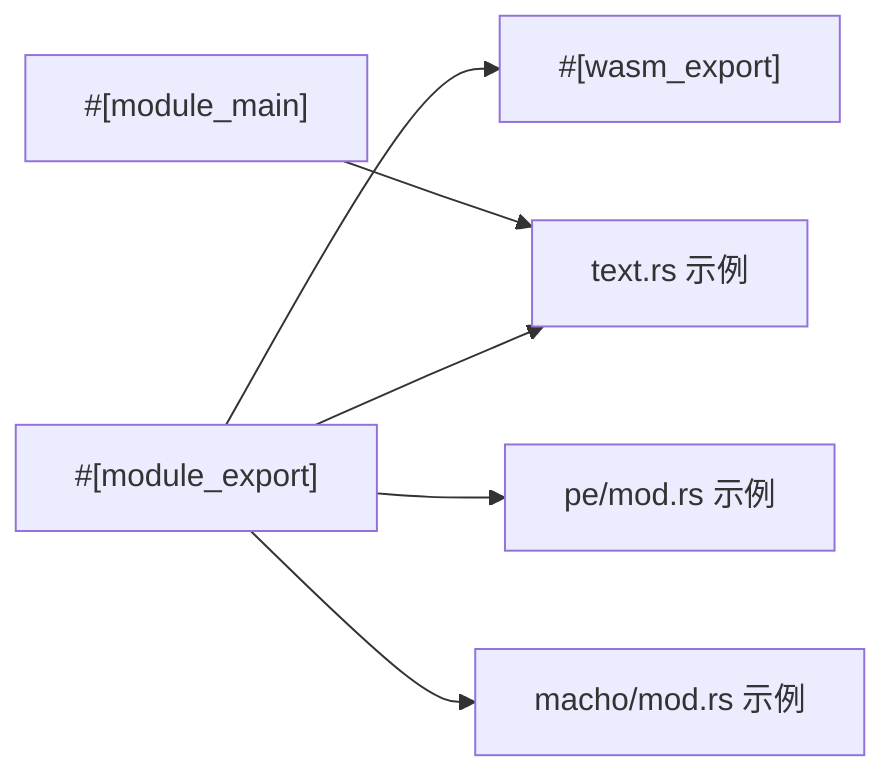

# 宏系统使用

<cite>
**本文引用的文件**
- [lib.rs](file://yara-x/macros/src/lib.rs)
- [module_main.rs](file://yara-x/macros/src/module_main.rs)
- [module_export.rs](file://yara-x/macros/src/module_export.rs)
- [wasm_export.rs](file://yara-x/macros/src/wasm_export.rs)
- [ModuleDeveloperGuide.md](file://yara-x/docs/ModuleDeveloperGuide.md)
- [text.rs](file://yara-x/lib/src/modules/text.rs)
- [pe/mod.rs](file://yara-x/lib/src/modules/pe/mod.rs)
- [macho/mod.rs](file://yara-x/lib/src/modules/macho/mod.rs)
</cite>

## 目录
1. [简介](#简介)
2. [项目结构](#项目结构)
3. [核心组件](#核心组件)
4. [架构总览](#架构总览)
5. [详细组件分析](#详细组件分析)
6. [依赖关系分析](#依赖关系分析)
7. [性能考量](#性能考量)
8. [故障排查指南](#故障排查指南)
9. [结论](#结论)
10. [附录](#附录)

## 简介
本文件面向 YARA-X 模块开发者，系统讲解宏系统在模块开发中的使用方法，重点覆盖以下三类宏：
- #[module_main]：模块入口函数声明与生命周期管理
- #[module_export]：模块函数导出与参数/返回值处理
- #[wasm_export]：WASM 层函数导出与符号命名规则

文档将从代码实现、调用流程、类型约束、最佳实践到常见错误逐一展开，并结合仓库中的真实模块示例进行说明。

## 项目结构
宏系统位于独立的 macros 子工程中，提供三个过程宏：
- module_main：为模块生成统一入口适配器
- module_export：将模块函数转换为 WASM 可调用形式并暴露给规则引擎
- wasm_export：定义 WASM 函数导出描述，生成符号表条目

**图表来源**
- [lib.rs:128-302](file://yara-x/macros/src/lib.rs#L128-L302)
- [module_main.rs:1-24](file://yara-x/macros/src/module_main.rs#L1-L24)
- [module_export.rs:1-112](file://yara-x/macros/src/module_export.rs#L1-L112)
- [wasm_export.rs:1-415](file://yara-x/macros/src/wasm_export.rs#L1-L415)
- [text.rs:1-110](file://yara-x/lib/src/modules/text.rs#L1-L110)
- [pe/mod.rs:38-51](file://yara-x/lib/src/modules/pe/mod.rs#L38-L51)

**章节来源**
- [lib.rs:128-302](file://yara-x/macros/src/lib.rs#L128-L302)

## 核心组件
- #[module_main] 宏
  - 职责：标记模块主函数，生成统一入口适配器，负责将扫描数据转换为模块输出结构
  - 入口签名：接收字节切片与可选元数据，返回模块 protobuf 结构
  - 生命周期：每个被扫描文件触发一次，负责填充模块根结构
- #[module_export] 宏
  - 职责：将模块函数暴露给规则引擎；内部基于 #[wasm_export] 实现
  - 参数要求：首参为 ScanContext 引用（& 或 &mut），其余为受支持的基本类型
  - 返回值：支持 Option<T> 形式表达“未定义”语义
- #[wasm_export] 宏
  - 职责：声明 WASM 可调用函数，生成导出描述项，参与符号表构建
  - 符号命名：根据参数与返回类型生成“修饰名”，用于规则引擎解析重载

**章节来源**
- [lib.rs:128-302](file://yara-x/macros/src/lib.rs#L128-L302)
- [module_main.rs:7-23](file://yara-x/macros/src/module_main.rs#L7-L23)
- [module_export.rs:15-46](file://yara-x/macros/src/module_export.rs#L15-L46)
- [wasm_export.rs:227-319](file://yara-x/macros/src/wasm_export.rs#L227-L319)

## 架构总览
宏系统通过编译期代码生成，将模块函数转换为规则引擎可调用的形式。下图展示了典型模块函数的生成路径：

**图表来源**
- [module_export.rs:47-111](file://yara-x/macros/src/module_export.rs#L47-L111)
- [wasm_export.rs:261-319](file://yara-x/macros/src/wasm_export.rs#L261-L319)
- [module_main.rs:7-23](file://yara-x/macros/src/module_main.rs#L7-L23)

## 详细组件分析

### #[module_main] 宏分析
- 功能要点
  - 将用户定义的主函数包装为统一入口 __main__，接受扫描数据与可选元数据
  - 返回值需实现动态消息接口，便于后续序列化与规则访问
- 使用规范
  - 每个模块仅能有一个 #[module_main] 标记的函数
  - 主函数签名固定为 (data: &[u8], meta: Option<&[u8]>) -> Result<RootProto, ModuleError>
  - 返回的根结构必须与 .proto 中 root_message 对应
- 生命周期管理
  - 每次扫描新文件都会调用一次 __main__
  - 可在其中进行缓存初始化与清理（如 PE 模块中的线程局部缓存）

**图表来源**
- [module_main.rs:7-23](file://yara-x/macros/src/module_main.rs#L7-L23)
- [text.rs:20-48](file://yara-x/lib/src/modules/text.rs#L20-L48)

**章节来源**
- [module_main.rs:7-23](file://yara-x/macros/src/module_main.rs#L7-L23)
- [text.rs:20-48](file://yara-x/lib/src/modules/text.rs#L20-L48)

### #[module_export] 宏分析
- 功能要点
  - 将用户函数转换为两部分：原始函数 + 一个 thunk 包装函数
  - thunk 函数以 wasmtime::Caller 作为首参，内部解包为 &ScanContext 后调用原函数
  - 通过 #[wasm_export] 注册导出描述，使函数可在规则中以模块名空间访问
- 参数与返回值
  - 支持 i32/i64/f32/f64/bool/RuntimeString
  - 返回值可使用 Option<T> 表达“未定义”
  - 字符串类型统一使用 RuntimeString，避免直接使用标准字符串类型
- 命名与重载
  - 可通过 name 显式指定导出名称，实现重载
  - 支持路径式命名（如 my_struct.add），映射到模块结构的嵌套字段
- 使用示例
  - 文本模块：get_line、avg_words_per_line、language
  - PE 模块：imphash、section_index、imports、exports_index 等多组重载

**图表来源**
- [module_export.rs:47-111](file://yara-x/macros/src/module_export.rs#L47-L111)
- [wasm_export.rs:261-319](file://yara-x/macros/src/wasm_export.rs#L261-L319)

**章节来源**
- [module_export.rs:15-111](file://yara-x/macros/src/module_export.rs#L15-L111)
- [text.rs:54-109](file://yara-x/lib/src/modules/text.rs#L54-L109)
- [pe/mod.rs:187-198](file://yara-x/lib/src/modules/pe/mod.rs#L187-L198)

### #[wasm_export] 宏分析
- 功能要点
  - 为 WASM 可调用函数生成导出描述，写入全局导出表
  - 计算“修饰名”：基于参数与返回类型的编码，用于规则引擎识别重载
  - 支持 public 标志控制是否对规则可见
- 类型约束与修饰名
  - 支持基本类型与特定包装类型（如 Option<T>）
  - 修饰名规则：参数类型序列 + "@" + 返回类型序列
  - 特殊类型如 RangedInteger、FixedLenString、Lowercase 等有专门编码
- 方法绑定
  - 支持 method_of 参数，将函数作为某个结构的方法导出
- 错误与校验
  - 首参必须为 &mut Caller<'_, ScanContext>
  - 至少包含一个参数（Caller 首参不计入）
  - 不支持的类型会报错

**图表来源**
- [wasm_export.rs:170-210](file://yara-x/macros/src/wasm_export.rs#L170-L210)
- [wasm_export.rs:261-319](file://yara-x/macros/src/wasm_export.rs#L261-L319)

**章节来源**
- [wasm_export.rs:170-319](file://yara-x/macros/src/wasm_export.rs#L170-L319)

## 依赖关系分析
宏之间的依赖关系如下：
- #[module_export] 依赖 #[wasm_export] 进行导出描述生成
- #[module_main] 与模块函数无直接依赖，但共同构成模块生命周期
- 模块函数在运行时通过 ScanContext 获取模块输出结构

**图表来源**
- [module_export.rs:96-108](file://yara-x/macros/src/module_export.rs#L96-L108)
- [wasm_export.rs:261-319](file://yara-x/macros/src/wasm_export.rs#L261-L319)
- [text.rs:20-109](file://yara-x/lib/src/modules/text.rs#L20-L109)
- [pe/mod.rs:38-51](file://yara-x/lib/src/modules/pe/mod.rs#L38-L51)
- [macho/mod.rs:289-334](file://yara-x/lib/src/modules/macho/mod.rs#L289-L334)

**章节来源**
- [module_export.rs:15-111](file://yara-x/macros/src/module_export.rs#L15-L111)
- [wasm_export.rs:227-319](file://yara-x/macros/src/wasm_export.rs#L227-L319)
- [text.rs:20-109](file://yara-x/lib/src/modules/text.rs#L20-L109)
- [pe/mod.rs:38-51](file://yara-x/lib/src/modules/pe/mod.rs#L38-L51)
- [macho/mod.rs:289-334](file://yara-x/lib/src/modules/macho/mod.rs#L289-L334)

## 性能考量
- 缓存策略
  - 在模块主函数中初始化/清理线程局部缓存，减少重复计算（如 PE 的 imphash、checksum）
- I/O 与解析
  - 使用流式解析与按需计算，避免一次性加载大文件
- 导出描述
  - #[wasm_export] 生成静态导出描述，运行时按需查找，开销极低

**章节来源**
- [pe/mod.rs:31-51](file://yara-x/lib/src/modules/pe/mod.rs#L31-L51)
- [pe/mod.rs:126-182](file://yara-x/lib/src/modules/pe/mod.rs#L126-L182)

## 故障排查指南
- 常见错误与解决
  - 首参类型错误：确保 #[wasm_export] 的首参为 &mut Caller<'_, ScanContext>
  - 不支持的类型：仅使用受支持的基本类型或包装类型
  - #[module_main] 多定义：每个模块只能有一个主函数
  - 返回值未定义：使用 Option<T> 表达“未定义”，规则中视为 undefined
  - 字符串类型错误：统一使用 RuntimeString，避免直接使用 String/&str/&[u8]
- 调试建议
  - 逐步注释宏使用，定位具体宏导致的问题
  - 查看生成的导出描述与修饰名，确认重载解析是否符合预期

**章节来源**
- [wasm_export.rs:268-274](file://yara-x/macros/src/wasm_export.rs#L268-L274)
- [lib.rs:146-152](file://yara-x/macros/src/lib.rs#L146-L152)
- [ModuleDeveloperGuide.md:507-545](file://yara-x/docs/ModuleDeveloperGuide.md#L507-L545)

## 结论
宏系统为 YARA-X 模块开发提供了简洁而强大的工具链：
- #[module_main] 统一了模块入口，保证生命周期一致性
- #[module_export] 将模块函数无缝暴露给规则引擎，支持重载与嵌套命名
- #[wasm_export] 提供底层导出机制与符号命名规则，确保跨语言互操作

遵循本文的最佳实践与规范，可以高效、安全地开发高质量的 YARA-X 模块。

## 附录
- 最佳实践
  - 使用 #[module_main] 填充模块根结构，避免在函数中重复解析
  - 使用 #[module_export] 的 name 与 method_of 参数清晰表达函数意图
  - 返回值优先使用 Option<T> 表达“未定义”，提升规则健壮性
  - 字符串处理统一使用 RuntimeString，必要时利用其变体特性优化内存
- 常见错误避免
  - 避免在 #[module_export] 函数中直接使用 &mut ScanContext（应通过 thunk 解包）
  - 不要混用标准字符串类型与 RuntimeString
  - 确保修饰名唯一且与规则调用一致，必要时显式指定 name

**章节来源**
- [ModuleDeveloperGuide.md:507-545](file://yara-x/docs/ModuleDeveloperGuide.md#L507-L545)
- [text.rs:54-109](file://yara-x/lib/src/modules/text.rs#L54-L109)
- [pe/mod.rs:187-340](file://yara-x/lib/src/modules/pe/mod.rs#L187-L340)