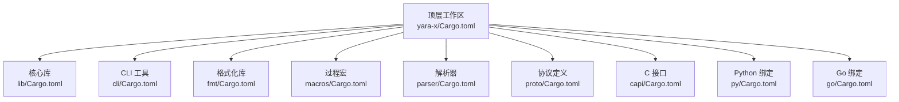
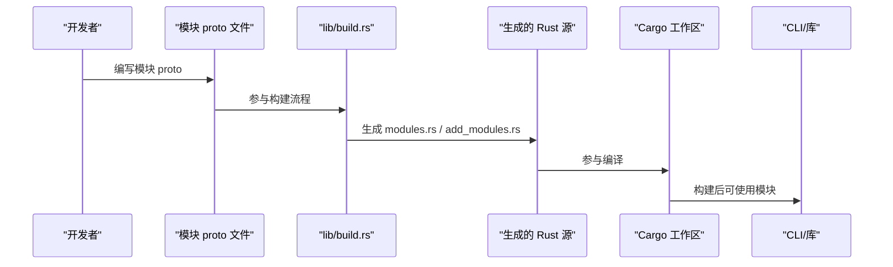
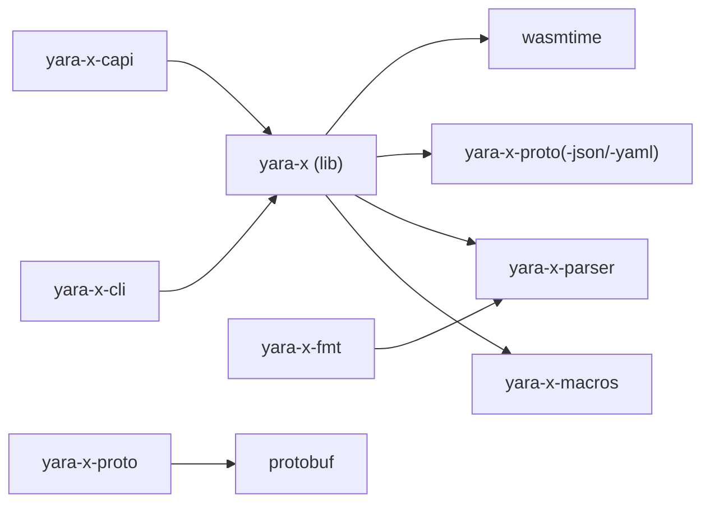

# 开发环境搭建

<cite>
**本文档引用的文件**
- [Cargo.toml](file://yara-x/Cargo.toml)
- [.cargo/config.toml](file://yara-x/.cargo/config.toml)
- [lib/Cargo.toml](file://yara-x/lib/Cargo.toml)
- [cli/Cargo.toml](file://yara-x/cli/Cargo.toml)
- [fmt/Cargo.toml](file://yara-x/fmt/Cargo.toml)
- [capi/Cargo.toml](file://yara-x/capi/Cargo.toml)
- [parser/Cargo.toml](file://yara-x/parser/Cargo.toml)
- [proto/Cargo.toml](file://yara-x/proto/Cargo.toml)
- [macros/Cargo.toml](file://yara-x/macros/Cargo.toml)
- [lib/build.rs](file://yara-x/lib/build.rs)
- [capi/build.rs](file://yara-x/capi/build.rs)
- [capi/cbindgen.toml](file://yara-x/capi/cbindgen.toml)
- [rustfmt.toml](file://yara-x/rustfmt.toml)
- [docs/ModuleDeveloperGuide.md](file://yara-x/docs/ModuleDeveloperGuide.md)
- [.github/workflows/tests.yaml](file://yara-x/.github/workflows/tests.yaml)
- [.github/workflows/release.yaml](file://yara-x/.github/workflows/release.yaml)
</cite>

## 目录
1. [简介](#简介)
2. [项目结构](#项目结构)
3. [核心组件](#核心组件)
4. [架构总览](#架构总览)
5. [详细组件分析](#详细组件分析)
6. [依赖关系分析](#依赖关系分析)
7. [性能考虑](#性能考虑)
8. [故障排除指南](#故障排除指南)
9. [结论](#结论)
10. [附录](#附录)

## 简介
本指南面向希望在 yara-x 项目中进行模块开发与本地环境搭建的开发者。内容涵盖：
- Rust 工具链安装与版本要求（含 CI 中使用的工具链矩阵）
- Cargo 工作区配置与成员管理
- 模块项目初始化模板与最佳实践
- 开发依赖与宏 crate 的使用方式
- IDE 配置建议、调试工具设置与环境验证步骤

## 项目结构
yara-x 采用多 crate 工作区组织，顶层通过工作区配置统一版本与依赖，各子 crate 职责清晰：
- lib：核心库，包含模块生成逻辑与默认功能集合
- cli：命令行工具
- fmt：规则格式化库
- macros：过程宏支持
- parser：YARA 规则解析器
- proto 系列：协议定义与代码生成
- capi：C 接口封装
- go/py：语言绑定

图表来源
- [Cargo.toml:17-30](file://yara-x/Cargo.toml#L17-L30)
- [lib/Cargo.toml:1-305](file://yara-x/lib/Cargo.toml#L1-L305)
- [cli/Cargo.toml:1-80](file://yara-x/cli/Cargo.toml#L1-L80)
- [fmt/Cargo.toml:1-26](file://yara-x/fmt/Cargo.toml#L1-L26)
- [macros/Cargo.toml:1-18](file://yara-x/macros/Cargo.toml#L1-L18)
- [parser/Cargo.toml:1-50](file://yara-x/parser/Cargo.toml#L1-L50)
- [proto/Cargo.toml:1-20](file://yara-x/proto/Cargo.toml#L1-L20)
- [capi/Cargo.toml:1-65](file://yara-x/capi/Cargo.toml#L1-L65)

章节来源
- [Cargo.toml:17-30](file://yara-x/Cargo.toml#L17-L30)

## 核心组件
- 工作区与版本管理
  - 顶层工作区统一声明包元数据、Rust 版本要求与成员列表，并集中管理依赖版本。
  - Rust 最低版本要求与 CI 工作流保持一致。
- 构建与生成
  - lib 的 build.rs 负责扫描模块 proto 定义，动态生成模块注册与入口文件。
  - capi 的 build.rs 使用 cbindgen 自动生成 C 头文件。
- 依赖与特性
  - 各 crate 通过 workspace 引用统一依赖版本；模块以特性开关控制启用与否。

章节来源
- [Cargo.toml:1-135](file://yara-x/Cargo.toml#L1-L135)
- [lib/build.rs:144-256](file://yara-x/lib/build.rs#L144-L256)
- [capi/build.rs:1-19](file://yara-x/capi/build.rs#L1-L19)

## 架构总览
下图展示模块开发相关的编译与运行时路径：从模块 proto 定义到生成 Rust 类型、注册模块、最终在 CLI/库中可用。

图表来源
- [lib/build.rs:13-142](file://yara-x/lib/build.rs#L13-L142)
- [Cargo.toml:17-30](file://yara-x/Cargo.toml#L17-L30)

## 详细组件分析

### Rust 工具链与版本要求
- 本地开发
  - 使用 rustup 安装与管理工具链，确保满足工作区指定的最低版本。
  - 建议安装稳定版工具链用于日常开发。
- CI 环境
  - 测试工作流使用矩阵安装不同 Rust 版本与目标平台，确保兼容性。
  - 发布工作流固定使用稳定工具链进行发布构建。
- 版本一致性
  - 顶层工作区声明了 rust-version，同时需要同步更新 CI 中的工具链版本矩阵。

章节来源
- [Cargo.toml:11-15](file://yara-x/Cargo.toml#L11-L15)
- [.github/workflows/tests.yaml:129-148](file://yara-x/.github/workflows/tests.yaml#L129-L148)
- [.github/workflows/release.yaml:51-78](file://yara-x/.github/workflows/release.yaml#L51-L78)

### Cargo 工作区配置与成员管理
- 成员管理
  - 顶层 Cargo.toml 的 members 列表定义了所有工作区成员，新增模块或库需在此登记。
- 依赖集中管理
  - workspace.dependencies 提供统一版本号，避免重复与漂移。
- 解析器策略
  - resolver = "2" 保证现代依赖解析行为。
- 自定义 Profile
  - 提供 release-lto 与 dev 包级别的优化配置，满足不同场景需求。

章节来源
- [Cargo.toml:17-30](file://yara-x/Cargo.toml#L17-L30)
- [Cargo.toml:117-135](file://yara-x/Cargo.toml#L117-L135)

### 模块项目初始化模板与最佳实践
- 模块结构
  - 在 lib/src/modules/protos 下放置模块 proto 文件，使用 yara.module_options 指定模块名称、根消息、Rust 模块名与特性开关。
  - 模块 Rust 实现可放在同目录的 .rs 文件或独立 mod 目录中。
- 特性开关与默认启用
  - 在 lib/Cargo.toml 的 features 段为模块添加特性标志，并按需加入 default 列表。
  - 若模块为可选依赖，使用 dep:xxx 并在特性中启用。
- 生成与注册
  - 通过 lib/build.rs 扫描 protos 目录，自动生成模块注册与入口文件，无需手工维护。
- 示例参考
  - 文档提供了完整的 text 模块示例，包括 proto 定义、主函数实现、可选函数导出与依赖添加。

章节来源
- [docs/ModuleDeveloperGuide.md:40-465](file://yara-x/docs/ModuleDeveloperGuide.md#L40-L465)
- [lib/build.rs:13-142](file://yara-x/lib/build.rs#L13-L142)
- [lib/Cargo.toml:104-224](file://yara-x/lib/Cargo.toml#L104-L224)

### 开发依赖与宏 crate 使用
- 开发依赖
  - 各 crate 的 dev-dependencies 用于测试与工具链，如断言、Goldenfile、并行执行等。
- 过程宏
  - macros crate 作为 proc-macro 库，被其他 crate 以 workspace 引用的方式使用。
  - 在模块开发中，可通过 yara-x-macros 提供的属性宏简化模块主函数与导出函数的声明。

章节来源
- [fmt/Cargo.toml:21-26](file://yara-x/fmt/Cargo.toml#L21-L26)
- [cli/Cargo.toml:77-80](file://yara-x/cli/Cargo.toml#L77-L80)
- [macros/Cargo.toml:14-18](file://yara-x/macros/Cargo.toml#L14-L18)
- [Cargo.toml:108-115](file://yara-x/Cargo.toml#L108-L115)

### C API 与头文件生成
- 生成流程
  - capi/build.rs 调用 cbindgen 生成 C 头文件，输出到 include/yara_x.h。
- 配置项
  - cbindgen.toml 控制头文件风格、包含 guard、注释与对齐等细节。
- 使用方式
  - 通过 cargo cbuild 生成静态库与动态库，便于外部语言绑定。

章节来源
- [capi/build.rs:1-19](file://yara-x/capi/build.rs#L1-L19)
- [capi/cbindgen.toml:1-115](file://yara-x/capi/cbindgen.toml#L1-L115)
- [capi/Cargo.toml:52-65](file://yara-x/capi/Cargo.toml#L52-L65)

### IDE 配置建议与调试工具
- 代码风格
  - 使用 rustfmt，遵循仓库提供的宽度与小启发式策略，确保团队一致性。
- 日志与调试
  - CLI 支持 logging 特性，结合 RUST_LOG 环境变量输出调试日志。
  - 解析器与核心库也提供 logging 特性，便于定位问题。
- 调试技巧
  - 对于大型输入导致的栈溢出问题，工作区为 yara-x-parser 设定了 dev 优化级别，避免尾递归消除失效导致的崩溃。

章节来源
- [rustfmt.toml:1-7](file://yara-x/rustfmt.toml#L1-L7)
- [cli/Cargo.toml:25-43](file://yara-x/cli/Cargo.toml#L25-L43)
- [Cargo.toml:127-135](file://yara-x/Cargo.toml#L127-L135)

### 开发环境验证步骤
- 基础检查
  - 确认已安装 rustup、Cargo 与所需目标三件套。
  - 验证工作区成员齐全，依赖版本一致。
- 构建验证
  - 在根目录执行 cargo build，确保工作区整体可构建。
  - 针对特定模块，启用对应特性后构建验证。
- C API 验证
  - 在 capi 目录执行 cargo cbuild，确认生成头文件与库文件。
- CLI 验证
  - 构建 CLI 并运行基础命令，检查日志输出与功能正常。

章节来源
- [Cargo.toml:17-30](file://yara-x/Cargo.toml#L17-L30)
- [capi/build.rs:1-19](file://yara-x/capi/build.rs#L1-19)
- [cli/Cargo.toml:15-23](file://yara-x/cli/Cargo.toml#L15-L23)

## 依赖关系分析

图表来源
- [lib/Cargo.toml:283-285](file://yara-x/lib/Cargo.toml#L283-L285)
- [Cargo.toml:108-115](file://yara-x/Cargo.toml#L108-L115)
- [cli/Cargo.toml:63-67](file://yara-x/cli/Cargo.toml#L63-L67)
- [fmt/Cargo.toml:19](file://yara-x/fmt/Cargo.toml#L19)
- [capi/Cargo.toml:46](file://yara-x/capi/Cargo.toml#L46)
- [proto/Cargo.toml:15-16](file://yara-x/proto/Cargo.toml#L15-L16)

章节来源
- [lib/Cargo.toml:226-285](file://yara-x/lib/Cargo.toml#L226-L285)
- [Cargo.toml:33-115](file://yara-x/Cargo.toml#L33-L115)

## 性能考虑
- LTO 发布配置
  - 提供 release-lto Profile，开启链接时优化与单代码单元，适合发布构建。
- 解析器优化
  - 为 yara-x-parser 在 dev 阶段启用优化级别，缓解大输入导致的栈溢出风险。
- 并行编译
  - wasm 编译支持并行，提升大规模规则编译效率。

章节来源
- [Cargo.toml:117-135](file://yara-x/Cargo.toml#L117-L135)
- [lib/Cargo.toml:79-81](file://yara-x/lib/Cargo.toml#L79-L81)

## 故障排除指南
- musl 链接问题
  - 当跨编译至 x86_64-unknown-linux-musl 时，需使用 musl-gcc 并强制静态重定位模型，避免 SIGSEGV。
- 模块未生效
  - 确认模块特性已在 lib/Cargo.toml 的 features 段启用，并在 default 列表中或显式传入 --features。
  - 确保 lib/build.rs 生成的 modules.rs 与 add_modules.rs 存在且未被手动修改。
- C API 头文件缺失
  - 确认已安装 cbindgen，执行 cargo cbuild 后检查 include/yara_x.h 是否生成。
- 日志与调试
  - CLI 启用 logging 特性并通过 RUST_LOG 设置日志级别，有助于定位问题。

章节来源
- [.cargo/config.toml:1-21](file://yara-x/.cargo/config.toml#L1-L21)
- [lib/build.rs:54-84](file://yara-x/lib/build.rs#L54-L84)
- [capi/build.rs:10-17](file://yara-x/capi/build.rs#L10-L17)
- [cli/Cargo.toml:25-43](file://yara-x/cli/Cargo.toml#L25-L43)

## 结论
通过遵循本指南，您可以快速完成 yara-x 的模块开发环境搭建与验证。关键在于：
- 使用与 CI 一致的 Rust 版本
- 正确配置工作区与特性开关
- 借助生成脚本自动完成模块注册
- 利用日志与调试工具定位问题
- 遵循代码风格与性能配置

## 附录

### A. Rust 工具链安装与验证
- 安装 rustup 与稳定工具链
- 验证版本：rustc --version、cargo --version
- 如需交叉编译目标，使用 rustup target add <target>

章节来源
- [.github/workflows/tests.yaml:129-133](file://yara-x/.github/workflows/tests.yaml#L129-L133)

### B. 工作区成员与依赖清单
- 成员：lib、capi、cli、fmt、macros、parser、proto、proto-json、proto-yaml、py
- 依赖：通过 workspace.dependencies 统一管理，避免版本漂移

章节来源
- [Cargo.toml:17-30](file://yara-x/Cargo.toml#L17-L30)
- [Cargo.toml:33-115](file://yara-x/Cargo.toml#L33-L115)

### C. 模块开发模板步骤
- 在 lib/src/modules/protos 新增 .proto 文件，配置 yara.module_options
- 在 lib/Cargo.toml 添加模块特性并按需加入 default
- 实现模块主函数与可选导出函数
- 构建验证：cargo build 或 cargo build --features=<module-module>

章节来源
- [docs/ModuleDeveloperGuide.md:40-465](file://yara-x/docs/ModuleDeveloperGuide.md#L40-L465)
- [lib/Cargo.toml:104-224](file://yara-x/lib/Cargo.toml#L104-L224)