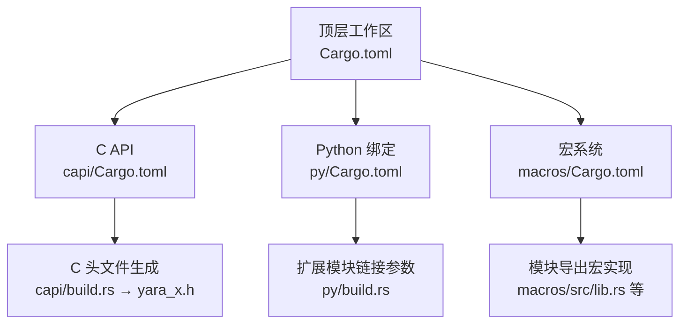
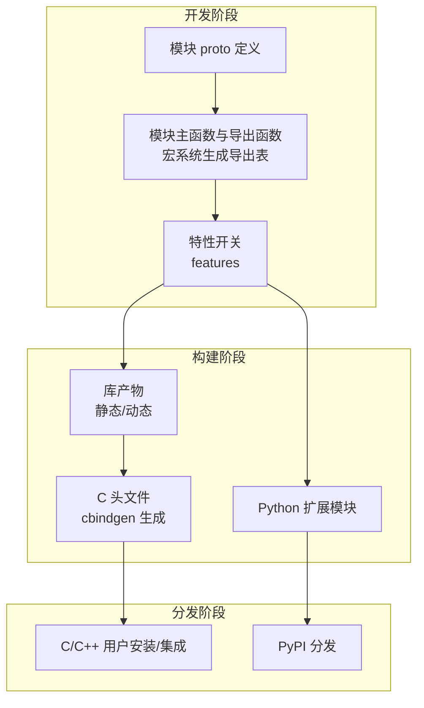
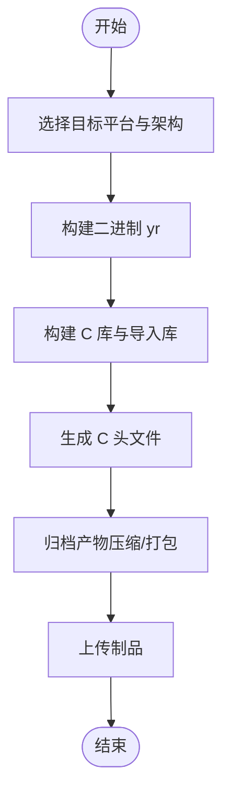
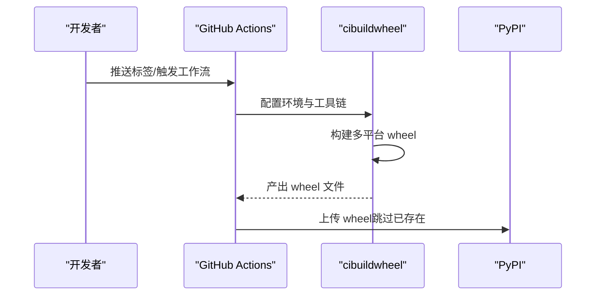
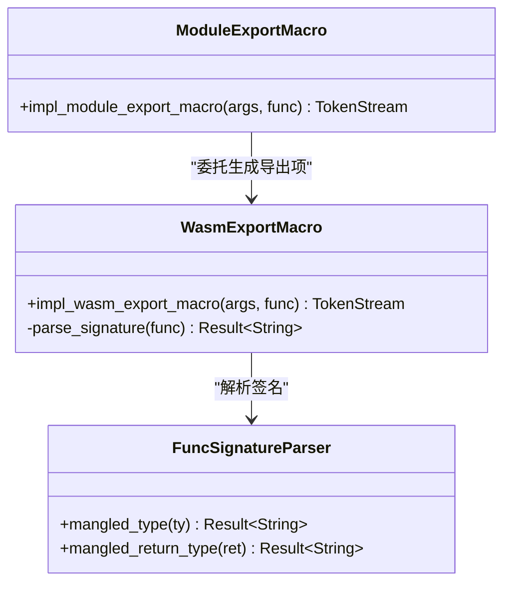
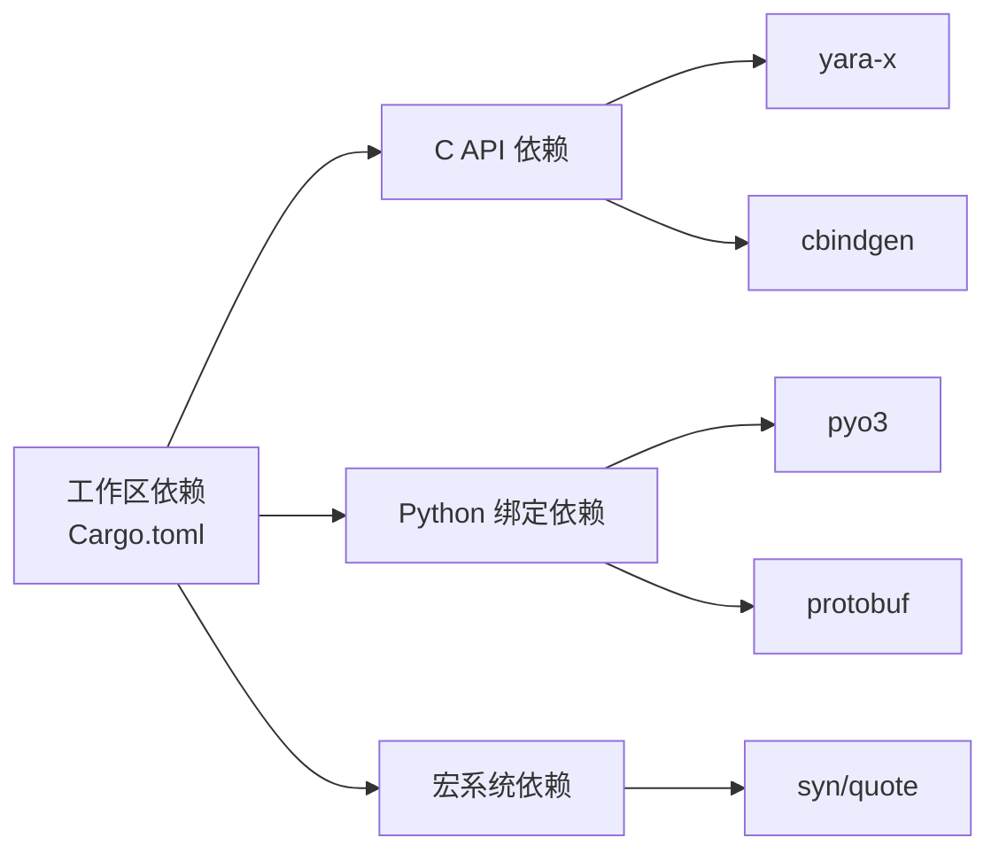

# 打包与分发

<cite>
**本文引用的文件**
- [Cargo.toml](file://yara-x/Cargo.toml)
- [capi/Cargo.toml](file://yara-x/capi/Cargo.toml)
- [py/Cargo.toml](file://yara-x/py/Cargo.toml)
- [macros/Cargo.toml](file://yara-x/macros/Cargo.toml)
- [macros/src/lib.rs](file://yara-x/macros/src/lib.rs)
- [macros/src/module_export.rs](file://yara-x/macros/src/module_export.rs)
- [macros/src/wasm_export.rs](file://yara-x/macros/src/wasm_export.rs)
- [capi/include/yara_x.h](file://yara-x/capi/include/yara_x.h)
- [capi/build.rs](file://yara-x/capi/build.rs)
- [py/build.rs](file://yara-x/py/build.rs)
- [docs/ModuleDeveloperGuide.md](file://yara-x/docs/ModuleDeveloperGuide.md)
- [.github/workflows/release.yaml](file://yara-x/.github/workflows/release.yaml)
</cite>

## 目录
1. [简介](#简介)
2. [项目结构](#项目结构)
3. [核心组件](#核心组件)
4. [架构总览](#架构总览)
5. [详细组件分析](#详细组件分析)
6. [依赖关系分析](#依赖关系分析)
7. [性能考量](#性能考量)
8. [故障排查指南](#故障排查指南)
9. [结论](#结论)
10. [附录](#附录)

## 简介
本章节聚焦于“自定义模块”的打包、分发与安装流程，覆盖以下主题：
- 不同平台下的打包方法：静态库、动态库与 WASM 模块的构建要点
- 模块分发最佳实践：版本管理、兼容性与依赖处理
- 安装方式：系统级安装、用户级安装与运行时加载
- 模块发现与注册机制：路径配置与环境变量
- 更新与卸载流程
- 模块签名与安全验证（如适用）

本指南以仓库中的多语言绑定与 C API 为依据，结合工作流与宏系统，给出可操作的流程与建议。

## 项目结构
yara-x 采用多 crate 工作区组织，其中与模块打包、分发直接相关的核心目录与文件如下：
- 工作区与特性开关：顶层工作区配置与各子 crate 的特性控制
- C API 与头文件生成：通过 cbindgen 自动生成 C 头文件
- Python 绑定：使用扩展模块形式分发
- 模块宏系统：用于声明模块导出函数与 WASM 导出符号
- 发布工作流：跨平台二进制与包制品的自动化构建与上传

图表来源
- [Cargo.toml:17-30](file://yara-x/Cargo.toml#L17-L30)
- [capi/Cargo.toml:14-47](file://yara-x/capi/Cargo.toml#L14-L47)
- [py/Cargo.toml:18-66](file://yara-x/py/Cargo.toml#L18-L66)
- [macros/Cargo.toml:1-18](file://yara-x/macros/Cargo.toml#L1-L18)
- [capi/build.rs:1-19](file://yara-x/capi/build.rs#L1-L19)
- [py/build.rs:1-4](file://yara-x/py/build.rs#L1-L4)
- [macros/src/lib.rs:104-302](file://yara-x/macros/src/lib.rs#L104-L302)

章节来源
- [Cargo.toml:17-30](file://yara-x/Cargo.toml#L17-L30)
- [capi/Cargo.toml:14-47](file://yara-x/capi/Cargo.toml#L14-L47)
- [py/Cargo.toml:18-66](file://yara-x/py/Cargo.toml#L18-L66)
- [macros/Cargo.toml:1-18](file://yara-x/macros/Cargo.toml#L1-L18)
- [capi/build.rs:1-19](file://yara-x/capi/build.rs#L1-L19)
- [py/build.rs:1-4](file://yara-x/py/build.rs#L1-L4)
- [macros/src/lib.rs:104-302](file://yara-x/macros/src/lib.rs#L104-L302)

## 核心组件
- 工作区与特性开关
  - 顶层工作区统一版本、特性与依赖；各子 crate 通过特性控制模块是否编译与启用
  - C API crate 提供静态库与动态库两种产物类型，并支持特性开关
  - Python 绑定 crate 通过扩展模块形式输出，包含多个模块特性开关
- C API 头文件生成
  - 使用 cbindgen 在构建时自动生成 C 头文件，确保 ABI 稳定
- 模块宏系统
  - 提供模块导出与 WASM 导出的派生宏，负责生成导出表与名称修饰
- 发布工作流
  - 自动化构建跨平台二进制、C 库与 Python 包，并上传到发布页或 PyPI

章节来源
- [Cargo.toml:17-30](file://yara-x/Cargo.toml#L17-L30)
- [capi/Cargo.toml:14-47](file://yara-x/capi/Cargo.toml#L14-L47)
- [py/Cargo.toml:18-66](file://yara-x/py/Cargo.toml#L18-L66)
- [capi/build.rs:1-19](file://yara-x/capi/build.rs#L1-L19)
- [macros/src/lib.rs:104-302](file://yara-x/macros/src/lib.rs#L104-L302)

## 架构总览
下图展示模块开发到分发的关键路径：从模块源码与 proto 定义，经由宏系统与特性开关，生成模块产物；随后通过 C API 或 Python 绑定进行分发。

图表来源
- [docs/ModuleDeveloperGuide.md:415-464](file://yara-x/docs/ModuleDeveloperGuide.md#L415-L464)
- [capi/Cargo.toml:40-47](file://yara-x/capi/Cargo.toml#L40-L47)
- [py/Cargo.toml:18-66](file://yara-x/py/Cargo.toml#L18-L66)
- [capi/build.rs:1-19](file://yara-x/capi/build.rs#L1-L19)

章节来源
- [docs/ModuleDeveloperGuide.md:415-464](file://yara-x/docs/ModuleDeveloperGuide.md#L415-L464)
- [capi/Cargo.toml:40-47](file://yara-x/capi/Cargo.toml#L40-L47)
- [py/Cargo.toml:18-66](file://yara-x/py/Cargo.toml#L18-L66)
- [capi/build.rs:1-19](file://yara-x/capi/build.rs#L1-L19)

## 详细组件分析

### C API 与静态/动态库打包
- 产物类型
  - C API crate 明确声明了静态库与动态库两种产物类型，便于在不同场景复用
- 头文件生成
  - 构建脚本调用 cbindgen 生成 C 头文件，确保接口稳定
- 特性开关
  - 支持启用原生代码序列化、规则剖析等特性，影响产物行为与大小
- 平台打包
  - 发布工作流针对 Linux、macOS、Windows 三类平台分别构建二进制与 C 库，并按目标架构打包

图表来源
- [.github/workflows/release.yaml:67-95](file://yara-x/.github/workflows/release.yaml#L67-L95)
- [capi/Cargo.toml:40-47](file://yara-x/capi/Cargo.toml#L40-L47)
- [capi/build.rs:1-19](file://yara-x/capi/build.rs#L1-L19)

章节来源
- [capi/Cargo.toml:40-47](file://yara-x/capi/Cargo.toml#L40-L47)
- [capi/build.rs:1-19](file://yara-x/capi/build.rs#L1-L19)
- [.github/workflows/release.yaml:67-95](file://yara-x/.github/workflows/release.yaml#L67-L95)

### Python 绑定与分发
- 产物类型
  - Python 绑定 crate 以扩展模块形式输出，适配多 Python 版本与平台
- 特性开关
  - 通过特性开启各类模块（如 console、elf、pe 等），默认启用一组常用模块
- 分发流程
  - 发布工作流使用 cibuildwheel 构建多平台 wheel，并上传至 PyPI

图表来源
- [.github/workflows/release.yaml:168-202](file://yara-x/.github/workflows/release.yaml#L168-L202)
- [py/Cargo.toml:18-66](file://yara-x/py/Cargo.toml#L18-L66)

章节来源
- [py/Cargo.toml:18-66](file://yara-x/py/Cargo.toml#L18-L66)
- [.github/workflows/release.yaml:168-202](file://yara-x/.github/workflows/release.yaml#L168-L202)

### 模块宏系统与导出机制
- 模块导出宏
  - 将 Rust 函数转换为可在 YARA 规则中调用的形式，内部通过 WASM 导出宏实现
- WASM 导出宏
  - 解析函数签名，生成名称修饰与导出表项，支持公共可见与方法归属
- 类型约束
  - 对函数参数与返回值类型有严格限制，确保与 YARA 运行时交互的稳定性

图表来源
- [macros/src/module_export.rs:47-111](file://yara-x/macros/src/module_export.rs#L47-L111)
- [macros/src/wasm_export.rs:261-319](file://yara-x/macros/src/wasm_export.rs#L261-L319)
- [macros/src/wasm_export.rs:170-210](file://yara-x/macros/src/wasm_export.rs#L170-L210)

章节来源
- [macros/src/lib.rs:104-302](file://yara-x/macros/src/lib.rs#L104-L302)
- [macros/src/module_export.rs:47-111](file://yara-x/macros/src/module_export.rs#L47-L111)
- [macros/src/wasm_export.rs:261-319](file://yara-x/macros/src/wasm_export.rs#L261-L319)

### 模块开发与构建流程（基于文档）
- proto 定义与模块选项
  - 通过 yara.module_options 指定模块名、根消息、Rust 模块与特性开关
- 主函数与导出函数
  - 使用 #[module_main] 声明入口；使用 #[module_export] 暴露函数
- 特性开关与默认启用
  - 在 lib/Cargo.toml 中添加特性并在 default 列表中启用
- 构建命令
  - 可通过 --features 指定启用特定模块

章节来源
- [docs/ModuleDeveloperGuide.md:415-464](file://yara-x/docs/ModuleDeveloperGuide.md#L415-L464)
- [docs/ModuleDeveloperGuide.md:476-488](file://yara-x/docs/ModuleDeveloperGuide.md#L476-L488)

## 依赖关系分析
- 工作区统一依赖与版本
  - 顶层工作区集中声明依赖版本，保证一致性
- 子 crate 依赖
  - C API 依赖 yara-x 与 cbindgen；Python 绑定依赖 pyo3、protobuf 等
- 宏系统
  - 提供派生宏与属性宏，减少样板代码，提升模块开发效率

图表来源
- [Cargo.toml:33-115](file://yara-x/Cargo.toml#L33-L115)
- [capi/Cargo.toml:44-49](file://yara-x/capi/Cargo.toml#L44-L49)
- [py/Cargo.toml:52-66](file://yara-x/py/Cargo.toml#L52-L66)
- [macros/Cargo.toml:14-18](file://yara-x/macros/Cargo.toml#L14-L18)

章节来源
- [Cargo.toml:33-115](file://yara-x/Cargo.toml#L33-L115)
- [capi/Cargo.toml:44-49](file://yara-x/capi/Cargo.toml#L44-L49)
- [py/Cargo.toml:52-66](file://yara-x/py/Cargo.toml#L52-L66)
- [macros/Cargo.toml:14-18](file://yara-x/macros/Cargo.toml#L14-L18)

## 性能考量
- 发布配置
  - 提供 release-lto 配置，启用链接时优化与单代码单元，减小体积并提升性能
- 编译器优化
  - 开发配置对解析器启用基础优化，避免递归导致栈溢出
- C API 行为
  - 原生代码序列化特性可减少运行时开销，但会增大序列化体积

章节来源
- [Cargo.toml:117-135](file://yara-x/Cargo.toml#L117-L135)
- [capi/Cargo.toml:19-29](file://yara-x/capi/Cargo.toml#L19-L29)

## 故障排查指南
- C 头文件未生成
  - 检查 cbindgen 是否正确安装与执行；确认构建脚本输出路径
- Python 扩展模块缺失或不可用
  - 确认 cibuildwheel 与测试命令配置；检查平台与架构是否被跳过
- 发布版本不一致
  - 校验标签与包版本号一致性；确保工作流中版本提取逻辑正确
- 模块未被构建
  - 确认特性开关已在 lib/Cargo.toml 中定义且加入 default 列表

章节来源
- [capi/build.rs:1-19](file://yara-x/capi/build.rs#L1-L19)
- [.github/workflows/release.yaml:56-64](file://yara-x/.github/workflows/release.yaml#L56-L64)
- [py/build.rs:1-4](file://yara-x/py/build.rs#L1-L4)

## 结论
- yara-x 的模块打包与分发围绕工作区特性、C API 与 Python 绑定展开
- 通过宏系统与特性开关，开发者可以灵活地扩展模块能力并控制产物规模
- 跨平台发布工作流确保二进制与包制品的一致性与可追溯性
- 实践中应重视版本管理、兼容性与依赖处理，以保障模块生态的稳定性

## 附录

### 不同平台下的打包方法
- Windows
  - 使用 cargo-c 构建 C 库与导入库，并随二进制一起打包
- Linux/macOS
  - 构建通用二进制并打包为压缩归档

章节来源
- [.github/workflows/release.yaml:72-95](file://yara-x/.github/workflows/release.yaml#L72-L95)

### 模块分发最佳实践
- 版本管理
  - 使用语义化版本；发布前校验标签与包版本一致
- 兼容性
  - 通过特性开关控制模块启用范围；为不同平台提供对应产物
- 依赖处理
  - 在工作区集中管理依赖版本；子 crate 仅声明必要依赖

章节来源
- [Cargo.toml:33-115](file://yara-x/Cargo.toml#L33-L115)
- [.github/workflows/release.yaml:56-64](file://yara-x/.github/workflows/release.yaml#L56-L64)

### 安装方法与运行时加载
- 系统级安装
  - 通过发行包提供的二进制与 C 库进行安装
- 用户级安装
  - Python 包可通过 pip 安装；扩展模块自动可用
- 运行时加载
  - C API 通过动态库加载；Python 绑定作为扩展模块直接导入

章节来源
- [.github/workflows/release.yaml:72-95](file://yara-x/.github/workflows/release.yaml#L72-L95)
- [py/Cargo.toml:18-66](file://yara-x/py/Cargo.toml#L18-L66)

### 模块发现与注册机制
- 路径配置
  - C API 提供包含目录与模块忽略/禁止接口，便于规则编译时定位模块
- 环境变量
  - 发布工作流中通过环境变量传递构建标志与工具链信息

章节来源
- [capi/include/yara_x.h:329-410](file://yara-x/capi/include/yara_x.h#L329-L410)
- [.github/workflows/release.yaml:68-78](file://yara-x/.github/workflows/release.yaml#L68-L78)

### 更新与卸载流程
- 更新
  - 重新构建并替换二进制、C 库或 Python 包；保持版本号一致
- 卸载
  - 删除对应二进制、库文件或卸载 Python 包

章节来源
- [.github/workflows/release.yaml:204-223](file://yara-x/.github/workflows/release.yaml#L204-L223)
- [.github/workflows/release.yaml:249-270](file://yara-x/.github/workflows/release.yaml#L249-L270)

### 模块签名与安全验证
- 当前仓库未提供模块签名与安全验证的具体实现
- 建议在外部流程中引入签名与完整性校验，以增强分发安全性

[本节为概念性建议，不直接分析具体文件]