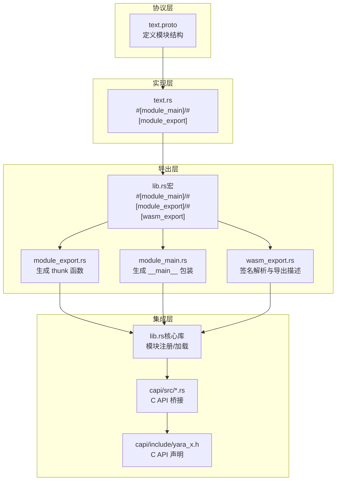
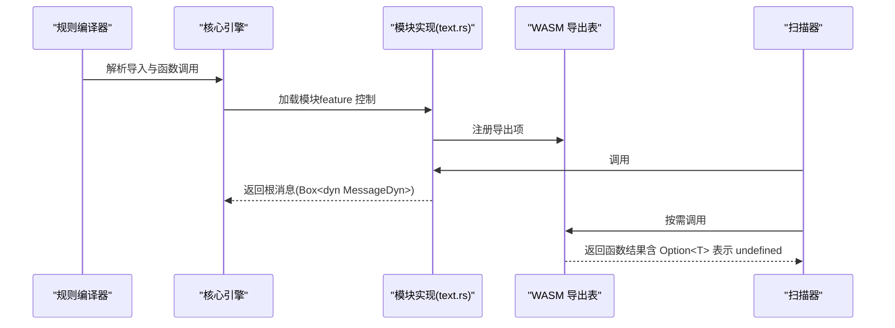
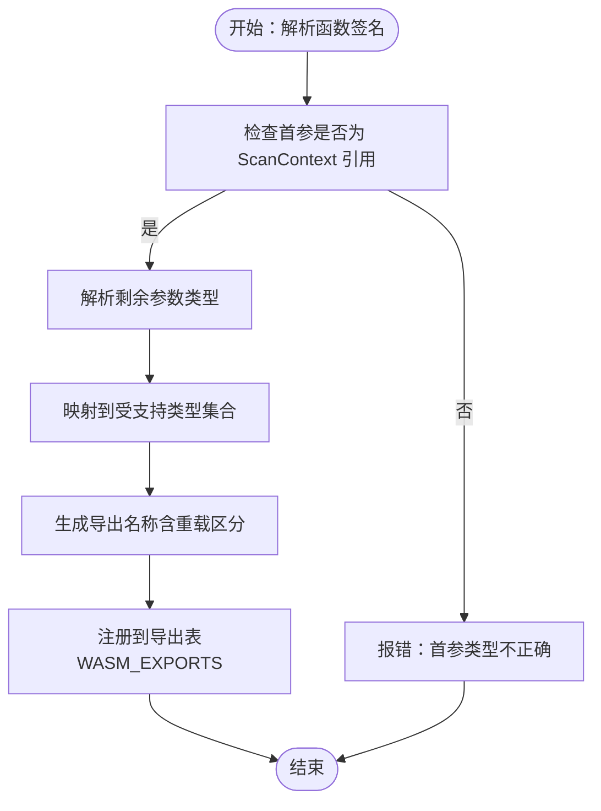
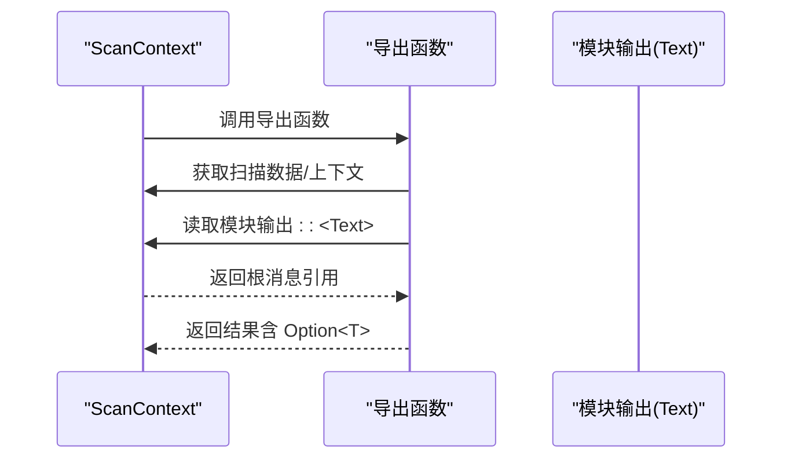
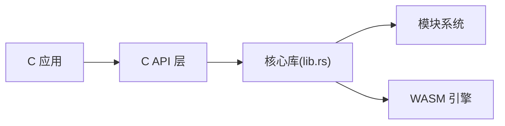
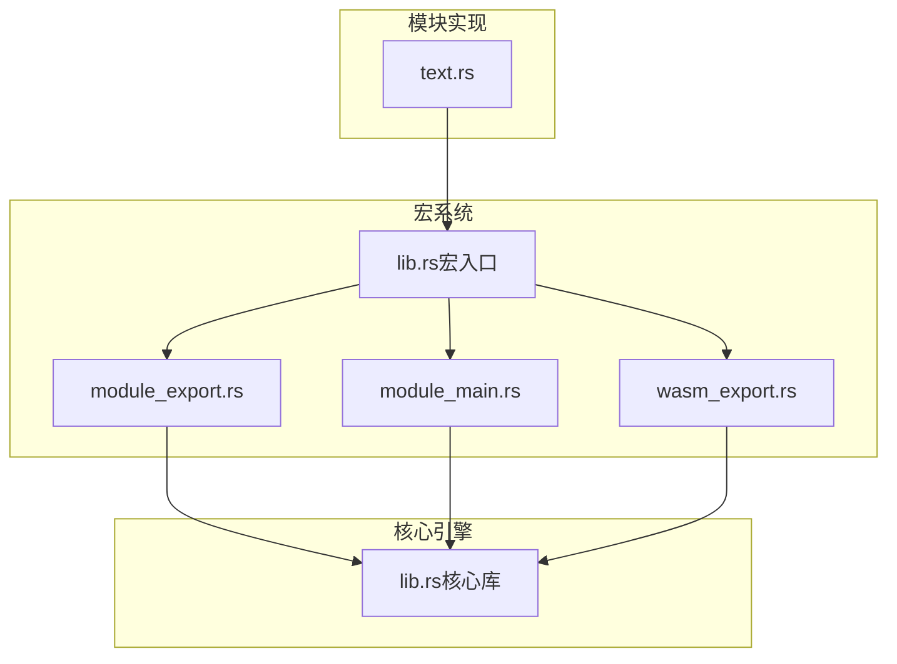

# 模块实现指南

<cite>
**本文引用的文件**
- [ModuleDeveloperGuide.md](file://docs/ModuleDeveloperGuide.md)
- [lib.rs（宏）](file://macros/src/lib.rs)
- [module_export.rs（宏实现）](file://macros/src/module_export.rs)
- [module_main.rs（宏实现）](file://macros/src/module_main.rs)
- [wasm_export.rs（宏实现）](file://macros/src/wasm_export.rs)
- [lib.rs（核心库入口）](file://lib/src/lib.rs)
- [yara_x.h（C API 头文件）](file://capi/include/yara_x.h)
- [lib.rs（C API 实现）](file://capi/src/lib.rs)
- [rule.rs（C API 规则相关）](file://capi/src/rule.rs)
- [rules.rs（C API 规则集合相关）](file://capi/src/rules.rs)
- [scanner.rs（C API 扫描器相关）](file://capi/src/scanner.rs)
- [compiler.rs（C API 编译器相关）](file://capi/src/compiler.rs)
- [pattern.rs（C API 模式相关）](file://capi/src/pattern.rs)
- [metadata.rs（C API 元数据相关）](file://capi/src/metadata.rs)
- [tests.rs（C API 测试）](file://capi/src/tests.rs)
- [text.proto（示例模块协议）](file://lib/src/modules/protos/text.proto)
- [text.rs（示例模块实现）](file://lib/src/modules/text.rs)
</cite>

## 目录
1. [简介](#简介)
2. [项目结构](#项目结构)
3. [核心组件](#核心组件)
4. [架构总览](#架构总览)
5. [详细组件分析](#详细组件分析)
6. [依赖关系分析](#依赖关系分析)
7. [性能考虑](#性能考虑)
8. [故障排除指南](#故障排除指南)
9. [结论](#结论)
10. [附录](#附录)

## 简介
本指南面向希望为 YARA-X 开发自定义模块的开发者，系统阐述模块接口设计原则、实现方法与最佳实践。内容涵盖：
- 模块接口设计：函数签名、参数类型、返回值格式与可选值语义
- 与核心引擎交互：数据传递、状态管理、错误处理
- 不同类型模块的实现模式：文件解析、计算、转换
- 功能测试与单元测试编写
- 性能优化与内存管理最佳实践

## 项目结构
YARA-X 的模块系统由“协议定义 + Rust 模块实现 + 宏导出 + 引擎集成”四部分组成：
- 协议层：使用 Protocol Buffers 定义模块根消息与字段
- 实现层：Rust 模块通过宏声明主函数与导出函数
- 导出层：宏将 Rust 函数转换为可在 WASM 中调用的导出项
- 集成层：核心引擎加载模块、执行扫描、收集输出

图表来源
- [text.proto](file://lib/src/modules/protos/text.proto)
- [text.rs](file://lib/src/modules/text.rs)
- [lib.rs（宏）](file://macros/src/lib.rs)
- [module_export.rs](file://macros/src/module_export.rs)
- [module_main.rs](file://macros/src/module_main.rs)
- [wasm_export.rs](file://macros/src/wasm_export.rs)
- [lib.rs（核心库入口）](file://lib/src/lib.rs)
- [yara_x.h](file://capi/include/yara_x.h)
- [lib.rs（C API）](file://capi/src/lib.rs)

章节来源
- [lib.rs（核心库入口）:1-178](file://lib/src/lib.rs#L1-L178)
- [ModuleDeveloperGuide.md:1-1113](file://docs/ModuleDeveloperGuide.md#L1-L1113)

## 核心组件
- 协议定义（Proto）
  - 使用 proto2/proto3 定义模块根消息与字段，支持格式化选项与可选/必需语义
  - 字段可配置为十六进制或时间戳等人类友好展示
- 主函数与导出函数
  - #[module_main] 标注模块主函数，接收扫描数据，返回根消息
  - #[module_export] 标注可从规则调用的函数，支持重命名与嵌套路径
  - #[wasm_export] 用于内部导出，签名解析与名称混淆生成
- 宏实现
  - module_export：生成 thunk 函数，将 Caller 转换为 ScanContext
  - module_main：生成 __main__ 包装，适配引擎调用约定
  - wasm_export：解析函数签名，生成导出描述项
- 引擎集成
  - 核心库负责模块注册、加载与调用
  - C API 提供跨语言桥接

章节来源
- [ModuleDeveloperGuide.md:40-414](file://docs/ModuleDeveloperGuide.md#L40-L414)
- [lib.rs（宏）:128-302](file://macros/src/lib.rs#L128-L302)
- [module_export.rs:15-111](file://macros/src/module_export.rs#L15-L111)
- [module_main.rs:7-23](file://macros/src/module_main.rs#L7-L23)
- [wasm_export.rs:261-319](file://macros/src/wasm_export.rs#L261-L319)
- [lib.rs（核心库入口）:61-71](file://lib/src/lib.rs#L61-L71)

## 架构总览
模块在引擎中的生命周期如下：
- 编译期：规则编译器识别模块导入与函数调用
- 加载期：核心库根据 feature 标记加载模块，注册导出项
- 运行期：扫描器对每个文件调用模块主函数，填充根消息；随后按需调用导出函数
- 输出期：模块输出与规则匹配结果合并，返回给调用方

图表来源
- [module_main.rs:10-16](file://macros/src/module_main.rs#L10-L16)
- [module_export.rs:33-46](file://macros/src/module_export.rs#L33-L46)
- [wasm_export.rs:261-319](file://macros/src/wasm_export.rs#L261-L319)
- [lib.rs（核心库入口）:61-71](file://lib/src/lib.rs#L61-L71)

## 详细组件分析

### 组件一：模块接口设计与实现
- 接口设计原则
  - 主函数签名固定：接收字节切片，返回根消息
  - 导出函数签名：首参为 ScanContext 引用，其余为受支持的基本类型
  - 可选返回值：使用 Option<T> 表示 undefined
- 参数与返回类型映射
  - 支持整数、浮点、布尔、字符串（RuntimeString）
  - 字符串必须使用 RuntimeString，避免直接使用标准字符串类型
- 函数命名与路径
  - 可通过 #[module_export(name = "...")] 指定导出路径
  - 支持同名重载（不同签名），由 YARA 在调用时选择

图表来源
- [wasm_export.rs:170-209](file://macros/src/wasm_export.rs#L170-L209)
- [lib.rs（宏）:232-302](file://macros/src/lib.rs#L232-L302)

章节来源
- [ModuleDeveloperGuide.md:466-746](file://docs/ModuleDeveloperGuide.md#L466-L746)
- [lib.rs（宏）:232-302](file://macros/src/lib.rs#L232-L302)
- [wasm_export.rs:261-319](file://macros/src/wasm_export.rs#L261-L319)

### 组件二：模块与核心引擎交互机制
- 数据传递
  - 主函数接收扫描数据字节切片，返回根消息
  - 导出函数通过 ScanContext 访问扫描数据与模块输出
- 状态管理
  - ScanContext 提供访问扫描数据与模块输出的方法
  - 模块输出可通过泛型方法获取，便于在函数中复用已提取信息
- 错误处理
  - 宏包装返回统一的错误类型，便于引擎捕获与传播
  - 导出函数返回 Option<T> 表示 undefined，避免异常

图表来源
- [ModuleDeveloperGuide.md:700-746](file://docs/ModuleDeveloperGuide.md#L700-L746)
- [module_export.rs:33-46](file://macros/src/module_export.rs#L33-L46)

章节来源
- [ModuleDeveloperGuide.md:700-746](file://docs/ModuleDeveloperGuide.md#L700-L746)
- [lib.rs（宏）:28-126](file://macros/src/lib.rs#L28-L126)

### 组件三：不同类型模块的实现模式
- 文件解析模块（示例：text）
  - 主函数解析输入数据，统计行数、词数等，填充根消息
  - 导出函数按需提供查询能力（如获取第 N 行）
- 计算模块
  - 基于模块输出进行二次计算（如平均词数/行）
  - 利用 Option<T> 表示缺失值场景
- 转换模块
  - 将扫描数据片段转换为字符串或派生结构
  - 注意 RuntimeString 的变体选择与内存拷贝策略

章节来源
- [ModuleDeveloperGuide.md:311-410](file://docs/ModuleDeveloperGuide.md#L311-L410)
- [text.proto:57-75](file://lib/src/modules/protos/text.proto#L57-L75)
- [text.rs:311-410](file://lib/src/modules/text.rs#L311-L410)

### 组件四：模块功能测试与单元测试编写
- 测试数据组织
  - 使用测试数据集模拟不同平台与归档格式
  - 支持 Linux/MacOS/其他操作系统的测试数据准备与还原
- 测试流程
  - 编译规则 → 加载模块 → 扫描样本 → 断言输出
  - 对导出函数进行边界条件与异常分支测试
- 示例参考
  - 文档提供了测试数据打包与解包的指导

章节来源
- [ModuleDeveloperGuide.md:29-38](file://docs/ModuleDeveloperGuide.md#L29-L38)

### 组件五：C API 与跨语言集成
- C API 声明
  - 头文件定义编译器、扫描器、规则、模式、元数据等接口
- C API 实现
  - 提供编译、扫描、规则枚举、模式匹配等函数
  - 内部通过核心库实现，向 C 语言暴露稳定 ABI
- 集成建议
  - 在 C 应用中初始化引擎、加载规则、执行扫描
  - 通过 C API 获取匹配结果与模块输出

图表来源
- [yara_x.h](file://capi/include/yara_x.h)
- [lib.rs（C API）](file://capi/src/lib.rs)
- [compiler.rs](file://capi/src/compiler.rs)
- [scanner.rs](file://capi/src/scanner.rs)
- [rules.rs](file://capi/src/rules.rs)
- [rule.rs](file://capi/src/rule.rs)
- [pattern.rs](file://capi/src/pattern.rs)
- [metadata.rs](file://capi/src/metadata.rs)
- [tests.rs](file://capi/src/tests.rs)

章节来源
- [yara_x.h](file://capi/include/yara_x.h)
- [lib.rs（C API）](file://capi/src/lib.rs)
- [lib.rs（核心库入口）:48-72](file://lib/src/lib.rs#L48-L72)

## 依赖关系分析
- 模块与宏的依赖
  - 模块实现依赖宏提供的属性与导出机制
  - 宏实现依赖签名解析与导出表注册
- 引擎与模块的耦合
  - 核心库负责模块加载与调用，保持低耦合高内聚
  - C API 作为外部集成入口，封装核心逻辑

图表来源
- [lib.rs（宏）:1-303](file://macros/src/lib.rs#L1-L303)
- [module_export.rs:1-112](file://macros/src/module_export.rs#L1-L112)
- [module_main.rs:1-24](file://macros/src/module_main.rs#L1-L24)
- [wasm_export.rs:1-415](file://macros/src/wasm_export.rs#L1-L415)
- [lib.rs（核心库入口）:1-178](file://lib/src/lib.rs#L1-L178)

章节来源
- [lib.rs（宏）:128-302](file://macros/src/lib.rs#L128-L302)
- [lib.rs（核心库入口）:61-71](file://lib/src/lib.rs#L61-L71)

## 性能考虑
- 字符串处理
  - 优先使用 RuntimeString::ScannedDataSlice 以避免不必要的拷贝
  - 对非扫描数据的字符串使用 RuntimeString::Rc，确保生命周期安全
- 可选值与 undefined
  - 使用 Option<T> 表达 undefined，减少无效计算
- 类型映射与签名
  - 合理选择参数与返回类型，避免不必要的装箱与拆箱
- 并发与资源
  - 模块实现应避免共享可变状态，减少锁竞争
  - 合理利用 feature 标记控制模块构建，降低默认开销

## 故障排除指南
- 常见问题
  - 首参类型错误：确保导出函数首参为 ScanContext 引用
  - 字符串类型错误：必须使用 RuntimeString，不可使用标准字符串类型
  - 可选值未正确处理：返回 None 时在规则中表现为 undefined
- 错误类型
  - 宏包装返回统一的模块错误类型，便于定位问题
  - C API 层提供稳定的错误传播机制

章节来源
- [wasm_export.rs:190-197](file://macros/src/wasm_export.rs#L190-L197)
- [lib.rs（宏）:232-302](file://macros/src/lib.rs#L232-L302)
- [lib.rs（核心库入口）:106-109](file://lib/src/lib.rs#L106-L109)

## 结论
通过协议定义、宏导出与引擎集成，YARA-X 为模块开发提供了清晰且强大的框架。遵循本文的接口设计原则、实现方法与最佳实践，可以高效地构建文件解析、计算与转换类模块，并在多语言环境中稳定运行。

## 附录
- 示例模块
  - text.proto：定义根消息与字段
  - text.rs：实现主函数与导出函数
- 开发流程
  - 定义协议 → 实现模块 → 构建与启用 feature → 编写测试 → 集成 C API

章节来源
- [text.proto:57-75](file://lib/src/modules/protos/text.proto#L57-L75)
- [text.rs:311-410](file://lib/src/modules/text.rs#L311-L410)
- [ModuleDeveloperGuide.md:415-464](file://docs/ModuleDeveloperGuide.md#L415-L464)