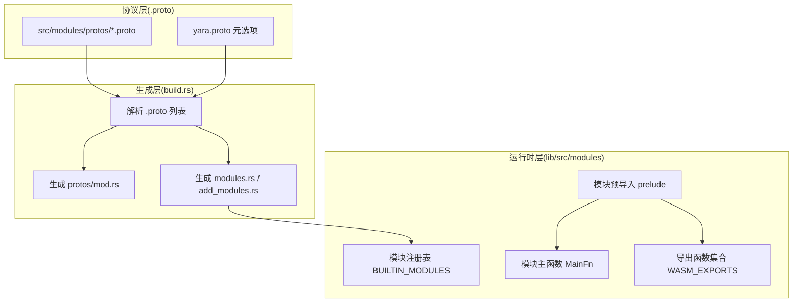
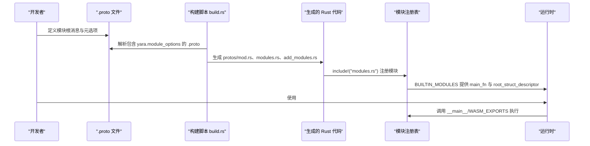
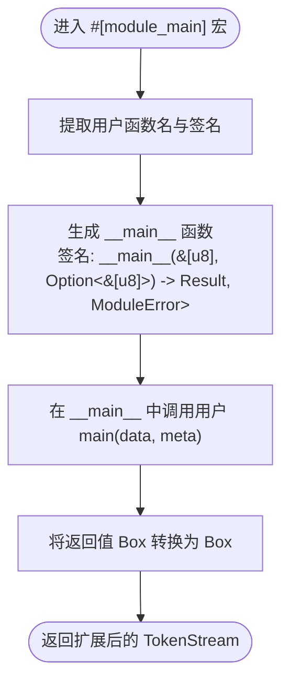
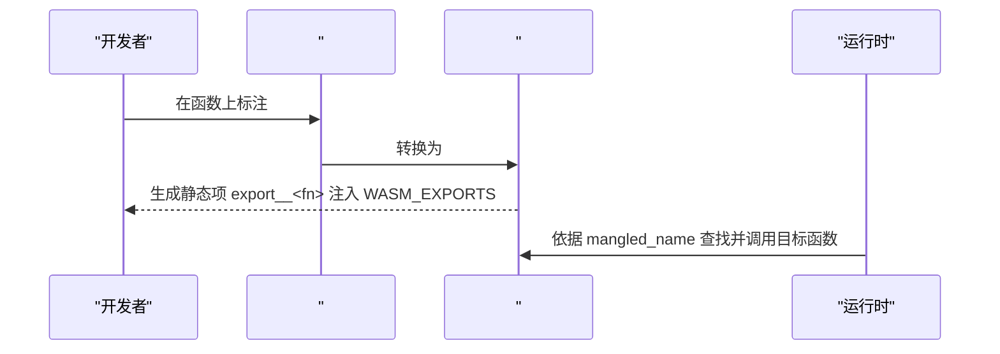
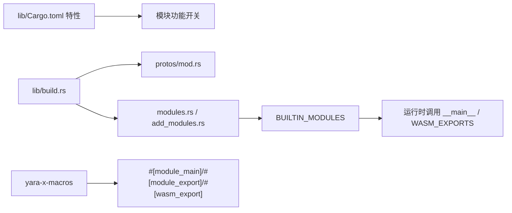

# 模块项目结构

<cite>
**本文引用的文件**
- [lib/Cargo.toml](file://lib/Cargo.toml)
- [lib/build.rs](file://lib/build.rs)
- [lib/src/modules/mod.rs](file://lib/src/modules/mod.rs)
- [macros/src/lib.rs](file://macros/src/lib.rs)
- [macros/src/module_main.rs](file://macros/src/module_main.rs)
- [macros/src/module_export.rs](file://macros/src/module_export.rs)
- [macros/src/wasm_export.rs](file://macros/src/wasm_export.rs)
- [docs/ModuleDeveloperGuide.md](file://docs/ModuleDeveloperGuide.md)
</cite>

## 目录
1. [引言](#引言)
2. [项目结构](#项目结构)
3. [核心组件](#核心组件)
4. [架构总览](#架构总览)
5. [详细组件分析](#详细组件分析)
6. [依赖关系分析](#依赖关系分析)
7. [性能考量](#性能考量)
8. [故障排查指南](#故障排查指南)
9. [结论](#结论)
10. [附录](#附录)

## 引言
本文件面向希望开发 YARA-X 自定义模块的开发者，系统性说明模块项目的结构设计与组织方式，涵盖：
- 模块 crate 的目录布局与 src 组织
- 模块声明与导出机制
- 标准 Cargo.toml 配置模板（含 crate 类型、依赖与特性）
- 模块主入口文件编写规范（#[module_main] 宏用法与初始化流程）
- 模块元数据定义与配置方法

## 项目结构
YARA-X 将模块系统分为三层：
- 协议层：以 .proto 文件描述模块结构与元数据
- 生成层：通过构建脚本解析 .proto 并生成 Rust 结构体与模块注册代码
- 运行时层：模块主函数与导出函数在运行时被调用



图表来源
- [lib/build.rs:13-142](file://lib/build.rs#L13-L142)
- [lib/src/modules/mod.rs:29-142](file://lib/src/modules/mod.rs#L29-L142)

章节来源
- [lib/build.rs:144-256](file://lib/build.rs#L144-L256)
- [lib/src/modules/mod.rs:8-27](file://lib/src/modules/mod.rs#L8-L27)

## 核心组件
- 协议与元数据：每个模块以 .proto 文件定义根消息与元选项，用于生成 Rust 结构体与模块注册信息。
- 构建脚本：扫描 protos 目录，解析包含 yara.module_options 的 .proto，生成模块注册与 Rust 模块入口。
- 模块预导入：统一导出模块开发所需的类型与宏，简化模块实现。
- 主函数宏 #[module_main]：将用户实现的 main 函数包装为统一签名的 __main__，供运行时调用。
- 导出函数宏 #[module_export]/#[wasm_export]：将 Rust 函数暴露给 YARA 规则或 WASM 调用。

章节来源
- [docs/ModuleDeveloperGuide.md:57-170](file://docs/ModuleDeveloperGuide.md#L57-L170)
- [lib/build.rs:13-142](file://lib/build.rs#L13-L142)
- [lib/src/modules/mod.rs:16-27](file://lib/src/modules/mod.rs#L16-L27)
- [macros/src/lib.rs:128-152](file://macros/src/lib.rs#L128-L152)
- [macros/src/module_main.rs:7-23](file://macros/src/module_main.rs#L7-L23)
- [macros/src/module_export.rs:47-111](file://macros/src/module_export.rs#L47-L111)
- [macros/src/wasm_export.rs:261-319](file://macros/src/wasm_export.rs#L261-L319)

## 架构总览
模块从 .proto 到运行时的关键流程如下：



图表来源
- [lib/build.rs:13-142](file://lib/build.rs#L13-L142)
- [lib/src/modules/mod.rs:29-142](file://lib/src/modules/mod.rs#L29-L142)
- [macros/src/module_main.rs:10-16](file://macros/src/module_main.rs#L10-L16)
- [macros/src/module_export.rs:103-108](file://macros/src/module_export.rs#L103-L108)

## 详细组件分析

### 组件一：模块主入口与宏 #[module_main]
- 作用：将用户实现的 main 函数包装为统一签名的 __main__，返回 Box<dyn MessageDyn>，供运行时调用。
- 约束：每个模块只能有一个 #[module_main] 标记的函数；函数签名需为 fn main(&[u8], Option<&[u8]>) -> YourRootProto。
- 生成逻辑：宏在原函数基础上追加 __main__，内部调用用户 main，并将结果适配为动态分发的消息类型。



图表来源
- [macros/src/module_main.rs:7-23](file://macros/src/module_main.rs#L7-L23)

章节来源
- [macros/src/lib.rs:128-152](file://macros/src/lib.rs#L128-L152)
- [macros/src/module_main.rs:7-23](file://macros/src/module_main.rs#L7-L23)
- [docs/ModuleDeveloperGuide.md:351-373](file://docs/ModuleDeveloperGuide.md#L351-L373)

### 组件二：模块导出函数宏 #[module_export] 与 #[wasm_export]
- #[module_export]：用于将 Rust 函数暴露给 YARA 规则，支持重载与路径命名（如 name = "ns.fn"）。
- #[wasm_export]：底层实现，负责生成函数签名的“名称混淆”字符串（mangled_name），并注册到全局切片 WASM_EXPORTS。
- 二者关系：#[module_export] 是 #[wasm_export] 的薄层封装，自动转换第一个参数类型为 &mut Caller<'_, ScanContext>，并在运行时通过 thunk 调用原始函数。



图表来源
- [macros/src/module_export.rs:47-111](file://macros/src/module_export.rs#L47-L111)
- [macros/src/wasm_export.rs:261-319](file://macros/src/wasm_export.rs#L261-L319)

章节来源
- [macros/src/lib.rs:290-302](file://macros/src/lib.rs#L290-L302)
- [macros/src/module_export.rs:47-111](file://macros/src/module_export.rs#L47-L111)
- [macros/src/wasm_export.rs:170-210](file://macros/src/wasm_export.rs#L170-L210)

### 组件三：模块元数据与注册表
- 元数据：在 .proto 文件中通过 option (yara.module_options) 声明模块名称、根消息、Rust 模块名与 Cargo 特性。
- 注册：构建脚本解析所有 .proto，筛选包含 yara.module_options 的文件，生成 modules.rs 与 add_modules.rs，并在运行时 include 进模块注册表。
- 运行时：BUILTIN_MODULES 保存每个模块的 main_fn、rust_module_name 与 root_struct_descriptor，供扫描器按需调用。

```mermaid
classDiagram
class Module {
+Option~MainFn~ main_fn
+Option~&'static str~ rust_module_name
+MessageDescriptor root_struct_descriptor
}
class BUILTIN_MODULES {
<<static>>
+insert(name, Module)
+iter() Iterator
}
class add_module! {
<<macro>>
+include!("add_modules.rs")
}
BUILTIN_MODULES --> Module : "存储"
add_module! --> BUILTIN_MODULES : "注册"
```

图表来源
- [lib/src/modules/mod.rs:54-99](file://lib/src/modules/mod.rs#L54-L99)
- [lib/src/modules/mod.rs:124-142](file://lib/src/modules/mod.rs#L124-L142)
- [lib/build.rs:47-142](file://lib/build.rs#L47-L142)

章节来源
- [docs/ModuleDeveloperGuide.md:120-169](file://docs/ModuleDeveloperGuide.md#L120-L169)
- [lib/build.rs:13-142](file://lib/build.rs#L13-L142)
- [lib/src/modules/mod.rs:124-142](file://lib/src/modules/mod.rs#L124-L142)

### 组件四：模块预导入与类型体系
- 预导入：模块实现统一通过 prelude 导入常用类型与宏，避免重复导入。
- 类型体系：RuntimeString、FixedLenString、Lowercase 等类型用于字符串处理；ScanContext 提供扫描上下文访问能力。

章节来源
- [lib/src/modules/mod.rs:16-27](file://lib/src/modules/mod.rs#L16-L27)
- [docs/ModuleDeveloperGuide.md:615-700](file://docs/ModuleDeveloperGuide.md#L615-L700)

## 依赖关系分析
- 构建期依赖：build.rs 依赖 protobuf 解析器与代码生成器，扫描 src/modules/protos 下的 .proto 文件。
- 运行时依赖：模块注册表依赖 protos/mod.rs（由构建期生成），模块主函数与导出函数依赖宏包 yara-x-macros。
- 特性控制：各模块通过独立的 Cargo 特性开关，默认特性列表可控制是否启用某模块。



图表来源
- [lib/Cargo.toml:104-224](file://lib/Cargo.toml#L104-L224)
- [lib/build.rs:149-230](file://lib/build.rs#L149-L230)
- [lib/src/modules/mod.rs:29-142](file://lib/src/modules/mod.rs#L29-L142)
- [macros/src/lib.rs:104-152](file://macros/src/lib.rs#L104-L152)

章节来源
- [lib/Cargo.toml:104-224](file://lib/Cargo.toml#L104-L224)
- [lib/build.rs:149-230](file://lib/build.rs#L149-L230)

## 性能考量
- 原生代码序列化：可通过特性 native-code-serialization 将平台原生代码内嵌至规则序列化产物，减少加载时间但增大体积。
- 并行编译：parallel-compilation 特性开启后可并行编译大量 WASM 代码，显著降低大型规则集编译时间。
- 默认启用模块：默认特性列表集中启用了多个模块，若仅需少数模块，建议显式禁用其余模块以减小二进制体积与编译时间。

章节来源
- [lib/Cargo.toml:75-81](file://lib/Cargo.toml#L75-L81)
- [lib/Cargo.toml:205-224](file://lib/Cargo.toml#L205-L224)

## 故障排查指南
- 构建期问题
  - 未生成 modules.rs 或 add_modules.rs：检查环境变量 YRX_REGENERATE_MODULES_RS 是否为 false；docs.rs 环境下不会写入文件。
  - .proto 未被识别：确认 .proto 包含 yara.module_options 且字段完整（name/root_message/rust_module 可选）。
- 运行时问题
  - 模块未注册：确认模块对应的 Cargo 特性已启用，且 rust_module 名称与 .proto 中一致。
  - 导出函数签名不匹配：确保 #[wasm_export] 的第一个参数为 &mut Caller<'_, ScanContext>，后续参数类型符合支持清单。
  - 字符串类型错误：必须使用 RuntimeString，避免直接使用 String/&str/&[u8]。

章节来源
- [lib/build.rs:234-250](file://lib/build.rs#L234-L250)
- [lib/build.rs:251-256](file://lib/build.rs#L251-L256)
- [docs/ModuleDeveloperGuide.md:508-546](file://docs/ModuleDeveloperGuide.md#L508-L546)
- [macros/src/wasm_export.rs:170-210](file://macros/src/wasm_export.rs#L170-L210)

## 结论
YARA-X 的模块系统通过 .proto 元数据驱动，结合构建期代码生成与运行时注册机制，实现了模块的声明式定义与强类型导出。开发者只需遵循 #[module_main]/#[module_export] 的约定与 .proto 元选项配置，即可快速构建可被 YARA 规则使用的模块。

## 附录

### A. 标准 Cargo.toml 配置模板（模块侧）
- crate 类型：lib（proc-macro 由 yara-x-macros 提供）
- 依赖：yara-x-macros（版本与工作区保持一致）
- 特性：按需启用模块功能（如 crypto、nom 等）

章节来源
- [lib/Cargo.toml:283](file://lib/Cargo.toml#L283)

### B. 模块目录布局与 src 组织
- 协议层：src/modules/protos/*.proto，每个模块一个 .proto，包含 yara.module_options。
- 生成层：lib/build.rs 负责扫描与生成 modules.rs/add_modules.rs/protos/mod.rs。
- 运行时层：lib/src/modules/mod.rs 提供预导入与注册表，模块实现位于对应 Rust 模块中。

章节来源
- [lib/build.rs:149-230](file://lib/build.rs#L149-L230)
- [lib/src/modules/mod.rs:8-27](file://lib/src/modules/mod.rs#L8-L27)

### C. 模块主入口文件编写规范
- 必须导入模块预导入：use crate::modules::prelude::*;
- 导入生成的 protos 模块：use crate::modules::protos::<your_module>::*;
- 实现 #[module_main] 函数：fn main(data: &[u8]) -> YourRootProto
- 返回值：填充后的根消息类型实例

章节来源
- [docs/ModuleDeveloperGuide.md:311-323](file://docs/ModuleDeveloperGuide.md#L311-L323)
- [docs/ModuleDeveloperGuide.md:351-373](file://docs/ModuleDeveloperGuide.md#L351-L373)

### D. 模块元数据定义与配置方法
- 在 .proto 文件顶部添加 import "yara.proto"
- 使用 option (yara.module_options) 指定：
  - name：模块导入名
  - root_message：根消息全名（含包名）
  - rust_module：Rust 模块名（可选）
  - cargo_feature：特性名（可选）

章节来源
- [docs/ModuleDeveloperGuide.md:107-169](file://docs/ModuleDeveloperGuide.md#L107-L169)