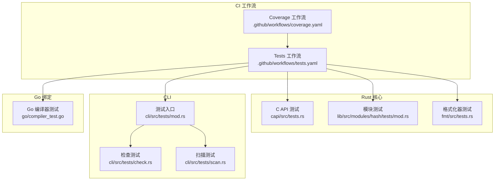
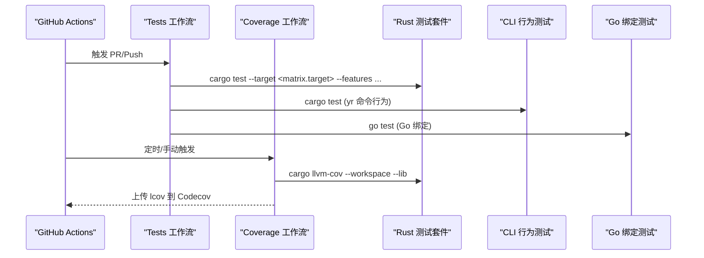
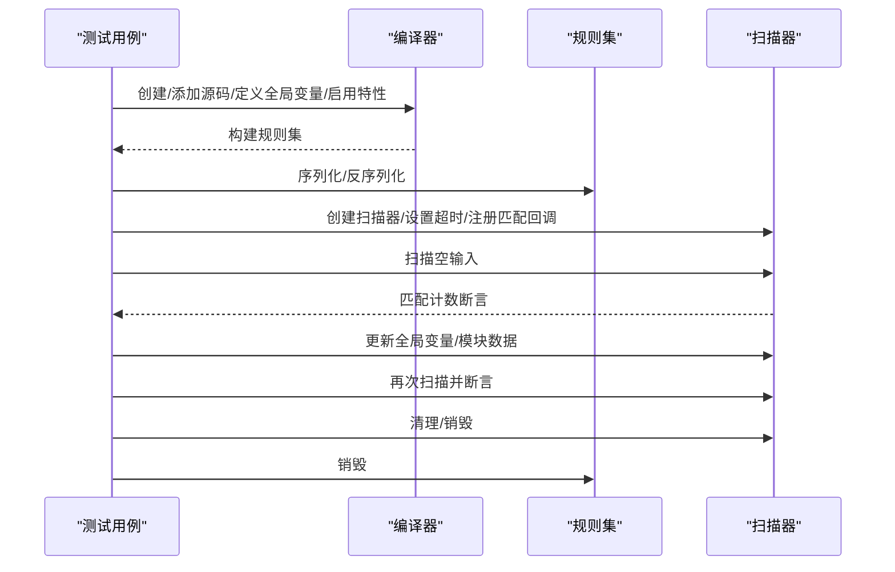
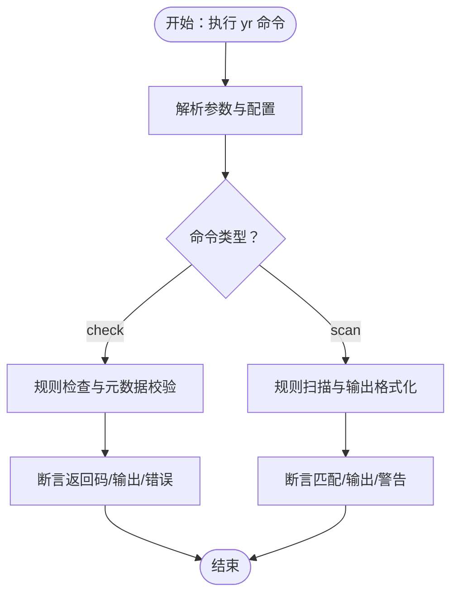
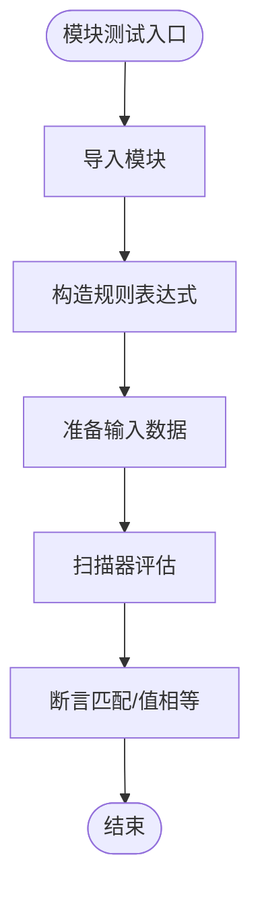
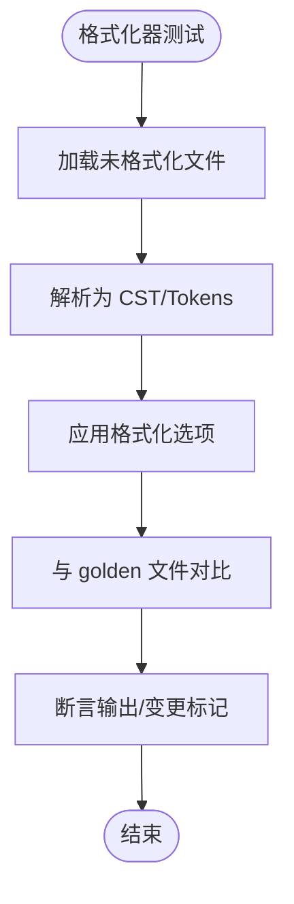
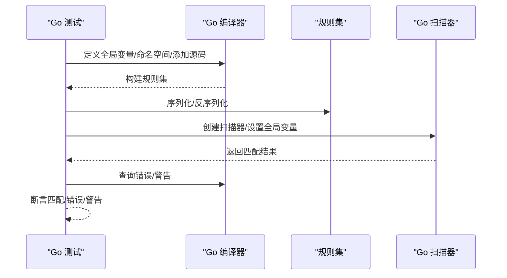
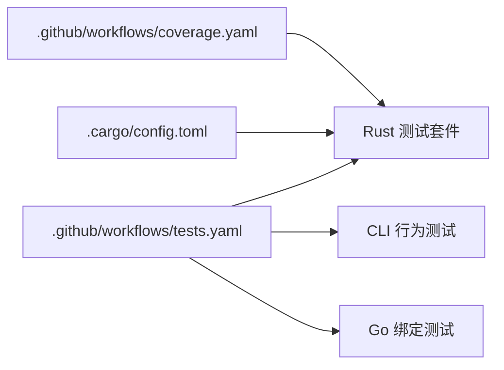

# 测试与调试

<cite>
**本文引用的文件**
- [tests.yaml](file://.github/workflows/tests.yaml)
- [coverage.yaml](file://.github/workflows/coverage.yaml)
- [config.toml](file://.cargo/config.toml)
- [capi 测试](file://capi/src/tests.rs)
- [CLI 检查测试](file://cli/src/tests/check.rs)
- [CLI 扫描测试](file://cli/src/tests/scan.rs)
- [格式化器测试](file://fmt/src/tests.rs)
- [哈希模块测试](file://lib/src/modules/hash/tests/mod.rs)
- [Go 编译器测试](file://go/compiler_test.go)
- [CLI 测试入口](file://cli/src/tests/mod.rs)
</cite>

## 目录
1. [简介](#简介)
2. [项目结构](#项目结构)
3. [核心组件](#核心组件)
4. [架构总览](#架构总览)
5. [详细组件分析](#详细组件分析)
6. [依赖分析](#依赖分析)
7. [性能考虑](#性能考虑)
8. [故障排查指南](#故障排查指南)
9. [结论](#结论)
10. [附录](#附录)

## 简介
本指南面向模块开发者与维护者，系统性地阐述 yara-x 的测试与调试实践，覆盖单元测试、集成测试、端到端测试、调试工具使用、常见问题诊断、测试覆盖率与质量保障流程，以及在持续集成（CI）中的自动化配置。文档以仓库内现有测试与工作流为依据，提供可操作的步骤与最佳实践。

## 项目结构
yara-x 在多语言与多子系统中均具备完善的测试体系：
- CLI 子系统：通过命令行行为测试验证规则检查、扫描、格式化等能力，并对输出与错误进行断言。
- 核心引擎（Rust）：针对 C API、模块功能、编译器与扫描器的行为进行单元与集成测试。
- Go 绑定：提供 Go 侧的编译器、扫描器与规则对象行为测试。
- 质量保障：通过 GitHub Actions 工作流执行跨平台测试与覆盖率生成。

图表来源
- [tests.yaml:1-148](file://.github/workflows/tests.yaml#L1-L148)
- [coverage.yaml:1-45](file://.github/workflows/coverage.yaml#L1-L45)
- [capi 测试:1-423](file://capi/src/tests.rs#L1-L423)
- [哈希模块测试:1-85](file://lib/src/modules/hash/tests/mod.rs#L1-L85)
- [格式化器测试:1-157](file://fmt/src/tests.rs#L1-L157)
- [CLI 测试入口:1-6](file://cli/src/tests/mod.rs#L1-L6)
- [CLI 检查测试:1-208](file://cli/src/tests/check.rs#L1-L208)
- [CLI 扫描测试:1-385](file://cli/src/tests/scan.rs#L1-L385)
- [Go 编译器测试:1-417](file://go/compiler_test.go#L1-L417)

章节来源
- [.github/workflows/tests.yaml:1-148](file://.github/workflows/tests.yaml#L1-L148)
- [.github/workflows/coverage.yaml:1-45](file://.github/workflows/coverage.yaml#L1-L45)

## 核心组件
- C API 行为与边界测试：涵盖编译、序列化/反序列化、扫描、模块数据注入、块扫描与错误处理。
- CLI 命令测试：覆盖规则检查、扫描、输出格式、变量定义、标签过滤、警告控制、递归路径处理等。
- 模块测试：以哈希模块为例，验证模块函数在不同输入范围与字符串上的正确性。
- 格式化器测试：验证空格、缩进、换行、对齐等格式化选项与批量 golden 测试。
- Go 绑定测试：覆盖命名空间、全局变量、模块忽略/禁用、包含语句、正则放宽、优化开关、慢模式告警、序列化/反序列化、错误与警告等。

章节来源
- [capi 测试:1-423](file://capi/src/tests.rs#L1-L423)
- [CLI 检查测试:1-208](file://cli/src/tests/check.rs#L1-L208)
- [CLI 扫描测试:1-385](file://cli/src/tests/scan.rs#L1-L385)
- [哈希模块测试:1-85](file://lib/src/modules/hash/tests/mod.rs#L1-L85)
- [格式化器测试:1-157](file://fmt/src/tests.rs#L1-L157)
- [Go 编译器测试:1-417](file://go/compiler_test.go#L1-L417)

## 架构总览
下图展示从 CI 到各测试子系统的调用关系与职责分工：

图表来源
- [tests.yaml:1-148](file://.github/workflows/tests.yaml#L1-L148)
- [coverage.yaml:1-45](file://.github/workflows/coverage.yaml#L1-L45)

## 详细组件分析

### C API 测试分析
- 测试要点
  - 全局变量与 JSON 变量定义、扫描器运行时更新与匹配结果联动。
  - 规则序列化/反序列化后仍可正常扫描。
  - 模块数据注入与清理机制，确保扫描前后状态一致。
  - 块扫描与 finish 流程，验证多次扫描与重置行为。
  - 错误码与错误消息断言，含源位置与上下文提示。
- 断言策略
  - 使用回调计数器统计匹配规则数量与元数据/标签/模式计数。
  - 对 last_error 进行非空判断与内容比对。
- 复杂度与性能
  - 单测关注行为正确性，不涉及大规模数据；建议在 CI 中启用多目标矩阵以覆盖平台差异。

图表来源
- [capi 测试:111-246](file://capi/src/tests.rs#L111-L246)

章节来源
- [capi 测试:1-423](file://capi/src/tests.rs#L1-L423)

### CLI 行为测试分析
- 检查命令（check）
  - 配置驱动的元数据类型校验与必填项检查，断言返回码与标准输出/错误。
  - 规则名正则约束与错误级别控制。
  - 配置字段未知时的错误提示。
- 扫描命令（scan）
  - 基础匹配、否定输出、按标签过滤、禁用特定警告、打印字符串/命名空间/元数据/标签。
  - 输出格式切换（如 NDJSON）、变量定义、控制台日志开关。
  - 忽略/禁用模块、递归路径处理、编译后规则文件扫描。
- 断言策略
  - 使用命令行断言库对退出码、标准输出/错误进行精确匹配或包含性断言。
  - 临时目录与规则文件写入，确保测试隔离与可重复。

图表来源
- [CLI 检查测试:1-208](file://cli/src/tests/check.rs#L1-L208)
- [CLI 扫描测试:1-385](file://cli/src/tests/scan.rs#L1-L385)

章节来源
- [CLI 检查测试:1-208](file://cli/src/tests/check.rs#L1-L208)
- [CLI 扫描测试:1-385](file://cli/src/tests/scan.rs#L1-L385)
- [CLI 测试入口:1-6](file://cli/src/tests/mod.rs#L1-L6)

### 模块测试分析（以哈希模块为例）
- 测试要点
  - 不同哈希算法（MD5/SHA1/SHA256/CRC32/Checksum32）在字节范围与字符串上的等价性验证。
  - 文件大小与片段长度组合下的正确性。
- 断言策略
  - 使用统一宏封装“规则为真”的断言，便于扩展与复用。
  - 输入数据与期望值明确，避免隐式假设。

图表来源
- [哈希模块测试:1-85](file://lib/src/modules/hash/tests/mod.rs#L1-L85)

章节来源
- [哈希模块测试:1-85](file://lib/src/modules/hash/tests/mod.rs#L1-L85)

### 格式化器测试分析
- 测试要点
  - 空格插入与对齐、缩进策略（空格/制表符）、换行与段落间距。
  - 配置选项组合测试与 golden 文件对比。
  - 非法 UTF-8 输入的错误定位与跨度断言。
- 断言策略
  - 使用并行迭代器批量验证默认测试集，确保一致性。
  - 使用断言库进行结构化比较，提升可读性。

图表来源
- [格式化器测试:1-157](file://fmt/src/tests.rs#L1-L157)

章节来源
- [格式化器测试:1-157](file://fmt/src/tests.rs#L1-L157)

### Go 绑定测试分析
- 测试要点
  - 命名空间管理与多命名空间规则匹配。
  - 全局变量（布尔/整数/浮点/字符串/数组/映射）定义与运行时更新。
  - 模块忽略/禁用、包含语句开关、正则放宽、条件优化、慢模式告警。
  - 规则序列化/反序列化与扫描器重建。
  - 编译错误与警告的结构化输出（含源位置与标注）。
- 断言策略
  - 对匹配规则数量、元数据与标签、导入列表等进行断言。
  - 对错误文本进行精确匹配，确保用户可读性。

图表来源
- [Go 编译器测试:1-417](file://go/compiler_test.go#L1-L417)

章节来源
- [Go 编译器测试:1-417](file://go/compiler_test.go#L1-L417)

## 依赖分析
- CI 工作流依赖
  - Tests 工作流通过矩阵构建多目标、多特性组合，覆盖主流平台与特性开关。
  - Coverage 工作流基于稳定工具链与覆盖率工具，生成 lcov 并上传至 Codecov。
- 组件耦合
  - CLI 测试依赖 yr 二进制与测试数据文件，需确保构建产物可用。
  - C API 测试直接调用底层 C 接口，对内存与回调有严格要求。
  - Go 测试依赖 Go 绑定库与规则对象生命周期管理。
- 外部依赖
  - Rust 工具链、目标三元组、可选系统库（如 libmagic）。
  - Go 生态与测试断言库。

图表来源
- [tests.yaml:1-148](file://.github/workflows/tests.yaml#L1-L148)
- [coverage.yaml:1-45](file://.github/workflows/coverage.yaml#L1-L45)
- [config.toml:1-21](file://.cargo/config.toml#L1-L21)

章节来源
- [tests.yaml:1-148](file://.github/workflows/tests.yaml#L1-L148)
- [coverage.yaml:1-45](file://.github/workflows/coverage.yaml#L1-L45)
- [config.toml:1-21](file://.cargo/config.toml#L1-L21)

## 性能考虑
- 测试执行时间
  - 通过矩阵并行化不同目标与特性，缩短整体耗时。
  - 将大文件/复杂规则拆分为独立用例，避免单测过长。
- 覆盖率采集
  - 使用 llvm-cov 生成 LCOV，结合 CI 缓存减少重复安装与构建。
- 扫描性能
  - 在测试中避免不必要的大文件扫描，优先使用小样本输入。
  - 合理设置超时与模块数据规模，防止测试阻塞。

## 故障排查指南
- C API 回调与内存
  - 若出现匹配计数异常，检查回调注册与用户数据指针传递是否正确。
  - 确保扫描器与规则集销毁顺序符合生命周期要求。
- CLI 命令失败
  - 检查返回码与标准错误输出，确认参数拼接与配置文件路径。
  - 对于 NDJSON/标签/元数据打印，核对字段顺序与格式。
- Go 绑定
  - 全局变量类型必须支持，否则会返回类型不支持的错误。
  - 模块禁用/忽略策略需与规则导入保持一致。
- 覆盖率未更新
  - 确认工作流触发条件与缓存键未被意外修改。
  - 检查上传令牌与网络连通性。

章节来源
- [capi 测试:1-423](file://capi/src/tests.rs#L1-L423)
- [CLI 检查测试:1-208](file://cli/src/tests/check.rs#L1-L208)
- [CLI 扫描测试:1-385](file://cli/src/tests/scan.rs#L1-L385)
- [Go 编译器测试:1-417](file://go/compiler_test.go#L1-L417)
- [coverage.yaml:1-45](file://.github/workflows/coverage.yaml#L1-L45)

## 结论
yara-x 的测试体系覆盖了核心引擎、CLI、Go 绑定与格式化器等多个层面，配合 CI 工作流实现了跨平台、多特性的自动化验证与覆盖率收集。遵循本文的测试设计与调试方法，可在保证质量的同时提升开发效率与稳定性。

## 附录

### 单元测试编写方法
- 设计测试用例
  - 明确输入、期望输出与边界条件；对错误场景与异常路径进行覆盖。
- 准备模拟数据
  - 使用最小化样例与固定种子，确保可重复性；必要时使用临时文件。
- 断言验证
  - 对数值、布尔、字符串与结构化输出分别断言；对错误消息进行精确匹配或包含性断言。

### 集成测试实施策略
- 与核心引擎交互
  - 通过编译器构建规则集，再交由扫描器执行；验证序列化/反序列化与模块数据注入。
- 端到端测试
  - 使用真实命令行参数与配置文件，断言完整输出与退出码；对路径、标签、输出格式等进行覆盖。

### 调试工具使用
- 日志与错误
  - 利用 last_error 或结构化错误输出定位语法与运行时错误。
- 断点调试
  - 在本地构建并使用调试符号运行测试，结合断点观察变量与回调状态。
- 性能分析
  - 使用火焰图或采样工具识别热点；在测试中避免无关 IO 与重复计算。

### 测试覆盖率与质量保证
- 覆盖率生成
  - 使用 llvm-cov 生成 LCOV 并上传至 Codecov，定期监控趋势。
- 质量门禁
  - 在 CI 中设置最低覆盖率阈值与失败即停策略，确保质量门槛。

### 持续集成自动化配置
- 测试矩阵
  - 在工作流中配置多目标、多特性组合，覆盖主流平台与特性开关。
- 缓存与依赖
  - 启用 Cargo 与包管理器缓存，减少重复安装时间。
- 质量报告
  - 将覆盖率与测试结果作为工件或服务集成，便于追踪与回溯。

章节来源
- [tests.yaml:1-148](file://.github/workflows/tests.yaml#L1-L148)
- [coverage.yaml:1-45](file://.github/workflows/coverage.yaml#L1-L45)
- [config.toml:1-21](file://.cargo/config.toml#L1-L21)