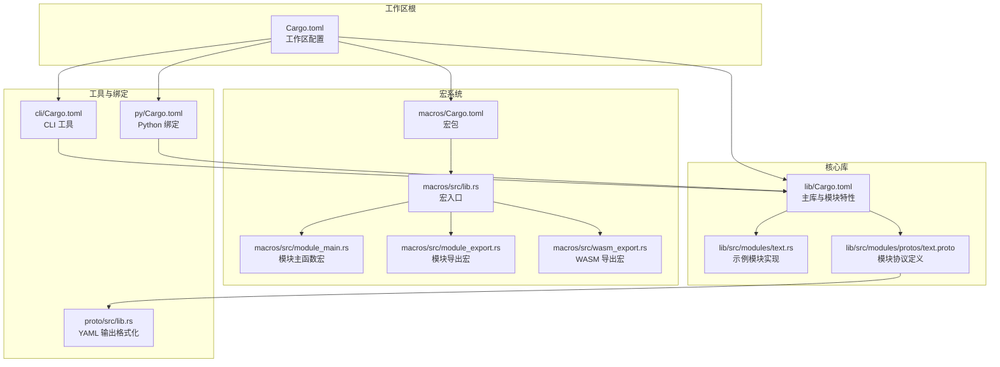
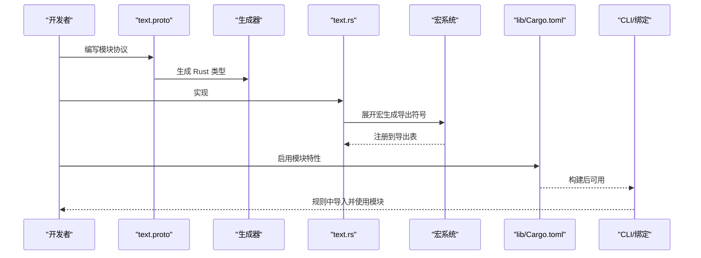
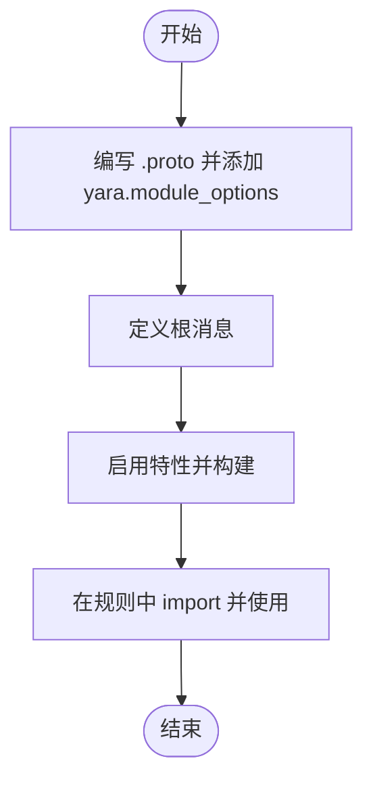
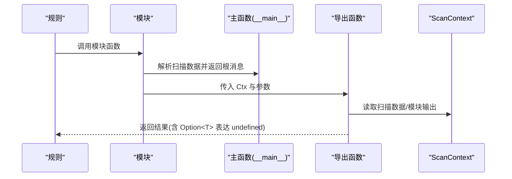
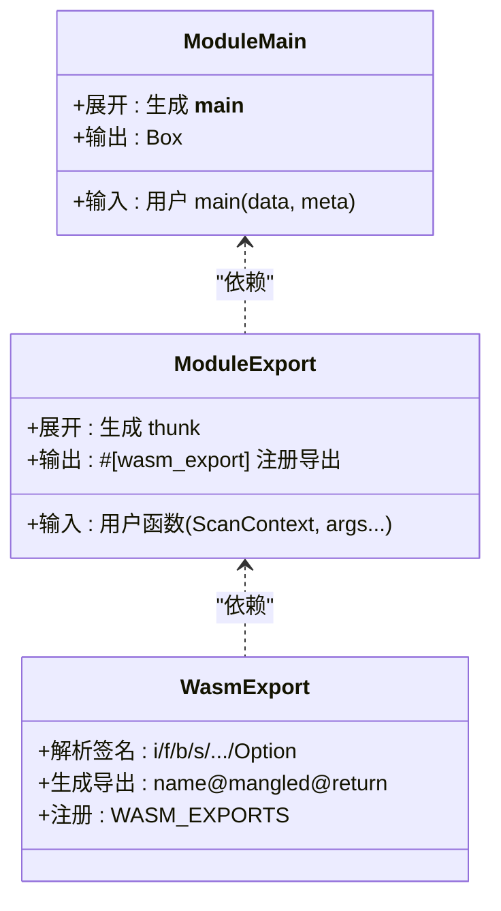

# 自定义模块开发

<cite>
**本文引用的文件**
- [Cargo.toml](file://Cargo.toml)
- [lib/Cargo.toml](file://lib/Cargo.toml)
- [macros/Cargo.toml](file://macros/Cargo.toml)
- [macros/src/lib.rs](file://macros/src/lib.rs)
- [macros/src/module_export.rs](file://macros/src/module_export.rs)
- [macros/src/module_main.rs](file://macros/src/module_main.rs)
- [macros/src/wasm_export.rs](file://macros/src/wasm_export.rs)
- [lib/src/modules/protos/text.proto](file://lib/src/modules/protos/text.proto)
- [lib/src/modules/text.rs](file://lib/src/modules/text.rs)
- [proto/src/lib.rs](file://proto/src/lib.rs)
- [cli/src/main.rs](file://cli/src/main.rs)
- [py/Cargo.toml](file://py/Cargo.toml)
- [docs/ModuleDeveloperGuide.md](file://docs/ModuleDeveloperGuide.md)
</cite>

## 目录
1. [简介](#简介)
2. [项目结构](#项目结构)
3. [核心组件](#核心组件)
4. [架构总览](#架构总览)
5. [详细组件分析](#详细组件分析)
6. [依赖关系分析](#依赖关系分析)
7. [性能考虑](#性能考虑)
8. [故障排查指南](#故障排查指南)
9. [结论](#结论)
10. [附录](#附录)

## 简介
本指南面向希望在 yara-x 中开发自定义模块的开发者，覆盖从开发环境准备、模块项目结构设计、Cargo.toml 配置与依赖管理、宏系统使用（模块导出宏与 WASM 导出宏）、测试策略、调试技巧到打包与分发的完整流程。文档以仓库中的模块开发指南、宏实现与示例模块为依据，提供可操作的步骤与最佳实践。

## 项目结构
yara-x 采用多包工作区（workspace）组织，核心模块位于 lib 包，宏由 yara-x-macros 提供，CLI 与 Python 绑定分别在 cli 与 py 包中。模块的协议定义位于 lib/src/modules/protos 下，对应的 Rust 实现位于 lib/src/modules。

**图表来源**
- [Cargo.toml:17-30](file://Cargo.toml#L17-L30)
- [lib/Cargo.toml:104-224](file://lib/Cargo.toml#L104-L224)
- [macros/Cargo.toml:1-18](file://macros/Cargo.toml#L1-L18)
- [cli/src/main.rs:1-108](file://cli/src/main.rs#L1-L108)
- [py/Cargo.toml:18-50](file://py/Cargo.toml#L18-L50)

**章节来源**
- [Cargo.toml:17-30](file://Cargo.toml#L17-L30)
- [lib/Cargo.toml:104-224](file://lib/Cargo.toml#L104-L224)
- [macros/Cargo.toml:1-18](file://macros/Cargo.toml#L1-L18)
- [cli/src/main.rs:1-108](file://cli/src/main.rs#L1-L108)
- [py/Cargo.toml:18-50](file://py/Cargo.toml#L18-L50)

## 核心组件
- 模块协议定义：通过 Protocol Buffers 定义模块的根消息与字段，支持 proto2 与 proto3，并可通过 yara.module_options 指定模块名称、根消息、Rust 模块名与 Cargo 特性。
- 模块实现：在 Rust 中实现模块主函数与导出函数，主函数返回根消息；导出函数通过 #[module_export] 暴露给规则调用。
- 宏系统：yara-x-macros 提供 #[module_main]、#[module_export]、#[wasm_export] 三类宏，负责生成运行时导出表与类型签名。
- 特性开关：模块默认不构建，需在 lib/Cargo.toml 的 features 中启用对应模块特性，或在顶层 Cargo.toml 中启用。
- CLI 与绑定：CLI 提供编译、扫描、转储等命令；Python 绑定通过 cdylib 暴露接口。

**章节来源**
- [lib/src/modules/protos/text.proto:1-37](file://lib/src/modules/protos/text.proto#L1-L37)
- [lib/src/modules/text.rs:20-48](file://lib/src/modules/text.rs#L20-L48)
- [macros/src/lib.rs:128-302](file://macros/src/lib.rs#L128-L302)
- [lib/Cargo.toml:104-224](file://lib/Cargo.toml#L104-L224)
- [cli/src/main.rs:84-95](file://cli/src/main.rs#L84-L95)
- [py/Cargo.toml:13-16](file://py/Cargo.toml#L13-L16)

## 架构总览
模块开发的关键流程：编写 .proto → 生成 Rust 类型 → 实现模块主函数与导出函数 → 通过宏生成导出符号 → 通过特性控制构建 → CLI/绑定使用模块。

**图表来源**
- [lib/src/modules/protos/text.proto:7-21](file://lib/src/modules/protos/text.proto#L7-L21)
- [lib/src/modules/text.rs:20-48](file://lib/src/modules/text.rs#L20-L48)
- [macros/src/module_export.rs:47-111](file://macros/src/module_export.rs#L47-L111)
- [lib/Cargo.toml:187-191](file://lib/Cargo.toml#L187-L191)
- [cli/src/main.rs:84-95](file://cli/src/main.rs#L84-L95)

## 详细组件分析

### 模块协议与结构设计
- 协议文件必须包含 yara.module_options，指定模块名称、根消息、Rust 模块名与可选的 Cargo 特性。
- 根消息即模块输出的结构体，主函数返回该结构体实例。
- 支持 proto2 与 proto3，二者在“未初始化值”的语义上不同，影响 undefined 值的表达。

**图表来源**
- [lib/src/modules/protos/text.proto:7-21](file://lib/src/modules/protos/text.proto#L7-L21)
- [docs/ModuleDeveloperGuide.md:40-194](file://docs/ModuleDeveloperGuide.md#L40-L194)

**章节来源**
- [lib/src/modules/protos/text.proto:1-37](file://lib/src/modules/protos/text.proto#L1-L37)
- [docs/ModuleDeveloperGuide.md:40-194](file://docs/ModuleDeveloperGuide.md#L40-L194)

### 模块主函数与导出函数
- 主函数：#[module_main] 标记，接收扫描数据，返回根消息；宏会生成适配运行时的包装函数。
- 导出函数：#[module_export] 标记，第一个参数为 ScanContext 引用，其余参数为 YARA 可接受的标量或字符串类型；可指定函数名或路径，支持重载式命名。

**图表来源**
- [macros/src/module_main.rs:7-23](file://macros/src/module_main.rs#L7-L23)
- [macros/src/module_export.rs:47-111](file://macros/src/module_export.rs#L47-L111)
- [lib/src/modules/text.rs:20-48](file://lib/src/modules/text.rs#L20-L48)
- [lib/src/modules/text.rs:54-76](file://lib/src/modules/text.rs#L54-L76)

**章节来源**
- [lib/src/modules/text.rs:20-48](file://lib/src/modules/text.rs#L20-L48)
- [lib/src/modules/text.rs:54-109](file://lib/src/modules/text.rs#L54-L109)
- [macros/src/module_main.rs:7-23](file://macros/src/module_main.rs#L7-L23)
- [macros/src/module_export.rs:47-111](file://macros/src/module_export.rs#L47-L111)

### 宏系统详解
- #[module_main]：生成 __main__ 包装函数，将用户函数转换为运行时可调用形式。
- #[module_export]：基于 #[wasm_export] 生成 thunk，将 Caller 转换为 ScanContext，并注册到导出表。
- #[wasm_export]：解析函数签名，生成带类型签名的导出项，支持 Option<T>、元组、泛型约束等。

**图表来源**
- [macros/src/module_main.rs:7-23](file://macros/src/module_main.rs#L7-L23)
- [macros/src/module_export.rs:47-111](file://macros/src/module_export.rs#L47-L111)
- [macros/src/wasm_export.rs:261-319](file://macros/src/wasm_export.rs#L261-L319)

**章节来源**
- [macros/src/lib.rs:128-302](file://macros/src/lib.rs#L128-L302)
- [macros/src/module_main.rs:7-23](file://macros/src/module_main.rs#L7-L23)
- [macros/src/module_export.rs:47-111](file://macros/src/module_export.rs#L47-L111)
- [macros/src/wasm_export.rs:170-209](file://macros/src/wasm_export.rs#L170-L209)

### 依赖管理与特性开关
- 在 lib/Cargo.toml 的 features 中新增模块特性，如 text-module，并在 default 列表中控制是否默认启用。
- 若模块依赖外部 crate，需在 dependencies 中声明并配合 optional 与 feature 条件启用。
- 顶层 Cargo.toml 将 yara-x-macros 作为 workspace 依赖引入，确保宏可用。

**章节来源**
- [lib/Cargo.toml:187-191](file://lib/Cargo.toml#L187-L191)
- [lib/Cargo.toml:204-224](file://lib/Cargo.toml#L204-L224)
- [Cargo.toml:108-110](file://Cargo.toml#L108-L110)

### 测试策略与调试技巧
- 使用 CLI 的 dump 命令查看模块输出，结合 YAML/JSON 格式化选项提升可读性。
- 对于字符串处理，使用 RuntimeString 的变体与 as_bstr/to_str 等方法，注意非 UTF-8场景返回 undefined。
- 在 ScanContext 中通过 module_output 获取主函数产出的根消息，进行二次计算或派生字段。

**章节来源**
- [proto/src/lib.rs:27-94](file://proto/src/lib.rs#L27-L94)
- [lib/src/modules/text.rs:67-76](file://lib/src/modules/text.rs#L67-L76)
- [docs/ModuleDeveloperGuide.md:615-746](file://docs/ModuleDeveloperGuide.md#L615-L746)

### 打包、分发与安装
- CLI：通过 cargo install 或直接构建二进制使用；特性可通过 --features 控制模块集合。
- Python 绑定：py 包以 cdylib 形式构建，提供 abi3 兼容性；特性映射至 yara-x 特性。
- 发布：顶层 Cargo.toml 工作区统一版本与元信息；注意排除大型测试产物避免包体积超限。

**章节来源**
- [cli/src/main.rs:84-95](file://cli/src/main.rs#L84-L95)
- [py/Cargo.toml:13-16](file://py/Cargo.toml#L13-L16)
- [py/Cargo.toml:18-50](file://py/Cargo.toml#L18-L50)
- [lib/Cargo.toml:16-21](file://lib/Cargo.toml#L16-L21)

## 依赖关系分析
模块开发涉及的依赖链路如下：

**图表来源**
- [lib/src/modules/protos/text.proto:1-37](file://lib/src/modules/protos/text.proto#L1-L37)
- [lib/src/modules/text.rs:20-48](file://lib/src/modules/text.rs#L20-L48)
- [macros/src/lib.rs:128-302](file://macros/src/lib.rs#L128-L302)
- [lib/Cargo.toml:104-224](file://lib/Cargo.toml#L104-L224)
- [cli/src/main.rs:84-95](file://cli/src/main.rs#L84-L95)

**章节来源**
- [lib/Cargo.toml:104-224](file://lib/Cargo.toml#L104-L224)
- [macros/src/lib.rs:128-302](file://macros/src/lib.rs#L128-L302)

## 性能考虑
- 开启并行编译特性以加速大规模规则编译（参见 lib/Cargo.toml 中 parallel-compilation 的说明）。
- 使用 proto2 的 optional 字段可更精确表达 undefined 值，减少不必要的默认值判断。
- 在导出函数中尽量避免重复解析扫描数据，优先复用 ScanContext 提供的数据视图。

[本节为通用指导，无需特定文件引用]

## 故障排查指南
- 宏展开错误：检查 #[module_main]/#[module_export]/#[wasm_export] 的参数与签名是否符合要求。
- 导出不可见：确认模块特性已启用，且导出函数标记为 public（宏默认公开）。
- 字符串处理异常：确保使用 RuntimeString 与 as_bstr/to_str，注意非 UTF-8返回 undefined。
- YAML 输出格式：通过 yara.field_options 的 fmt 控制十六进制与时间戳显示。

**章节来源**
- [macros/src/wasm_export.rs:261-319](file://macros/src/wasm_export.rs#L261-L319)
- [proto/src/lib.rs:27-94](file://proto/src/lib.rs#L27-L94)
- [lib/src/modules/text.rs:54-109](file://lib/src/modules/text.rs#L54-L109)

## 结论
通过规范的协议定义、严谨的宏使用与特性控制，开发者可在 yara-x 中高效构建自定义模块。遵循本文的结构设计、依赖管理与测试调试流程，可显著降低集成成本并提升模块质量。

[本节为总结性内容，无需特定文件引用]

## 附录

### 开发环境与构建步骤
- 准备：安装 Rust 工具链与 Cargo，克隆仓库并进入 yara-x 目录。
- 新增模块：
  - 在 lib/src/modules/protos 新建 .proto 文件并配置 yara.module_options。
  - 在 lib/src/modules 新建模块实现文件，按示例实现主函数与导出函数。
  - 在 lib/Cargo.toml 的 features 中添加模块特性，并在 default 中选择是否默认启用。
- 构建与验证：
  - 使用 cargo build --features=your-module 启用模块特性进行构建。
  - 使用 CLI 的 dump/scan 命令验证模块行为。

**章节来源**
- [docs/ModuleDeveloperGuide.md:415-464](file://docs/ModuleDeveloperGuide.md#L415-L464)
- [lib/Cargo.toml:187-191](file://lib/Cargo.toml#L187-L191)

### 示例模块模板（路径指引）
- 协议模板：参考 [lib/src/modules/protos/text.proto:1-37](file://lib/src/modules/protos/text.proto#L1-L37)
- 实现模板：参考 [lib/src/modules/text.rs:1-110](file://lib/src/modules/text.rs#L1-L110)

**章节来源**
- [lib/src/modules/protos/text.proto:1-37](file://lib/src/modules/protos/text.proto#L1-L37)
- [lib/src/modules/text.rs:1-110](file://lib/src/modules/text.rs#L1-L110)