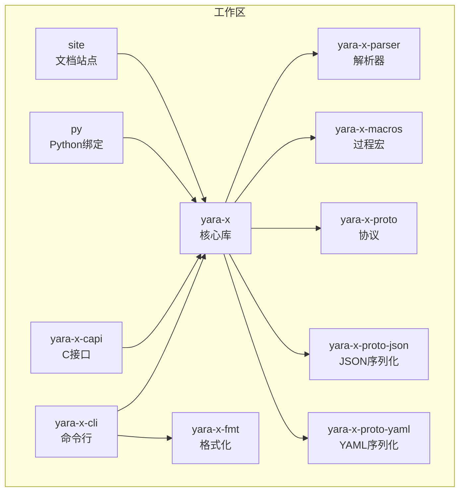
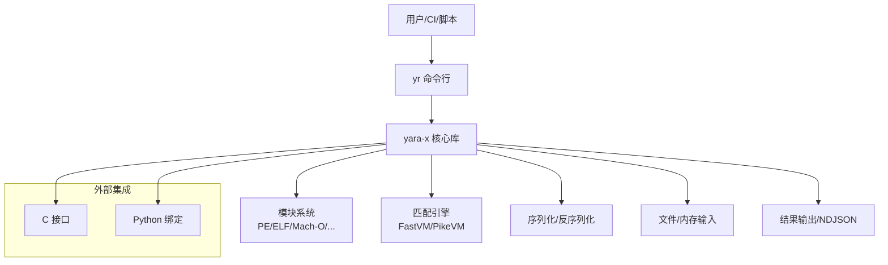
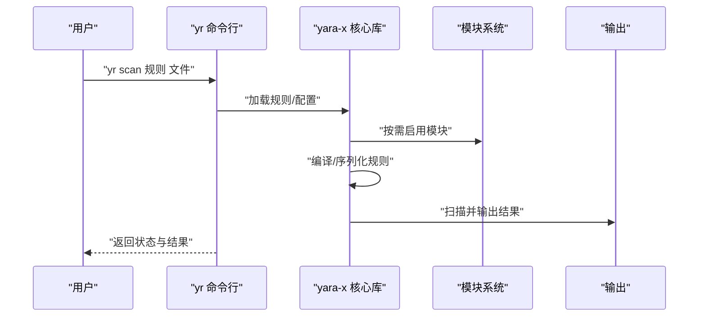
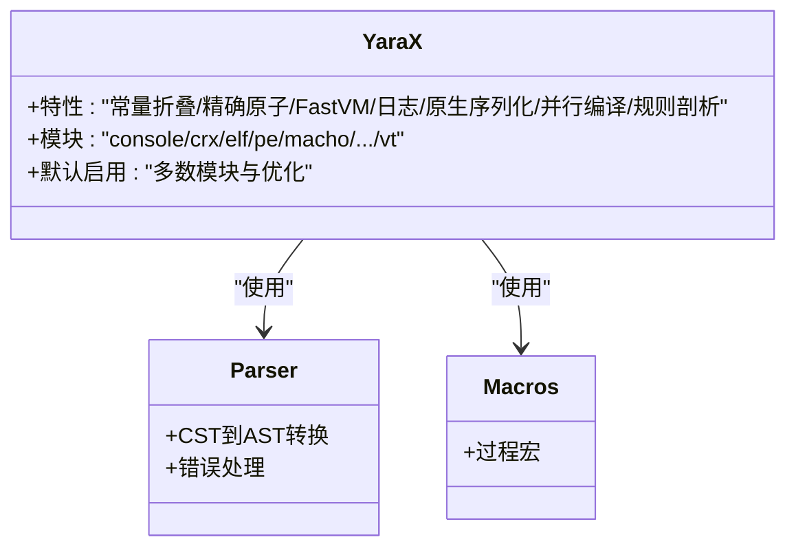
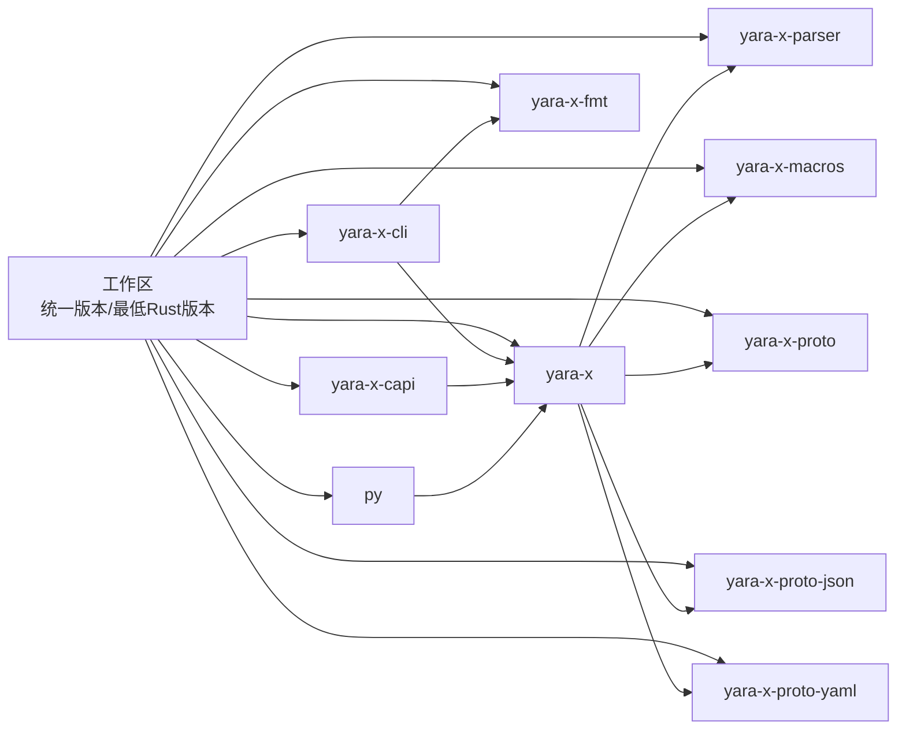

# 贡献与开发

<cite>
**本文引用的文件**
- [Cargo.toml（工作区）](file://yara-x/Cargo.toml)
- [README.md](file://yara-x/README.md)
- [rustfmt.toml](file://yara-x/rustfmt.toml)
- [.cargo/config.toml](file://yara-x/.cargo/config.toml)
- [cli/Cargo.toml](file://yara-x/cli/Cargo.toml)
- [lib/Cargo.toml](file://yara-x/lib/Cargo.toml)
- [macros/Cargo.toml](file://yara-x/macros/Cargo.toml)
- [docs/ModuleDeveloperGuide.md](file://yara-x/docs/ModuleDeveloperGuide.md)
- [site/content/docs/cli/_index.md](file://yara-x/site/content/docs/cli/_index.md)
- [site/content/docs/cli/commands.md](file://yara-x/site/content/docs/cli/commands.md)
- [site/content/docs/cli/config.md](file://yara-x/site/content/docs/cli/config.md)
- [site/content/docs/intro/getting_started.md](file://yara-x/site/content/docs/intro/getting_started.md)
- [site/content/docs/intro/installation.md](file://yara-x/site/content/docs/intro/installation.md)
- [site/content/docs/intro/yara_vs_yara-x.md](file://yara-x/site/content/docs/intro/yara_vs_yara-x.md)
- [site/content/docs/writing_rules/_index.md](file://yara-x/site/content/docs/writing_rules/_index.md)
- [site/content/docs/writing_rules/syntax.md](file://yara-x/site/content/docs/writing_rules/syntax.md)
- [site/content/docs/writing_rules/conditions.md](file://yara-x/site/content/docs/writing_rules/conditions.md)
- [site/content/docs/writing_rules/text_patterns.md](file://yara-x/site/content/docs/writing_rules/text_patterns.md)
- [site/content/docs/writing_rules/hex_patterns.md](file://yara-x/site/content/docs/writing_rules/hex_patterns.md)
- [site/content/docs/writing_rules/includes.md](file://yara-x/site/content/docs/writing_rules/includes.md)
- [site/content/docs/writing_rules/external_variables.md](file://yara-x/site/content/docs/writing_rules/external_variables.md)
- [site/content/docs/writing_rules/global_and_private.md](file://yara-x/site/content/docs/writing_rules/global_and_private.md)
- [site/content/docs/writing_rules/regexps.md](file://yara-x/site/content/docs/writing_rules/regexps.md)
- [site/content/docs/writing_rules/undefined_values.md](file://yara-x/site/content/docs/writing_rules/undefined_values.md)
- [site/content/docs/writing_rules/disabling_warnings.md](file://yara-x/site/content/docs/writing_rules/disabling_warnings.md)
- [site/content/docs/modules/_index.md](file://yara-x/site/content/docs/modules/_index.md)
- [site/content/docs/modules/modules.md](file://yara-x/site/content/docs/modules/modules.md)
- [site/content/docs/modules/console.md](file://yara-x/site/content/docs/modules/console.md)
- [site/content/docs/modules/hash.md](file://yara-x/site/content/docs/modules/hash.md)
- [site/content/docs/modules/pe.md](file://yara-x/site/content/docs/modules/pe.md)
- [site/content/docs/modules/elf.md](file://yara-x/site/content/docs/modules/elf.md)
- [site/content/docs/modules/macho.md](file://yara-x/site/content/docs/modules/macho.md)
- [site/content/docs/modules/dotnet.md](file://yara-x/site/content/docs/modules/dotnet.md)
- [site/content/docs/modules/time.md](file://yara-x/site/content/docs/modules/time.md)
- [site/content/docs/modules/string.md](file://yara-x/site/content/docs/modules/string.md)
- [site/content/docs/modules/math.md](file://yara-x/site/content/docs/modules/math.md)
- [site/content/docs/modules/crx.md](file://yara-x/site/content/docs/modules/crx.md)
- [site/content/docs/modules/lnk.md](file://yara-x/site/content/docs/modules/lnk.md)
- [site/content/docs/api/_index.md](file://yara-x/site/content/docs/api/_index.md)
- [site/content/docs/api/rust.md](file://yara-x/site/content/docs/api/rust.md)
- [site/content/docs/api/python.md](file://yara-x/site/content/docs/api/python.md)
- [site/content/docs/api/go.md](file://yara-x/site/content/docs/api/go.md)
- [site/content/docs/api/c.md](file://yara-x/site/content/docs/api/c.md)
- [site/content/blog/_index.md](file://yara-x/site/content/blog/_index.md)
- [site/content/blog/a-new-parser-for-yara/index.md](file://yara-x/site/content/blog/a-new-parser-for-yara/index.md)
- [site/content/blog/introducing-yara-x/index.md](file://yara-x/site/content/blog/introducing-yara-x/index.md)
- [site/content/blog/yara-x-is-stable/index.md](file://yara-x/site/content/blog/yara-x-is-stable/index.md)
- [site/content/blog/yara-x-is-getting-smarter/index.md](file://yara-x/site/content/blog/yara-x-is-getting-smarter/index.md)
- [site/content/blog/the-fmt-command/index.md](file://yara-x/site/content/blog/the-fmt-command/index.md)
- [site/content/blog/ndjson-output/index.md](file://yara-x/site/content/blog/ndjson-output/index.md)
- [site/content/blog/rules-profiling/index.md](file://yara-x/site/content/blog/rules-profiling/index.md)
- [site/content/blog/virustotal-moves-to-yara-x/index.md](file://yara-x/site/content/blog/virustotal-moves-to-yara-x/index.md)
- [site/content/privacy.md](file://yara-x/site/content/privacy.md)
- [site/config/_default/hugo.toml](file://yara-x/site/config/_default/hugo.toml)
- [site/config/_default/menus/menus.en.toml](file://yara-x/site/config/_default/menus/menus.en.toml)
- [site/config/_default/params.toml](file://yara-x/site/config/_default/params.toml)
- [site/config/_default/markup.toml](file://yara-x/site/config/_default/markup.toml)
- [site/config/production/hugo.toml](file://yara-x/site/config/production/hugo.toml)
- [site/config/next/hugo.toml](file://yara-x/site/config/next/hugo.toml)
- [site/package.json](file://yara-x/site/package.json)
- [site/.editorconfig](file://yara-x/site/.editorconfig)
- [site/.markdownlint-cli2.jsonc](file://yara-x/site/.markdownlint-cli2.jsonc)
- [site/.eslintrc.json](file://yara-x/site/.eslintrc.json)
- [site/.stylelintrc.json](file://yara-x/site/.stylelintrc.json)
- [site/assets/js/custom.js](file://yara-x/site/assets/js/custom.js)
- [site/assets/js/flexsearch.js](file://yara-x/site/assets/js/flexsearch.js)
- [site/layouts/partials/head/custom-head.html](file://yara-x/site/layouts/partials/head/custom-head.html)
- [site/layouts/partials/head/script-header.html](file://yara-x/site/layouts/partials/head/script-header.html)
- [site/layouts/partials/footer/script-footer-custom.html](file://yara-x/site/layouts/partials/footer/script-footer-custom.html)
- [AUTHORS](file://yara-x/AUTHORS)
</cite>

## 目录
1. [简介](#简介)
2. [项目结构](#项目结构)
3. [核心组件](#核心组件)
4. [架构总览](#架构总览)
5. [详细组件分析](#详细组件分析)
6. [依赖分析](#依赖分析)
7. [性能考虑](#性能考虑)
8. [故障排查指南](#故障排查指南)
9. [结论](#结论)
10. [附录](#附录)

## 简介
本指南面向希望参与 yara-x 开发与贡献的开发者，涵盖开发环境搭建、IDE 配置与调试、代码贡献流程（分支管理、提交规范、代码审查与测试）、架构设计原则与模块划分、编码规范与文档质量保障、项目治理与社区参与方式等。yara-x 是一款为恶意软件研究人员打造的高性能、安全且用户友好的模式匹配工具，目标是成为规则匹配领域的首选方案。

## 项目结构
yara-x 采用多包工作区组织，核心模块包括：
- 核心库：yara-x（规则编译、扫描、模块系统）
- 命令行：yara-x-cli（yr 可执行程序）
- C 接口：yara-x-capi（头文件与绑定生成）
- 格式化：yara-x-fmt（规则格式化器）
- 宏：yara-x-macros（过程宏）
- 解析器：yara-x-parser（词法/语法解析）
- 协议与序列化：yara-x-proto、yara-x-proto-json、yara-x-proto-yaml
- Python 绑定：py
- 文档站点：site（Hugo 构建）

图表来源
- [Cargo.toml（工作区）:17-30](file://yara-x/Cargo.toml#L17-L30)
- [lib/Cargo.toml:1-305](file://yara-x/lib/Cargo.toml#L1-L305)
- [cli/Cargo.toml:1-80](file://yara-x/cli/Cargo.toml#L1-L80)
- [macros/Cargo.toml:1-18](file://yara-x/macros/Cargo.toml#L1-L18)

章节来源
- [Cargo.toml（工作区）:17-30](file://yara-x/Cargo.toml#L17-L30)
- [README.md:1-69](file://yara-x/README.md#L1-L69)

## 核心组件
- 核心库（yara-x）：提供规则编译、扫描、模块系统与平台特性（如并行编译、原生代码序列化、日志与性能剖析）。默认启用多项模块与优化特性，可通过特性开关控制。
- 命令行（yara-x-cli）：yr 可执行程序，支持规则检查、编译、扫描、调试、格式化、补全等功能；内置日志与规则剖析特性。
- C 接口（yara-x-capi）：通过 cbindgen 生成 C 头文件，提供 C API 以供外部集成。
- 格式化（yara-x-fmt）：规则格式化器，包含大量测试数据与处理器模块。
- 宏（yara-x-macros）：过程宏实现，简化模块导出与导出逻辑。
- 解析器（yara-x-parser）：词法与语法解析，支持 CST 到 AST 的转换与错误处理。
- 协议与序列化（proto/json/yaml）：定义与生成协议缓冲区相关代码，支持 JSON/YAML 序列化。
- Python 绑定（py）：Rust 与 Python 的绑定层，提供 API 类型与测试。
- 文档站点（site）：基于 Hugo 的文档与博客系统，覆盖 CLI、API、模块与规则编写指南。

章节来源
- [lib/Cargo.toml:30-224](file://yara-x/lib/Cargo.toml#L30-L224)
- [cli/Cargo.toml:25-67](file://yara-x/cli/Cargo.toml#L25-L67)
- [macros/Cargo.toml:11-18](file://yara-x/macros/Cargo.toml#L11-L18)

## 架构总览
yara-x 的运行时由“规则解析—编译—序列化—扫描”构成，CLI 作为入口调用核心库；C 接口与 Python 绑定分别面向 C/Go/Python 生态；模块系统通过特性开关按需启用；站点提供文档与博客。

图表来源
- [lib/Cargo.toml:104-224](file://yara-x/lib/Cargo.toml#L104-L224)
- [cli/Cargo.toml:45-67](file://yara-x/cli/Cargo.toml#L45-L67)
- [site/content/docs/api/_index.md](file://yara-x/site/content/docs/api/_index.md)

## 详细组件分析

### 命令行组件（yr）
- 功能：规则检查、编译、扫描、调试、格式化、补全、配置加载与帮助。
- 特性开关：日志、规则剖析、调试命令（开发者专用）。
- 测试：CLI 测试需要先构建二进制再执行，避免默认 cargo test 干扰。

图表来源
- [cli/Cargo.toml:15-23](file://yara-x/cli/Cargo.toml#L15-L23)
- [cli/Cargo.toml:25-43](file://yara-x/cli/Cargo.toml#L25-L43)
- [lib/Cargo.toml:104-224](file://yara-x/lib/Cargo.toml#L104-L224)

章节来源
- [cli/Cargo.toml:15-80](file://yara-x/cli/Cargo.toml#L15-L80)

### 核心库组件（yara-x）
- 特性：常量折叠、精确原子、FastVM、protoc 支持、日志、原生代码序列化、并行编译、规则剖析、加密模块集合等。
- 模块：console、crx、cuckoo、dotnet、elf、hash、lnk、macho、magic、math、pe、string、time、vt 等。
- 默认启用模块列表明确，便于最小化构建与功能裁剪。

图表来源
- [lib/Cargo.toml:30-224](file://yara-x/lib/Cargo.toml#L30-L224)
- [macros/Cargo.toml:11-18](file://yara-x/macros/Cargo.toml#L11-L18)

章节来源
- [lib/Cargo.toml:30-224](file://yara-x/lib/Cargo.toml#L30-L224)

### C 接口组件（yara-x-capi）
- 通过 cbindgen 生成 C 头文件，提供 C API。
- 构建脚本与配置文件位于 capi 目录。

章节来源
- [capi/build.rs](file://yara-x/capi/build.rs)
- [capi/cbindgen.toml](file://yara-x/capi/cbindgen.toml)
- [capi/include/yara_x.h](file://yara-x/capi/include/yara_x.h)

### 格式化组件（yara-x-fmt）
- 提供规则格式化能力，包含处理器模块与大量测试数据。
- 用于统一规则风格，提升可读性与一致性。

章节来源
- [fmt/src/lib.rs](file://yara-x/fmt/src/lib.rs)
- [fmt/src/processor/mod.rs](file://yara-x/fmt/src/processor/mod.rs)
- [fmt/src/testdata/](file://yara-x/fmt/src/testdata/)

### 宏组件（yara-x-macros）
- 过程宏实现，简化模块导出与导出逻辑，提升开发效率。

章节来源
- [macros/Cargo.toml:14-18](file://yara-x/macros/Cargo.toml#L14-L18)

### 解析器组件（yara-x-parser）
- 词法与语法解析，支持 CST 到 AST 的转换与深度优先遍历。
- 错误处理与测试完善。

章节来源
- [parser/src/lib.rs](file://yara-x/parser/src/lib.rs)
- [parser/src/cst/mod.rs](file://yara-x/parser/src/cst/mod.rs)
- [parser/src/ast/mod.rs](file://yara-x/parser/src/ast/mod.rs)
- [parser/src/parser/mod.rs](file://yara-x/parser/src/parser/mod.rs)
- [parser/src/tokenizer/mod.rs](file://yara-x/parser/src/tokenizer/mod.rs)

### 协议与序列化组件
- proto、proto-json、proto-yaml 分别定义与生成协议缓冲区相关代码，支持 JSON/YAML 序列化。

章节来源
- [proto/Cargo.toml](file://yara-x/proto/Cargo.toml)
- [proto-json/Cargo.toml](file://yara-x/proto-json/Cargo.toml)
- [proto-yaml/Cargo.toml](file://yara-x/proto-yaml/Cargo.toml)

### Python 绑定组件（py）
- 提供 Python API 类型与测试，便于在 Python 环境中使用 yara-x。

章节来源
- [py/Cargo.toml](file://yara-x/py/Cargo.toml)

### 文档站点组件（site）
- Hugo 站点，包含 CLI、API、模块与规则编写指南，以及博客文章与配置。

章节来源
- [site/content/docs/cli/_index.md](file://yara-x/site/content/docs/cli/_index.md)
- [site/content/docs/cli/commands.md](file://yara-x/site/content/docs/cli/commands.md)
- [site/content/docs/cli/config.md](file://yara-x/site/content/docs/cli/config.md)
- [site/content/docs/api/_index.md](file://yara-x/site/content/docs/api/_index.md)
- [site/content/docs/api/rust.md](file://yara-x/site/content/docs/api/rust.md)
- [site/content/docs/api/python.md](file://yara-x/site/content/docs/api/python.md)
- [site/content/docs/api/go.md](file://yara-x/site/content/docs/api/go.md)
- [site/content/docs/api/c.md](file://yara-x/site/content/docs/api/c.md)
- [site/content/docs/modules/_index.md](file://yara-x/site/content/docs/modules/_index.md)
- [site/content/docs/modules/modules.md](file://yara-x/site/content/docs/modules/modules.md)
- [site/content/docs/writing_rules/_index.md](file://yara-x/site/content/docs/writing_rules/_index.md)
- [site/content/blog/_index.md](file://yara-x/site/content/blog/_index.md)

## 依赖分析
- 工作区统一版本与最低 Rust 版本，成员包通过 workspace 依赖共享版本号与公共依赖。
- 核心库对解析器、过程宏、协议与序列化有直接依赖；CLI 依赖核心库与格式化器；C 接口与 Python 绑定分别依赖核心库。
- 部分模块依赖加密、压缩、XML 等第三方库，通过特性开关启用。

图表来源
- [Cargo.toml（工作区）:17-30](file://yara-x/Cargo.toml#L17-L30)
- [lib/Cargo.toml:226-285](file://yara-x/lib/Cargo.toml#L226-L285)
- [cli/Cargo.toml:45-67](file://yara-x/cli/Cargo.toml#L45-L67)
- [macros/Cargo.toml:14-18](file://yara-x/macros/Cargo.toml#L14-L18)

章节来源
- [Cargo.toml（工作区）:17-30](file://yara-x/Cargo.toml#L17-L30)
- [lib/Cargo.toml:226-285](file://yara-x/lib/Cargo.toml#L226-L285)

## 性能考虑
- 优化配置：工作区提供 release-lto 配置，启用链接时优化以获得更小体积与更好性能。
- 调试优化：dev 配置对解析器包启用优化级别，避免递归函数导致栈溢出。
- 并行编译：核心库支持并行编译 WASM 代码，显著降低大规模规则编译时间，但可能带来线程开销。
- 规则剖析：启用日志与规则剖析特性可在扫描后输出最耗时规则信息，辅助性能定位。

章节来源
- [Cargo.toml（工作区）:117-135](file://yara-x/Cargo.toml#L117-L135)
- [lib/Cargo.toml:75-86](file://yara-x/lib/Cargo.toml#L75-L86)

## 故障排查指南
- 日志与调试：CLI 提供日志特性，可通过环境变量设置日志级别；调试命令仅在开发者特性开启时可用。
- 规则剖析：启用规则剖析特性可输出扫描期间的性能信息，便于识别瓶颈。
- 格式化问题：使用格式化器统一规则风格，减少因格式差异导致的误解或不一致。
- 文档与示例：参考站点中的 CLI、API、模块与规则编写指南，结合示例进行验证。

章节来源
- [cli/Cargo.toml:25-43](file://yara-x/cli/Cargo.toml#L25-L43)
- [lib/Cargo.toml:75-86](file://yara-x/lib/Cargo.toml#L75-L86)
- [site/content/docs/cli/commands.md](file://yara-x/site/content/docs/cli/commands.md)

## 结论
本指南从环境搭建、贡献流程、架构设计、编码规范与质量保障、治理与社区参与等方面，为贡献者提供了系统性的开发指引。建议在本地完成构建与测试后再提交 PR，并遵循站点文档与编码规范，确保高质量交付。

## 附录

### 开发环境搭建
- Rust 工具链
  - 最低版本与工作区版本在工作区配置中统一维护，确保所有成员包版本一致。
  - 使用 Cargo 工作区进行构建与测试，避免单包版本不一致。
- IDE 配置
  - 使用 rustfmt.toml 控制格式宽度与启发式策略，保持团队风格一致。
  - .cargo/config.toml 提供 musl 链接配置，跨平台构建时注意 linker 与 rustflags 设置。
- 调试设置
  - CLI 支持日志特性，通过环境变量设置日志级别；规则剖析特性可用于性能分析。
  - 在 dev 配置下对解析器包启用优化，避免栈溢出问题。

章节来源
- [Cargo.toml（工作区）:11-15](file://yara-x/Cargo.toml#L11-L15)
- [Cargo.toml（工作区）:133-134](file://yara-x/Cargo.toml#L133-L134)
- [rustfmt.toml:1-7](file://yara-x/rustfmt.toml#L1-L7)
- [.cargo/config.toml:1-21](file://yara-x/.cargo/config.toml#L1-L21)
- [cli/Cargo.toml:25-43](file://yara-x/cli/Cargo.toml#L25-L43)

### 代码贡献流程
- 分支管理
  - 建议采用功能分支开发，主分支保持稳定；发布前通过标签与变更记录管理版本。
- 提交规范
  - 使用清晰的提交信息描述变更内容；涉及格式化时单独提交，避免混杂无关改动。
- 代码审查
  - 提交 PR 前确保通过本地构建与测试；在 CI 通过后再请求审查。
- 测试要求
  - 在相关模块添加单元测试与集成测试；CLI 测试需先构建二进制再执行。
  - 使用站点文档中的示例与规则进行回归测试。

章节来源
- [cli/Cargo.toml:18-23](file://yara-x/cli/Cargo.toml#L18-L23)
- [site/content/docs/cli/_index.md](file://yara-x/site/content/docs/cli/_index.md)

### 架构设计原则与模块划分
- 模块化：通过特性开关启用/禁用模块，实现最小可用集与功能裁剪。
- 可扩展：模块系统允许新增模块而不影响核心库；过程宏简化导出逻辑。
- 可观测性：日志与规则剖析特性贯穿核心库与 CLI，便于问题定位与性能优化。
- 文档驱动：站点提供 CLI、API、模块与规则编写指南，确保使用者与贡献者有一致理解。

章节来源
- [lib/Cargo.toml:104-224](file://yara-x/lib/Cargo.toml#L104-L224)
- [macros/Cargo.toml:11-18](file://yara-x/macros/Cargo.toml#L11-L18)
- [site/content/docs/modules/_index.md](file://yara-x/site/content/docs/modules/_index.md)

### 编码规范与文档要求
- 代码风格：遵循 rustfmt.toml 中的宽度与启发式策略；必要时使用 nightly 扩展（注释宽度与换行）。
- 文档质量：站点文档与博客文章应保持更新，规则与模块文档需与实现同步。
- 示例与测试：提供充分的示例与测试数据，确保规则与模块行为可验证。

章节来源
- [rustfmt.toml:1-7](file://yara-x/rustfmt.toml#L1-L7)
- [site/content/docs/writing_rules/_index.md](file://yara-x/site/content/docs/writing_rules/_index.md)
- [site/content/blog/_index.md](file://yara-x/site/content/blog/_index.md)

### 项目治理与社区参与
- 治理结构：作者列表与许可证信息见 AUTHORS 与工作区配置；社区贡献通过 PR 与 Issue 参与。
- 决策流程：重大变更建议在 Issue 讨论后再提交 PR；CI 与覆盖率指标作为合并门槛。
- 社区参与：阅读站点文档与博客，关注新特性与改进；遇到问题及时提交 Issue。

章节来源
- [AUTHORS](file://yara-x/AUTHORS)
- [Cargo.toml（工作区）:1-10](file://yara-x/Cargo.toml#L1-L10)
- [README.md:1-69](file://yara-x/README.md#L1-L69)