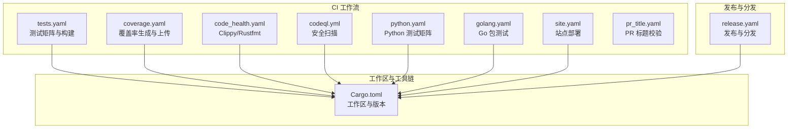
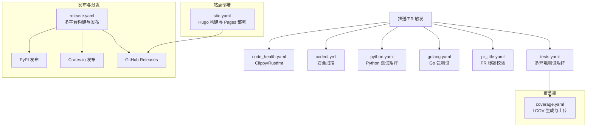
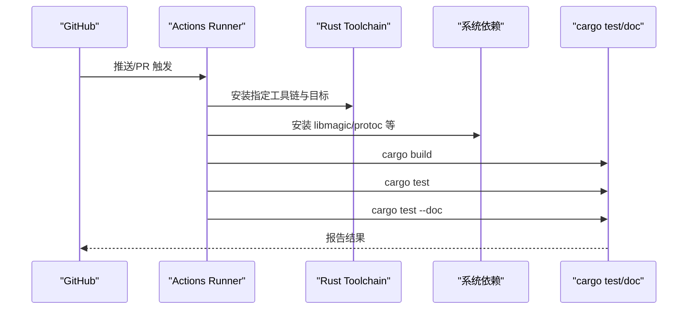
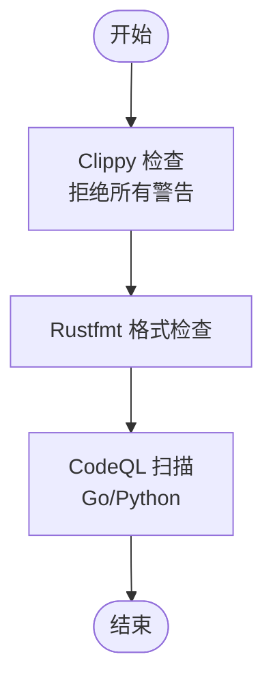
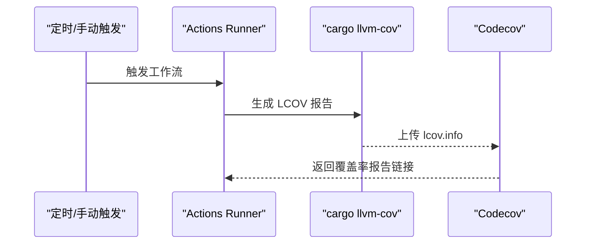
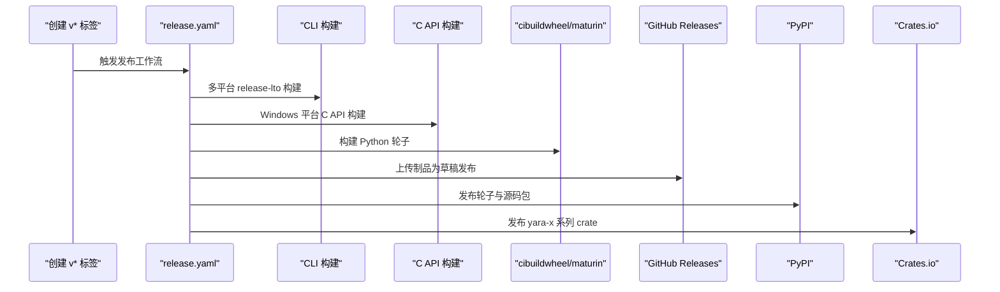
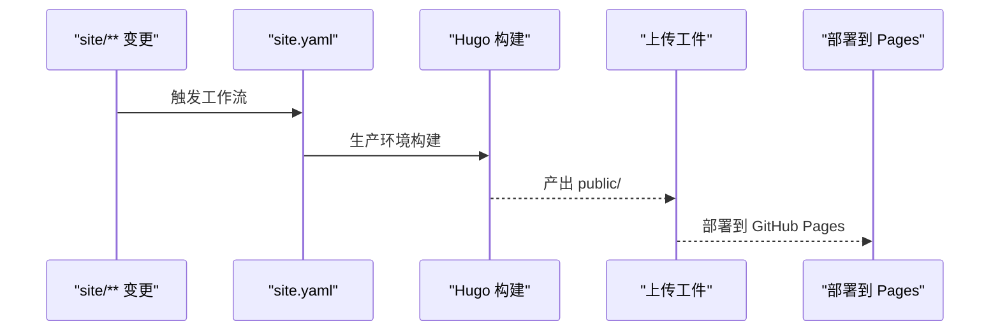
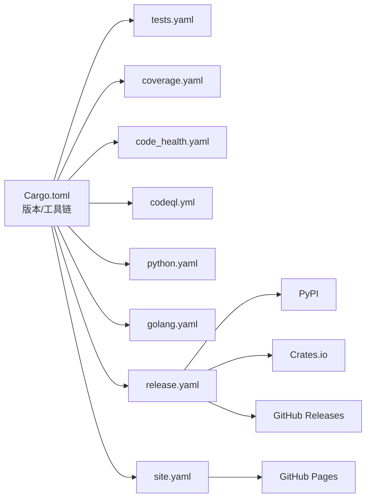

# CI/CD 集成

<cite>
**本文引用的文件**
- [.github/workflows/tests.yaml](file://yara-x/.github/workflows/tests.yaml)
- [.github/workflows/coverage.yaml](file://yara-x/.github/workflows/coverage.yaml)
- [.github/workflows/code_health.yaml](file://yara-x/.github/workflows/code_health.yaml)
- [.github/workflows/release.yaml](file://yara-x/.github/workflows/release.yaml)
- [.github/workflows/codeql.yml](file://yara-x/.github/workflows/codeql.yml)
- [.github/workflows/python.yaml](file://yara-x/.github/workflows/python.yaml)
- [.github/workflows/golang.yaml](file://yara-x/.github/workflows/golang.yaml)
- [.github/workflows/site.yaml](file://yara-x/.github/workflows/site.yaml)
- [.github/workflows/pr_title.yaml](file://yara-x/.github/workflows/pr_title.yaml)
- [Cargo.toml](file://yara-x/Cargo.toml)
</cite>

## 目录
1. [简介](#简介)
2. [项目结构](#项目结构)
3. [核心组件](#核心组件)
4. [架构总览](#架构总览)
5. [详细组件分析](#详细组件分析)
6. [依赖关系分析](#依赖关系分析)
7. [性能考量](#性能考量)
8. [故障排查指南](#故障排查指南)
9. [结论](#结论)
10. [附录](#附录)

## 简介
本指南面向开发与 DevOps 工程师，系统梳理 YARA-X 仓库中的 CI/CD 自动化实践，覆盖：
- 自动化测试：单元测试、集成测试与跨语言测试矩阵
- 代码质量：静态分析（Clippy）、格式化（Rustfmt）与安全扫描（CodeQL）
- 覆盖率：基于 LCOV 的代码覆盖率生成与上传
- 发布流程：版本管理、多目标平台构建、打包与分发（PyPI、Crates.io、GitHub Releases）
- 持续部署：站点部署到 GitHub Pages
- GitHub Actions 工作流与自定义流水线设计建议

## 项目结构
YARA-X 使用 GitHub Actions 在多语言、多平台环境下执行 CI/CD。关键工作流分布于 .github/workflows 目录，配合 Cargo 工作区统一版本与构建配置。

图表来源
- [.github/workflows/tests.yaml:1-148](file://yara-x/.github/workflows/tests.yaml#L1-L148)
- [.github/workflows/coverage.yaml:1-45](file://yara-x/.github/workflows/coverage.yaml#L1-L45)
- [.github/workflows/code_health.yaml:1-24](file://yara-x/.github/workflows/code_health.yaml#L1-L24)
- [.github/workflows/codeql.yml:1-70](file://yara-x/.github/workflows/codeql.yml#L1-L70)
- [.github/workflows/python.yaml:1-49](file://yara-x/.github/workflows/python.yaml#L1-L49)
- [.github/workflows/golang.yaml:1-46](file://yara-x/.github/workflows/golang.yaml#L1-L46)
- [.github/workflows/site.yaml:1-80](file://yara-x/.github/workflows/site.yaml#L1-L80)
- [.github/workflows/pr_title.yaml:1-18](file://yara-x/.github/workflows/pr_title.yaml#L1-L18)
- [Cargo.toml:1-135](file://yara-x/Cargo.toml#L1-L135)

章节来源
- [.github/workflows/tests.yaml:1-148](file://yara-x/.github/workflows/tests.yaml#L1-L148)
- [.github/workflows/coverage.yaml:1-45](file://yara-x/.github/workflows/coverage.yaml#L1-L45)
- [.github/workflows/code_health.yaml:1-24](file://yara-x/.github/workflows/code_health.yaml#L1-L24)
- [.github/workflows/codeql.yml:1-70](file://yara-x/.github/workflows/codeql.yml#L1-L70)
- [.github/workflows/python.yaml:1-49](file://yara-x/.github/workflows/python.yaml#L1-L49)
- [.github/workflows/golang.yaml:1-46](file://yara-x/.github/workflows/golang.yaml#L1-L46)
- [.github/workflows/site.yaml:1-80](file://yara-x/.github/workflows/site.yaml#L1-L80)
- [.github/workflows/pr_title.yaml:1-18](file://yara-x/.github/workflows/pr_title.yaml#L1-L18)
- [Cargo.toml:1-135](file://yara-x/Cargo.toml#L1-L135)

## 核心组件
- 测试与构建矩阵（tests.yaml）：覆盖 MSRV、稳定版、Nightly、macOS、32 位、Windows、无默认特性、Protobuf 编译等场景，按矩阵组合执行 cargo build/test/doc。
- 代码健康（code_health.yaml）：对所有测试与非依赖项运行 Clippy 并拒绝所有警告；Rustfmt 校验格式。
- 覆盖率（coverage.yaml）：每日定时与手动触发，使用 cargo llvm-cov 生成 LCOV 并上传至 Codecov。
- 安全扫描（codeql.yml）：对 Go 与 Python 子项目进行自动扫描。
- 多语言测试（python.yaml、golang.yaml）：分别在多个 Python 与 Go 版本上测试扩展与包。
- 发布（release.yaml）：根据标签触发，构建多平台二进制、C 头文件与库、Python 轮子，上传为制品并在完成后发布到 PyPI 与 Crates.io。
- 站点部署（site.yaml）：Hugo 构建站点并部署到 GitHub Pages。
- PR 标题校验（pr_title.yaml）：使用语义化 PR 标题规则。

章节来源
- [.github/workflows/tests.yaml:1-148](file://yara-x/.github/workflows/tests.yaml#L1-L148)
- [.github/workflows/code_health.yaml:1-24](file://yara-x/.github/workflows/code_health.yaml#L1-L24)
- [.github/workflows/coverage.yaml:1-45](file://yara-x/.github/workflows/coverage.yaml#L1-L45)
- [.github/workflows/codeql.yml:1-70](file://yara-x/.github/workflows/codeql.yml#L1-L70)
- [.github/workflows/python.yaml:1-49](file://yara-x/.github/workflows/python.yaml#L1-L49)
- [.github/workflows/golang.yaml:1-46](file://yara-x/.github/workflows/golang.yaml#L1-L46)
- [.github/workflows/release.yaml:1-270](file://yara-x/.github/workflows/release.yaml#L1-L270)
- [.github/workflows/site.yaml:1-80](file://yara-x/.github/workflows/site.yaml#L1-L80)
- [.github/workflows/pr_title.yaml:1-18](file://yara-x/.github/workflows/pr_title.yaml#L1-L18)

## 架构总览
下图展示从代码提交到发布与部署的整体流程，以及各工作流之间的依赖关系。

图表来源
- [.github/workflows/tests.yaml:1-148](file://yara-x/.github/workflows/tests.yaml#L1-L148)
- [.github/workflows/code_health.yaml:1-24](file://yara-x/.github/workflows/code_health.yaml#L1-L24)
- [.github/workflows/coverage.yaml:1-45](file://yara-x/.github/workflows/coverage.yaml#L1-L45)
- [.github/workflows/codeql.yml:1-70](file://yara-x/.github/workflows/codeql.yml#L1-L70)
- [.github/workflows/python.yaml:1-49](file://yara-x/.github/workflows/python.yaml#L1-L49)
- [.github/workflows/golang.yaml:1-46](file://yara-x/.github/workflows/golang.yaml#L1-L46)
- [.github/workflows/release.yaml:1-270](file://yara-x/.github/workflows/release.yaml#L1-L270)
- [.github/workflows/site.yaml:1-80](file://yara-x/.github/workflows/site.yaml#L1-L80)
- [.github/workflows/pr_title.yaml:1-18](file://yara-x/.github/workflows/pr_title.yaml#L1-L18)

## 详细组件分析

### 自动化测试流程（单元/集成/跨语言）
- 测试矩阵覆盖：
  - MSRV、稳定版、Nightly、macOS、32 位、Windows、Windows 32 位、无默认特性、Protobuf 编译。
  - 使用缓存加速依赖安装与编译。
  - 条件安装系统依赖（如 libmagic、protoc）与 Rust 工具链。
- 单元与文档测试：
  - cargo test 与 cargo test --doc 分别执行单元与文档测试。
- 跨语言测试：
  - Python：使用 maturin 开发模式安装扩展并执行 pytest。
  - Go：通过 cargo-c 生成 C ABI 库，Go 侧调用测试。

图表来源
- [.github/workflows/tests.yaml:104-148](file://yara-x/.github/workflows/tests.yaml#L104-L148)
- [.github/workflows/python.yaml:27-47](file://yara-x/.github/workflows/python.yaml#L27-L47)
- [.github/workflows/golang.yaml:34-46](file://yara-x/.github/workflows/golang.yaml#L34-L46)

章节来源
- [.github/workflows/tests.yaml:1-148](file://yara-x/.github/workflows/tests.yaml#L1-L148)
- [.github/workflows/python.yaml:1-49](file://yara-x/.github/workflows/python.yaml#L1-L49)
- [.github/workflows/golang.yaml:1-46](file://yara-x/.github/workflows/golang.yaml#L1-L46)

### 代码质量检查流程（静态分析/格式化/安全扫描）
- Clippy：拒绝所有警告，仅检查测试与非依赖项，确保风格与潜在问题及时发现。
- Rustfmt：统一格式，避免风格分歧。
- CodeQL：针对 Go 与 Python 子项目进行自动安全扫描，按周调度与 PR/Push 触发。

图表来源
- [.github/workflows/code_health.yaml:6-24](file://yara-x/.github/workflows/code_health.yaml#L6-L24)
- [.github/workflows/codeql.yml:1-70](file://yara-x/.github/workflows/codeql.yml#L1-L70)

章节来源
- [.github/workflows/code_health.yaml:1-24](file://yara-x/.github/workflows/code_health.yaml#L1-L24)
- [.github/workflows/codeql.yml:1-70](file://yara-x/.github/workflows/codeql.yml#L1-L70)

### 覆盖率流程（LCOV 与 Codecov）
- 触发条件：每日定时、工作流变更或手动触发。
- 步骤：安装工具链与依赖 → 安装 cargo-llvm-cov → 生成 LCOV → 上传至 Codecov。
- 建议：结合阈值与分支保护策略，确保覆盖率稳定提升。

图表来源
- [.github/workflows/coverage.yaml:1-45](file://yara-x/.github/workflows/coverage.yaml#L1-L45)

章节来源
- [.github/workflows/coverage.yaml:1-45](file://yara-x/.github/workflows/coverage.yaml#L1-L45)

### 发布流程自动化（版本/构建/分发）
- 触发方式：创建以 v 开头的标签。
- 版本一致性：校验 Git 标签与工作区版本一致。
- 多平台构建：
  - CLI 二进制：Linux Intel/ARM、macOS Intel/ARM、Windows，使用 release-lto 配置与静态 CRT。
  - C 头文件与库：Windows 平台额外构建 C API。
  - Python：使用 cibuildwheel 与 maturin 构建多平台轮子，支持 PyPy。
- 分发：
  - GitHub Releases：草稿发布，包含二进制与 C API 包。
  - PyPI：使用 gh-action-pypi-publish 发布轮子与源码包。
  - Crates.io：登录后顺序发布工作区子 crate。

图表来源
- [.github/workflows/release.yaml:1-270](file://yara-x/.github/workflows/release.yaml#L1-L270)

章节来源
- [.github/workflows/release.yaml:1-270](file://yara-x/.github/workflows/release.yaml#L1-L270)

### 持续部署策略（站点到 GitHub Pages）
- 触发：site 目录变更或工作流文件变更。
- 步骤：安装 Node.js 与依赖 → Hugo 构建 → 上传工件 → 部署到 Pages。
- 并发控制：同一时间仅允许一次部署，避免冲突。

图表来源
- [.github/workflows/site.yaml:1-80](file://yara-x/.github/workflows/site.yaml#L1-L80)

章节来源
- [.github/workflows/site.yaml:1-80](file://yara-x/.github/workflows/site.yaml#L1-L80)

### GitHub Actions 工作流与自定义流水线设计
- 触发策略：按需选择 push、pull_request、schedule、workflow_dispatch、tag 创建等。
- 矩阵与条件：利用 matrix 组合不同操作系统、目标架构、语言版本；通过 if/contains 等条件控制步骤。
- 缓存与复用：actions/cache 与 actions/setup-* 提升效率。
- 安全与权限：最小权限原则，敏感令牌通过 secrets 注入。
- 自定义建议：
  - 将“构建”“测试”“覆盖率”“安全扫描”拆分为独立作业，便于并行与重试。
  - 对大型构建使用更大的 Runner 或分阶段产物缓存。
  - 对发布作业增加“预发布/正式发布”双通道，降低风险。

章节来源
- [.github/workflows/tests.yaml:1-148](file://yara-x/.github/workflows/tests.yaml#L1-L148)
- [.github/workflows/coverage.yaml:1-45](file://yara-x/.github/workflows/coverage.yaml#L1-L45)
- [.github/workflows/code_health.yaml:1-24](file://yara-x/.github/workflows/code_health.yaml#L1-L24)
- [.github/workflows/codeql.yml:1-70](file://yara-x/.github/workflows/codeql.yml#L1-L70)
- [.github/workflows/python.yaml:1-49](file://yara-x/.github/workflows/python.yaml#L1-L49)
- [.github/workflows/golang.yaml:1-46](file://yara-x/.github/workflows/golang.yaml#L1-L46)
- [.github/workflows/release.yaml:1-270](file://yara-x/.github/workflows/release.yaml#L1-L270)
- [.github/workflows/site.yaml:1-80](file://yara-x/.github/workflows/site.yaml#L1-L80)
- [.github/workflows/pr_title.yaml:1-18](file://yara-x/.github/workflows/pr_title.yaml#L1-L18)

## 依赖关系分析
- 版本与工具链：
  - 工作区统一版本由 Cargo.toml 管理，MSRV 与 rust-version 与工作流保持同步。
  - 各工作流通过 dtolnay/rust-toolchain 与 actions/setup-* 管理工具链版本。
- 作业耦合：
  - 发布作业依赖构建产物；PyPI 发布依赖 Python 构建作业；Pages 部署独立于发布。
- 外部依赖：
  - Codecov、CodeQL、PyPI 发布、GitHub Releases、GitHub Pages。

图表来源
- [Cargo.toml:1-135](file://yara-x/Cargo.toml#L1-L135)
- [.github/workflows/tests.yaml:1-148](file://yara-x/.github/workflows/tests.yaml#L1-L148)
- [.github/workflows/coverage.yaml:1-45](file://yara-x/.github/workflows/coverage.yaml#L1-L45)
- [.github/workflows/code_health.yaml:1-24](file://yara-x/.github/workflows/code_health.yaml#L1-L24)
- [.github/workflows/codeql.yml:1-70](file://yara-x/.github/workflows/codeql.yml#L1-L70)
- [.github/workflows/python.yaml:1-49](file://yara-x/.github/workflows/python.yaml#L1-L49)
- [.github/workflows/golang.yaml:1-46](file://yara-x/.github/workflows/golang.yaml#L1-L46)
- [.github/workflows/release.yaml:1-270](file://yara-x/.github/workflows/release.yaml#L1-L270)
- [.github/workflows/site.yaml:1-80](file://yara-x/.github/workflows/site.yaml#L1-L80)

章节来源
- [Cargo.toml:1-135](file://yara-x/Cargo.toml#L1-L135)
- [.github/workflows/tests.yaml:1-148](file://yara-x/.github/workflows/tests.yaml#L1-L148)
- [.github/workflows/release.yaml:1-270](file://yara-x/.github/workflows/release.yaml#L1-L270)

## 性能考量
- 缓存策略：使用 actions/cache 缓存 Cargo registry、Git 与 target 目录，显著缩短后续运行时间。
- 并行与矩阵：合理拆分作业，利用 matrix 并行执行多平台/多语言测试。
- 构建优化：release-lto 配置用于最终发布，日常测试可使用常规 release 以提升速度。
- Runner 选择：对耗时扫描与大型构建考虑更大 Runner 实例。
- 依赖最小化：仅在必要时安装系统依赖与 Protobuf 工具。

章节来源
- [.github/workflows/tests.yaml:108-115](file://yara-x/.github/workflows/tests.yaml#L108-L115)
- [.github/workflows/coverage.yaml:34-38](file://yara-x/.github/workflows/coverage.yaml#L34-L38)
- [Cargo.toml:117-135](file://yara-x/Cargo.toml#L117-L135)

## 故障排查指南
- 版本不匹配：
  - 现象：发布前版本校验失败。
  - 排查：确认 Cargo.toml 中版本与标签一致；检查工作区成员版本。
- 工具链不兼容：
  - 现象：MSRV 或 Nightly 构建失败。
  - 排查：核对 tests.yaml 与 code_health.yaml 中的 rust-version 与工具链版本。
- 覆盖率上传失败：
  - 现象：Codecov 未收到报告。
  - 排查：确认 cargo-llvm-cov 安装与 lcov 输出路径正确；检查 CODECOV_TOKEN。
- 安全扫描未触发：
  - 现象：CodeQL 未扫描。
  - 排查：确认分支策略与调度；检查语言矩阵是否包含 Go/Python。
- 发布作业卡住：
  - 现象：PyPI 或 Crates.io 发布失败。
  - 排查：检查 secrets 与网络连通性；确认制品已上传且命名规范。
- 站点部署冲突：
  - 现象：并发部署导致失败。
  - 排查：确认 concurrency 配置与 Pages 设置。

章节来源
- [.github/workflows/release.yaml:56-63](file://yara-x/.github/workflows/release.yaml#L56-L63)
- [.github/workflows/coverage.yaml:40-44](file://yara-x/.github/workflows/coverage.yaml#L40-L44)
- [.github/workflows/codeql.yml:3-70](file://yara-x/.github/workflows/codeql.yml#L3-L70)
- [.github/workflows/site.yaml:22-26](file://yara-x/.github/workflows/site.yaml#L22-L26)

## 结论
该仓库已建立完善的 CI/CD 体系：多语言、多平台测试矩阵确保质量；Clippy/Rustfmt/CodeQL 保障代码健康与安全；覆盖率与发布流程自动化实现高效交付；站点部署直达 Pages。建议持续优化缓存与 Runner 资源，完善阈值与分支保护，进一步提升稳定性与效率。

## 附录
- 关键文件清单与职责
  - tests.yaml：多环境测试与构建矩阵
  - code_health.yaml：静态分析与格式化
  - coverage.yaml：覆盖率生成与上传
  - codeql.yml：安全扫描
  - python.yaml/golang.yaml：跨语言测试
  - release.yaml：版本管理、构建与分发
  - site.yaml：站点构建与部署
  - pr_title.yaml：PR 标题规范
  - Cargo.toml：工作区与版本

章节来源
- [.github/workflows/tests.yaml:1-148](file://yara-x/.github/workflows/tests.yaml#L1-L148)
- [.github/workflows/code_health.yaml:1-24](file://yara-x/.github/workflows/code_health.yaml#L1-L24)
- [.github/workflows/coverage.yaml:1-45](file://yara-x/.github/workflows/coverage.yaml#L1-L45)
- [.github/workflows/codeql.yml:1-70](file://yara-x/.github/workflows/codeql.yml#L1-L70)
- [.github/workflows/python.yaml:1-49](file://yara-x/.github/workflows/python.yaml#L1-L49)
- [.github/workflows/golang.yaml:1-46](file://yara-x/.github/workflows/golang.yaml#L1-L46)
- [.github/workflows/release.yaml:1-270](file://yara-x/.github/workflows/release.yaml#L1-L270)
- [.github/workflows/site.yaml:1-80](file://yara-x/.github/workflows/site.yaml#L1-L80)
- [.github/workflows/pr_title.yaml:1-18](file://yara-x/.github/workflows/pr_title.yaml#L1-L18)
- [Cargo.toml:1-135](file://yara-x/Cargo.toml#L1-L135)