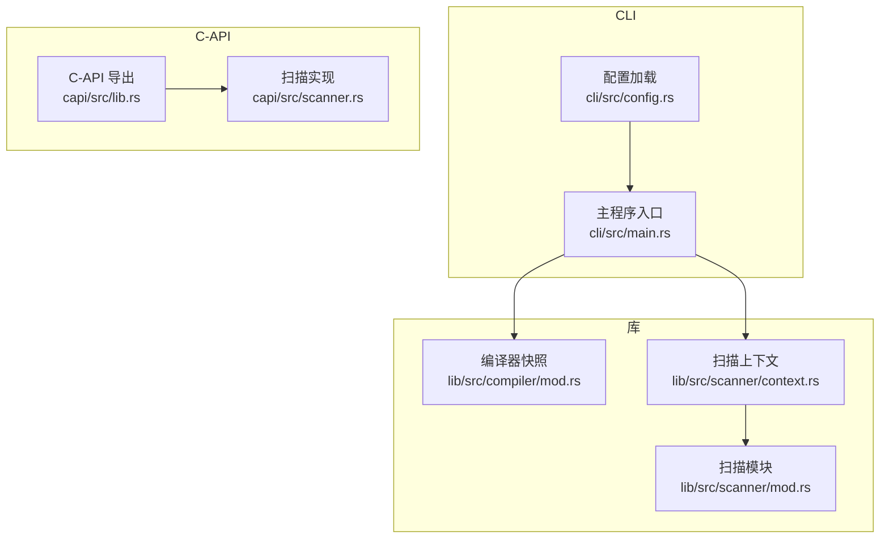
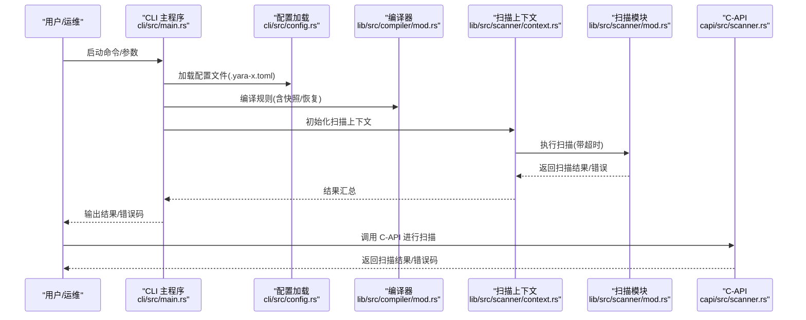
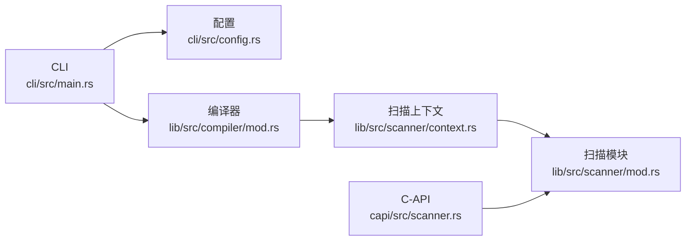

# 备份与恢复

<cite>
**本文引用的文件**
- [README.md](file://README.md)
- [Cargo.toml](file://Cargo.toml)
- [cli/src/config.rs](file://cli/src/config.rs)
- [cli/src/main.rs](file://cli/src/main.rs)
- [lib/src/compiler/mod.rs](file://lib/src/compiler/mod.rs)
- [lib/src/scanner/context.rs](file://lib/src/scanner/context.rs)
- [lib/src/scanner/mod.rs](file://lib/src/scanner/mod.rs)
- [capi/src/lib.rs](file://capi/src/lib.rs)
- [capi/src/scanner.rs](file://capi/src/scanner.rs)
- [.gemini/config.yaml](file://.gemini/config.yaml)
- [site/config/_default/hugo.toml](file://site/config/_default/hugo.toml)
</cite>

## 目录
1. [简介](#简介)
2. [项目结构](#项目结构)
3. [核心组件](#核心组件)
4. [架构总览](#架构总览)
5. [详细组件分析](#详细组件分析)
6. [依赖关系分析](#依赖关系分析)
7. [性能考量](#性能考量)
8. [故障排查指南](#故障排查指南)
9. [结论](#结论)
10. [附录](#附录)

## 简介
本指南面向数据管理员与系统管理员，围绕 YARA-X 的规则文件、扫描结果与配置数据，构建一套可落地的备份与恢复策略。内容涵盖：
- 数据备份范围：规则文件、扫描结果、配置数据
- 备份类型与频率：全量、增量、差异的选择建议
- 灾难恢复计划：故障场景、RTO/RPO 设定
- 安全与加密：备份数据的加密与安全存储
- 恢复流程与验证：数据完整性与功能验证
- 监控与告警：备份状态监控与告警配置

## 项目结构
YARA-X 是一个多模块工作区（workspace），CLI、C-API、解析器、编译器、扫描器等组件协同工作。与备份相关的关键位置包括：
- 规则文件与配置：CLI 配置文件（TOML）用于规则格式化与检查；用户可在运行时指定配置路径。
- 扫描器上下文：扫描过程中的状态、超时与内存管理，影响扫描结果的持久化与恢复。
- 编译器快照：编译器具备快照能力，便于在错误或异常时回滚到一致状态。

**图表来源**
- [cli/src/config.rs:1-211](file://cli/src/config.rs#L1-L211)
- [cli/src/main.rs:1-120](file://cli/src/main.rs#L1-L120)
- [lib/src/compiler/mod.rs:1140-1180](file://lib/src/compiler/mod.rs#L1140-L1180)
- [lib/src/scanner/context.rs:48-585](file://lib/src/scanner/context.rs#L48-L585)
- [lib/src/scanner/mod.rs:94-134](file://lib/src/scanner/mod.rs#L94-L134)
- [capi/src/lib.rs:250-270](file://capi/src/lib.rs#L250-L270)
- [capi/src/scanner.rs:193-239](file://capi/src/scanner.rs#L193-L239)

**章节来源**
- [Cargo.toml:17-30](file://Cargo.toml#L17-L30)
- [README.md:1-69](file://README.md#L1-L69)

## 核心组件
- CLI 配置与规则格式化/检查：通过 TOML 配置控制规则格式化、元数据校验与标签规范，是规则文件“配置数据”的一部分。
- 编译器快照：提供快照与恢复能力，确保在编译过程中出现异常时能回到一致状态，间接支持“配置数据”的一致性与可恢复性。
- 扫描器上下文与超时：扫描过程的状态机、超时机制与内存对象管理，影响扫描结果的生成与持久化。
- C-API：对外提供扫描接口，其错误处理与返回码可用于监控与告警。

**章节来源**
- [cli/src/config.rs:11-211](file://cli/src/config.rs#L11-L211)
- [lib/src/compiler/mod.rs:1140-1180](file://lib/src/compiler/mod.rs#L1140-L1180)
- [lib/src/scanner/context.rs:48-585](file://lib/src/scanner/context.rs#L48-L585)
- [capi/src/lib.rs:250-270](file://capi/src/lib.rs#L250-L270)

## 架构总览
下图展示从 CLI 到编译器、扫描器再到 C-API 的调用链，以及与配置的关系。该链路决定了备份与恢复的关键节点与数据流。

**图表来源**
- [cli/src/main.rs:1-120](file://cli/src/main.rs#L1-L120)
- [cli/src/config.rs:199-211](file://cli/src/config.rs#L199-L211)
- [lib/src/compiler/mod.rs:1140-1180](file://lib/src/compiler/mod.rs#L1140-L1180)
- [lib/src/scanner/context.rs:48-585](file://lib/src/scanner/context.rs#L48-L585)
- [lib/src/scanner/mod.rs:94-134](file://lib/src/scanner/mod.rs#L94-L134)
- [capi/src/scanner.rs:193-239](file://capi/src/scanner.rs#L193-L239)

## 详细组件分析

### 规则文件备份策略
- 备份对象
  - 规则源文件（YARA 规则文本）
  - CLI 配置文件（.yara-x.toml）：包含格式化、检查、警告等规则，属于“配置数据”
- 备份方式
  - 全量备份：规则与配置文件的完整归档
  - 增量备份：基于版本控制（如 Git）跟踪变更，仅备份变更集
  - 差异备份：周期性全量 + 日常差异，适合规则频繁变更的场景
- 频率建议
  - 开发阶段：每日全量 + 每日差异
  - 生产环境：每周全量 + 每日差异，或每日全量
- 保留策略
  - 至少保留最近 4 周的全量与差异
  - 长期归档保留最近 12 个月的全量
- 变更追踪
  - 使用版本控制系统记录规则与配置的每次变更，便于审计与回滚

**章节来源**
- [cli/src/config.rs:11-211](file://cli/src/config.rs#L11-L211)
- [cli/src/main.rs:20-70](file://cli/src/main.rs#L20-L70)

### 扫描结果备份策略
- 备份对象
  - 扫描结果（匹配规则列表、元数据、命中片段等）
  - 扫描上下文状态（超时、内存对象等）：影响结果的生成与持久化
- 备份方式
  - 全量备份：对扫描结果进行序列化归档
  - 增量备份：仅备份新增或变更的扫描结果
  - 差异备份：按时间窗口聚合结果，减少存储压力
- 频率建议
  - 实时/准实时：生产环境建议每小时或每日批量归档
  - 归档：超过保留期的结果进行冷存储
- 保留策略
  - RPO：根据业务容忍度设定（如 15 分钟至 1 小时不等）
  - RTO：根据 SLA 设定（如 1 小时内恢复）

**章节来源**
- [lib/src/scanner/context.rs:48-585](file://lib/src/scanner/context.rs#L48-L585)
- [lib/src/scanner/mod.rs:94-134](file://lib/src/scanner/mod.rs#L94-L134)

### 配置数据备份策略
- 备份对象
  - CLI 配置（.yara-x.toml）：格式化、检查、警告等
  - 编译器快照：编译器状态的一致性保障
- 备份方式
  - 全量备份：配置文件与编译器快照的定期归档
  - 增量备份：配置变更触发的增量归档
- 频率建议
  - 配置变更即刻备份；每日全量兜底
- 保留策略
  - 至少保留最近 4 周的配置快照

**章节来源**
- [cli/src/config.rs:199-211](file://cli/src/config.rs#L199-L211)
- [lib/src/compiler/mod.rs:1140-1180](file://lib/src/compiler/mod.rs#L1140-L1180)

### 灾难恢复计划（RTO/RPO）
- 故障场景
  - 规则文件丢失或损坏
  - 扫描结果不可用或不完整
  - 配置数据丢失或错误
  - 编译器状态异常导致规则无法编译
- RTO/RPO 设定
  - RTO：根据业务 SLA 设定（如 1 小时内恢复）
  - RPO：根据数据容忍度设定（如 15 分钟内数据丢失）
- 恢复流程
  - 识别故障类型与影响范围
  - 从最近可用备份恢复规则、结果与配置
  - 验证完整性与功能（见下一节）
  - 恢复后持续监控与告警

**章节来源**
- [lib/src/compiler/mod.rs:1140-1180](file://lib/src/compiler/mod.rs#L1140-L1180)
- [lib/src/scanner/context.rs:48-585](file://lib/src/scanner/context.rs#L48-L585)

### 备份数据的加密与安全存储
- 加密
  - 传输中：TLS/HTTPS
  - 存储中：对备份文件进行端到端加密（如使用对称/非对称密钥）
  - 密钥管理：使用硬件安全模块（HSM）或密钥管理服务（KMS）
- 访问控制
  - 最小权限原则
  - 多因素认证（MFA）
- 存储位置
  - 本地热备 + 云冷备
  - 异地容灾存储

[本节为通用实践指导，无需特定文件来源]

### 恢复流程与验证
- 恢复流程
  - 选择最近可用备份（考虑 RPO）
  - 按顺序恢复：配置 → 规则 → 扫描结果
  - 重启相关服务，确认依赖项可用
- 验证方法
  - 数据完整性：校验和/哈希比对
  - 功能验证：执行代表性扫描任务，核对匹配结果与性能指标
- 错误处理
  - 若恢复失败，回退至上一版本备份
  - 记录恢复日志与失败原因，触发告警

**章节来源**
- [capi/src/scanner.rs:193-239](file://capi/src/scanner.rs#L193-L239)
- [capi/src/lib.rs:250-270](file://capi/src/lib.rs#L250-L270)

### 备份监控与告警配置
- 监控指标
  - 备份成功率、失败次数、耗时
  - 备份文件大小与增长趋势
  - 最近一次备份时间与版本
- 告警策略
  - 连续失败阈值触发告警
  - 备份延迟超过 RPO 触发紧急告警
- 工具建议
  - 使用日志聚合与指标系统（如 Prometheus/Grafana）
  - 集成邮件/IM 通知

[本节为通用实践指导，无需特定文件来源]

## 依赖关系分析
- 组件耦合
  - CLI 依赖配置模块与编译器模块
  - 扫描器上下文依赖扫描模块与编译器状态
  - C-API 依赖扫描实现与错误码定义
- 外部依赖
  - 版本控制工具（Git）用于规则与配置的变更追踪
  - 存储与密钥管理服务（云厂商或自建）

**图表来源**
- [cli/src/main.rs:1-120](file://cli/src/main.rs#L1-L120)
- [cli/src/config.rs:199-211](file://cli/src/config.rs#L199-L211)
- [lib/src/compiler/mod.rs:1140-1180](file://lib/src/compiler/mod.rs#L1140-L1180)
- [lib/src/scanner/context.rs:48-585](file://lib/src/scanner/context.rs#L48-L585)
- [lib/src/scanner/mod.rs:94-134](file://lib/src/scanner/mod.rs#L94-L134)
- [capi/src/scanner.rs:193-239](file://capi/src/scanner.rs#L193-L239)

**章节来源**
- [Cargo.toml:17-30](file://Cargo.toml#L17-L30)

## 性能考量
- 备份性能
  - 增量/差异备份减少 I/O 压力
  - 并行压缩与分块传输提升吞吐
- 恢复性能
  - 冷热分离存储：热备快速恢复，冷备低成本长期保存
  - 预热缓存：对常用规则与配置进行预加载

[本节为通用实践指导，无需特定文件来源]

## 故障排查指南
- 常见问题
  - 配置文件加载失败：检查路径与权限，确认 TOML 格式正确
  - 扫描超时：调整扫描上下文超时设置，优化规则复杂度
  - C-API 错误码：根据返回码定位具体错误（如超时、错误）
- 排查步骤
  - 查看日志与错误码
  - 验证备份完整性与可读性
  - 在隔离环境中执行恢复与验证

**章节来源**
- [cli/src/config.rs:199-211](file://cli/src/config.rs#L199-L211)
- [lib/src/scanner/context.rs:48-585](file://lib/src/scanner/context.rs#L48-L585)
- [capi/src/lib.rs:250-270](file://capi/src/lib.rs#L250-L270)
- [capi/src/scanner.rs:193-239](file://capi/src/scanner.rs#L193-L239)

## 结论
通过明确规则文件、扫描结果与配置数据的备份范围，结合全量/增量/差异策略与严格的 RTO/RPO 设定，并辅以加密、访问控制与监控告警，YARA-X 的备份与恢复体系可满足生产环境的高可用与合规要求。建议将本指南作为组织级标准操作流程（SOP）的一部分，持续演进与演练。

[本节为总结性内容，无需特定文件来源]

## 附录
- 配置文件示例与路径
  - CLI 默认配置文件路径：$HOME/.yara-x.toml
  - 配置加载逻辑参考：[cli/src/main.rs:20-70](file://cli/src/main.rs#L20-L70)，[cli/src/config.rs:199-211](file://cli/src/config.rs#L199-L211)
- 文档与站点配置
  - 文档站点配置参考：[site/config/_default/hugo.toml:1-87](file://site/config/_default/hugo.toml#L1-L87)
- 代码审查配置
  - Gemini 代码审查开关：[.gemini/config.yaml:1-3](file://.gemini/config.yaml#L1-L3)

**章节来源**
- [cli/src/main.rs:20-70](file://cli/src/main.rs#L20-L70)
- [cli/src/config.rs:199-211](file://cli/src/config.rs#L199-L211)
- [site/config/_default/hugo.toml:1-87](file://site/config/_default/hugo.toml#L1-L87)
- [.gemini/config.yaml:1-3](file://.gemini/config.yaml#L1-L3)