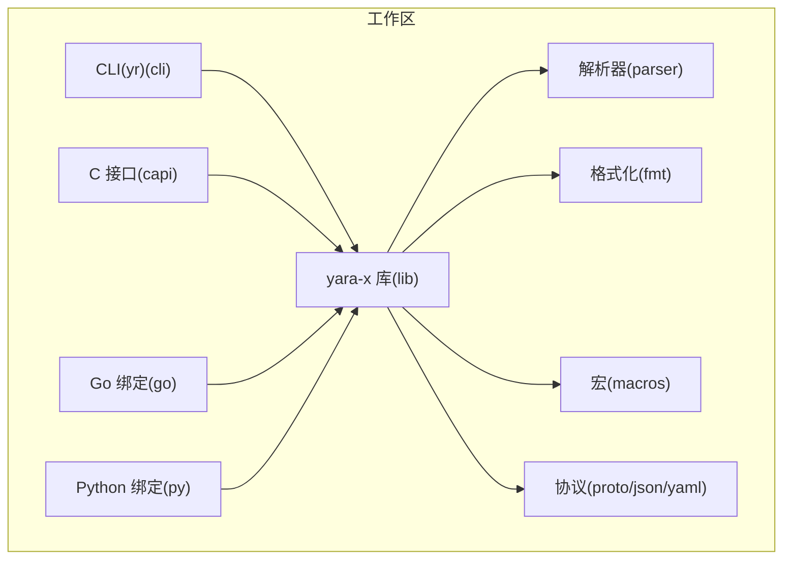
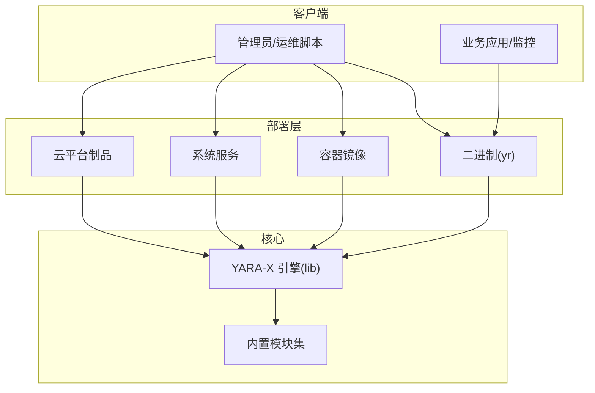
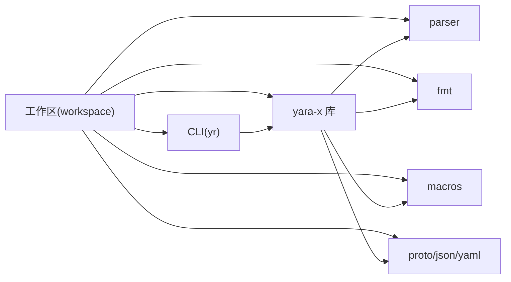

# 生产环境部署

<cite>
**本文引用的文件**
- [README.md](file://README.md)
- [Cargo.toml](file://Cargo.toml)
- [cli/Cargo.toml](file://cli/Cargo.toml)
- [lib/Cargo.toml](file://lib/Cargo.toml)
- [.github/workflows/release.yaml](file://.github/workflows/release.yaml)
- [go/go.mod](file://go/go.mod)
- [py/pyproject.toml](file://py/pyproject.toml)
</cite>

## 目录
1. [简介](#简介)
2. [项目结构](#项目结构)
3. [核心组件](#核心组件)
4. [架构总览](#架构总览)
5. [详细组件分析](#详细组件分析)
6. [依赖关系分析](#依赖关系分析)
7. [性能考虑](#性能考虑)
8. [故障排查指南](#故障排查指南)
9. [结论](#结论)
10. [附录](#附录)

## 简介
本指南面向系统管理员与 DevOps 工程师，提供 YARA-X 在生产环境中的部署与运维实践。内容涵盖硬件与系统要求、环境准备、多部署方式（二进制、容器化、系统服务、云平台）、安全配置、性能调优与容量规划等。仓库中包含 CLI、Rust 核心库、Go 与 Python 绑定，以及跨平台发布流水线，可作为生产部署的可靠基础。

## 项目结构
YARA-X 采用 Rust 工作区组织，核心模块与接口如下：
- lib：纯 Rust 实现的核心引擎与模块集合
- cli：命令行工具（yr），提供规则编译、扫描、调试等功能
- capi：C 接口与头文件，便于在其他语言中集成
- parser/fmt/macros/proto 等子项目：解析器、格式化器、宏与协议支持
- go 与 py：Go/Python 绑定，便于在不同生态中使用
- .github/workflows：CI/CD 流水线，覆盖多平台构建与发布

图表来源
- [Cargo.toml:17-30](file://Cargo.toml#L17-L30)
- [lib/Cargo.toml:1-305](file://lib/Cargo.toml#L1-L305)
- [cli/Cargo.toml:1-80](file://cli/Cargo.toml#L1-L80)

章节来源
- [Cargo.toml:17-30](file://Cargo.toml#L17-L30)
- [README.md:60-69](file://README.md#L60-L69)

## 核心组件
- 核心引擎（lib）：提供规则编译、匹配、模块扩展能力；支持特性开关与模块化功能
- 命令行工具（cli）：提供 scan/check/dump/fmt 等常用操作，支持日志与规则性能分析
- C 接口（capi）：导出 C 头文件与动态库，便于在非 Rust 环境集成
- Go/Python 绑定：通过各自生态的构建工具进行打包与分发
- 发布流水线：覆盖 Linux/macOS/Windows 与 Intel/ARM 平台，支持 LTO 优化与多目标产物

章节来源
- [lib/Cargo.toml:30-224](file://lib/Cargo.toml#L30-L224)
- [cli/Cargo.toml:25-44](file://cli/Cargo.toml#L25-L44)
- [.github/workflows/release.yaml:20-46](file://.github/workflows/release.yaml#L20-L46)

## 架构总览
下图展示生产部署的关键节点与交互：CLI 作为入口，调用核心引擎执行规则编译与扫描；C/Go/Python 绑定用于在不同运行时中复用核心能力；发布流水线生成多平台二进制与包。

图表来源
- [lib/Cargo.toml:205-224](file://lib/Cargo.toml#L205-L224)
- [.github/workflows/release.yaml:67-96](file://.github/workflows/release.yaml#L67-L96)

## 详细组件分析

### 硬件与系统要求
- CPU
  - 支持 x86_64、AArch64 平台，流水线覆盖 Intel 与 ARM
  - 建议优先使用具备 SSE/NEON 指令集的现代 CPU，以获得更好的正则与原子匹配性能
- 内存
  - 规则数量与复杂度直接影响内存占用；建议为每万条规则预留数 GB 的堆空间，并考虑并发扫描带来的峰值
  - 配置文件与缓存策略需结合业务规模评估
- 存储
  - 规则文件与扫描目标通常为顺序读取；SSD 可降低延迟
  - 规则序列化与缓存文件建议放置在高吞吐盘上
- 网络
  - 若使用远程规则源或云平台托管，需确保带宽与延迟满足扫描吞吐需求
  - 容器/云部署时注意内网访问与安全组策略

章节来源
- [.github/workflows/release.yaml:27-46](file://.github/workflows/release.yaml#L27-L46)

### 环境准备
- 操作系统兼容性
  - 跨平台支持：Linux、macOS、Windows；流水线覆盖 x86_64 与 aarch64
- 依赖与工具链
  - Rust 工具链：MSRV 与稳定版本均被 CI 使用，建议统一工具链版本
  - LTO 优化：release-lto 配置用于减小体积与提升性能
  - Go/Python 绑定：Go 1.18+、Python 3.9+，使用对应构建后端
- 权限配置
  - 仅授予运行所需最小权限；避免在生产主机上使用 root 执行扫描任务
  - 规则与缓存目录设置为非 root 用户可写，但限制访问范围

章节来源
- [Cargo.toml:11-15](file://Cargo.toml#L11-L15)
- [.github/workflows/release.yaml:51-54](file://.github/workflows/release.yaml#L51-L54)
- [go/go.mod:3](file://go/go.mod#L3)
- [py/pyproject.toml:9](file://py/pyproject.toml#L9)

### 多种部署方式

#### 二进制部署（推荐）
- 获取发布产物
  - 从发布页下载对应平台的压缩包，包含 yr 二进制与 C 接口文件（Windows）
- 安装与验证
  - 解压到 /usr/local/bin 或自定义路径，赋予执行权限
  - 运行 yr --help 与基础扫描测试
- 配置
  - 将规则文件与缓存目录挂载到持久卷，设置只读规则与受限写入缓存

章节来源
- [.github/workflows/release.yaml:80-96](file://.github/workflows/release.yaml#L80-L96)

#### 容器化部署
- 构建镜像
  - 使用官方 Dockerfile（若存在）或基于 alpine:latest 编写最小镜像
  - 复用 release-lto 产物，减少镜像体积
- 运行参数
  - 以非 root 用户运行，挂载规则与缓存目录
  - 设置资源限制（CPU/内存），启用只读根文件系统
- 编排
  - Kubernetes：Deployment/StatefulSet + ConfigMap/Secret，持久卷挂载规则与缓存
  - Docker Compose：单实例或副本集群，按需添加健康检查

章节来源
- [.github/workflows/release.yaml:67-78](file://.github/workflows/release.yaml#L67-L78)

#### 系统服务部署
- Linux systemd
  - 创建服务单元，设置用户、工作目录、规则与缓存路径
  - 启用自动重启与日志轮转
- Windows 服务
  - 使用 NSSM 或 PowerShell 注册服务，设置启动账户与工作目录
- 监控
  - 集成进程指标采集与告警，关注 CPU/内存/IO 峰值

章节来源
- [cli/Cargo.toml:25-44](file://cli/Cargo.toml#L25-L44)

#### 云平台部署
- AWS/GCP/Azure
  - 使用 ECR/AKS/GKE/Azure Container Instances 托管容器
  - 规则与缓存使用对象存储/持久盘，配置网络 ACL 与密钥管理
- Serverless
  - 将 yr 封装为 Lambda/Cloud Function，注意冷启动与超时控制
  - 输入输出通过 S3/SAS Blob 管理

章节来源
- [.github/workflows/release.yaml:20-46](file://.github/workflows/release.yaml#L20-L46)

### 安全配置最佳实践
- 最小权限原则
  - 以非特权用户运行 yr；仅授予读取规则与写入缓存的权限
- 网络安全
  - 限制规则源访问；对远程规则启用校验与签名验证
  - 使用内网或私有网络访问，必要时启用 TLS 与防火墙策略
- 数据保护
  - 对敏感规则与结果进行加密存储；定期清理临时文件
  - 审计日志记录关键操作，保留合规证据

章节来源
- [lib/Cargo.toml:30-86](file://lib/Cargo.toml#L30-L86)

### 性能调优与容量规划
- 规则与引擎
  - 启用常量折叠与精确原子匹配以减少运行时开销
  - 使用规则性能分析功能定位热点规则，拆分或重写低效条件
- 并发与资源
  - 利用多核并行扫描；根据 CPU 核心数与内存上限设置并发度
  - 对大型规则集启用并行编译（谨慎使用，避免线程争用）
- 缓存与 I/O
  - 开启规则序列化与本地缓存，减少重复编译
  - 将规则与缓存置于 SSD，避免频繁磁盘抖动
- 容量规划
  - 基于规则条数、平均匹配时间与并发请求估算 CPU/内存/IO
  - 为峰值流量预留 20%-50% 缓余，结合弹性伸缩策略

章节来源
- [lib/Cargo.toml:30-86](file://lib/Cargo.toml#L30-L86)
- [lib/Cargo.toml:75-81](file://lib/Cargo.toml#L75-L81)
- [Cargo.toml:117-135](file://Cargo.toml#L117-L135)

## 依赖关系分析
- 工作区依赖
  - 通过 workspace.dependencies 统一管理第三方库版本，保证一致性
- CLI 依赖
  - 依赖 yara-x 与解析/序列化模块；可选日志与补全功能
- 核心库依赖
  - 正则、哈希、PE/ELF/Mach-O 等模块按需启用；WASM 时使用时钟与并行编译特性
- 发布流水线
  - 多目标交叉编译与 LTO 优化，生成跨平台二进制与 C 接口产物

图表来源
- [Cargo.toml:33-116](file://Cargo.toml#L33-L116)
- [cli/Cargo.toml:45-67](file://cli/Cargo.toml#L45-L67)
- [lib/Cargo.toml:226-285](file://lib/Cargo.toml#L226-L285)

章节来源
- [Cargo.toml:33-116](file://Cargo.toml#L33-L116)
- [cli/Cargo.toml:45-67](file://cli/Cargo.toml#L45-L67)
- [lib/Cargo.toml:226-285](file://lib/Cargo.toml#L226-L285)

## 性能考虑
- 编译期优化
  - 使用 release-lto 配置，降低二进制体积并提升运行时性能
- 运行时优化
  - 启用常量折叠与精确原子匹配；在大型规则集场景谨慎开启并行编译
  - 使用规则性能分析功能识别瓶颈，针对性重构
- I/O 与缓存
  - 将规则与缓存置于高性能存储；合理设置缓存失效策略

章节来源
- [Cargo.toml:117-135](file://Cargo.toml#L117-L135)
- [lib/Cargo.toml:30-86](file://lib/Cargo.toml#L30-L86)

## 故障排查指南
- 日志与诊断
  - CLI 支持通过 RUST_LOG 环境变量启用日志；规则性能分析可用于定位慢规则
- 常见问题
  - 规则编译失败：检查语法与模块依赖；确认启用的模块与平台匹配
  - 扫描性能异常：检查并发度、规则复杂度与缓存命中率
  - 权限错误：确认运行用户对规则与缓存目录具有读写权限
- 监控与告警
  - 集成系统指标与应用日志，设置 CPU/内存/IO 峰值阈值告警

章节来源
- [cli/Cargo.toml:29-43](file://cli/Cargo.toml#L29-L43)
- [lib/Cargo.toml:83-86](file://lib/Cargo.toml#L83-L86)

## 结论
YARA-X 提供了高性能、可扩展且跨平台的规则匹配能力。通过合理的硬件与系统配置、最小权限的安全策略、多样的部署方式与持续的性能优化，可在生产环境中稳定高效地运行。建议结合业务规模与合规要求制定详细的容量规划与应急响应流程。

## 附录

### 关键特性与功能清单
- 规则编译与匹配：常量折叠、精确原子匹配、FastVM 正则
- 模块化：PE/ELF/Mach-O/Hash/Console/Time/VT 等模块
- 并发：规则并行编译、WASM 并行编译
- 日志与性能：日志开关、规则性能分析
- 接口：CLI、C 接口、Go/Python 绑定

章节来源
- [lib/Cargo.toml:30-224](file://lib/Cargo.toml#L30-L224)
- [cli/Cargo.toml:25-44](file://cli/Cargo.toml#L25-L44)