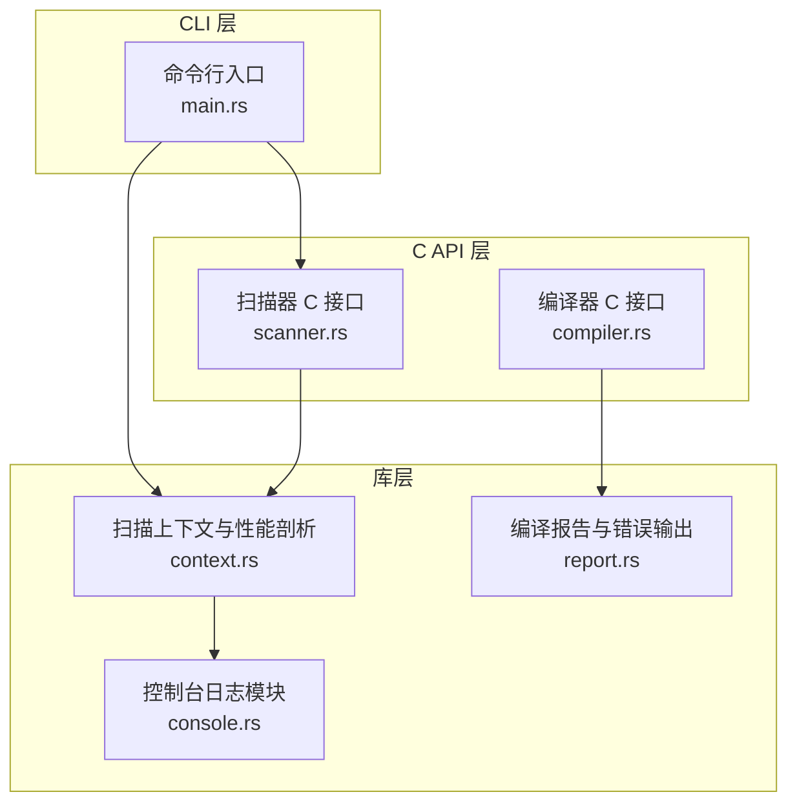
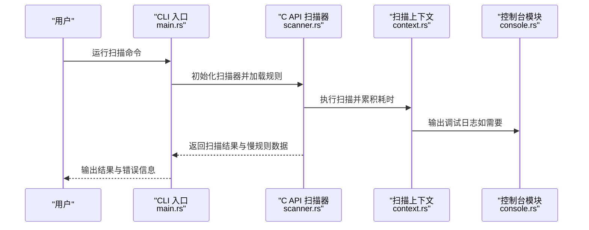
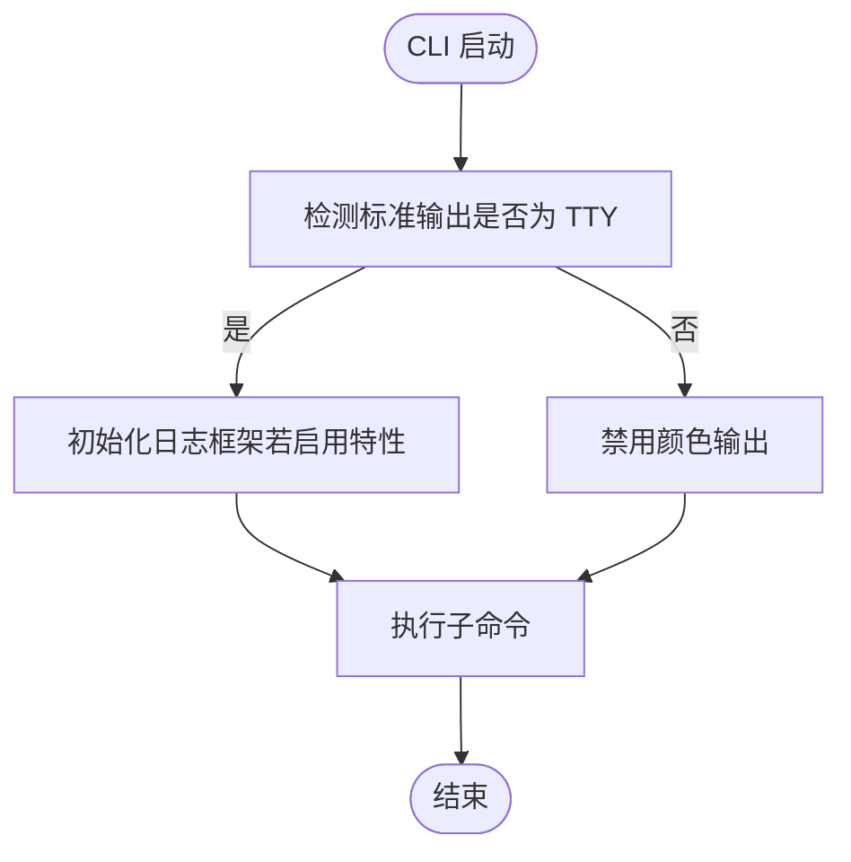
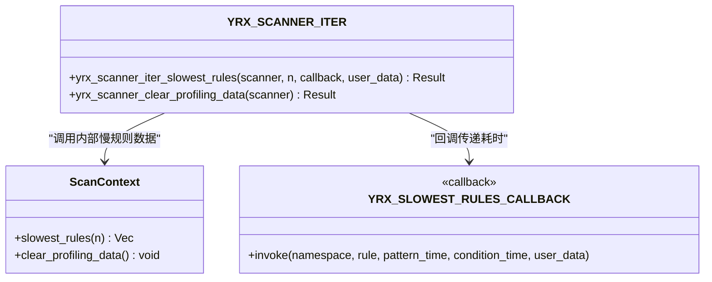
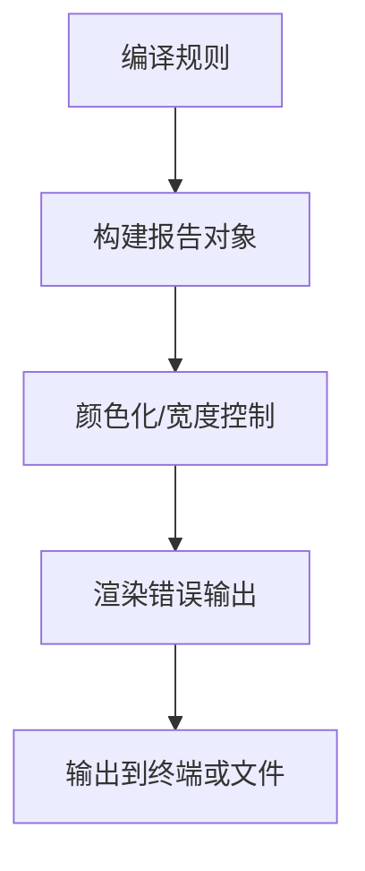
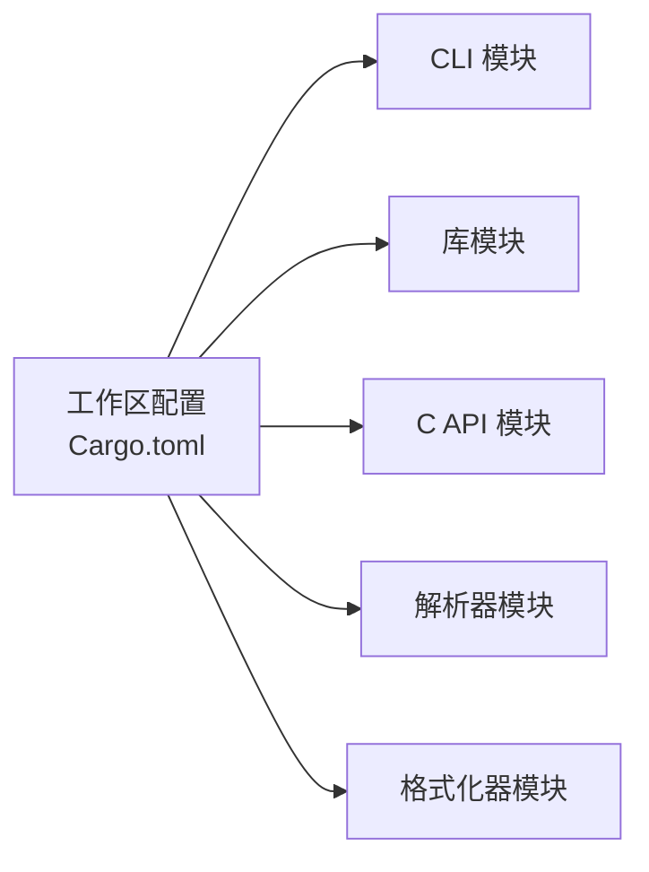
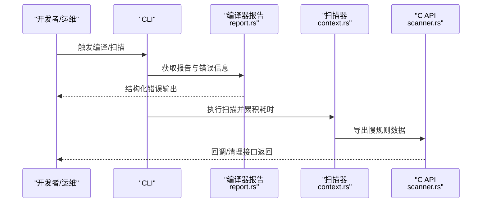

# 监控与日志

<cite>
**本文引用的文件**
- [Cargo.toml](file://yara-x/Cargo.toml)
- [main.rs](file://cli/src/main.rs)
- [console.rs](file://lib/src/modules/console.rs)
- [context.rs](file://lib/src/scanner/context.rs)
- [scanner.rs](file://capi/src/scanner.rs)
- [tests.rs](file://lib/src/scanner/tests.rs)
- [compiler.rs](file://capi/src/compiler.rs)
- [report.rs](file://lib/src/compiler/report.rs)
</cite>

## 目录
1. [简介](#简介)
2. [项目结构](#项目结构)
3. [核心组件](#核心组件)
4. [架构总览](#架构总览)
5. [详细组件分析](#详细组件分析)
6. [依赖关系分析](#依赖关系分析)
7. [性能考量](#性能考量)
8. [故障排查指南](#故障排查指南)
9. [结论](#结论)
10. [附录](#附录)

## 简介
本指南面向运维团队与 SRE 工程师，围绕 yara-x 的监控与日志配置提供系统化实践建议。内容涵盖关键性能指标（扫描性能、内存使用、并发处理、错误率）的定义与采集路径、监控系统（Prometheus、Grafana、ELK Stack）集成方案、日志记录策略（日志级别、格式标准化、敏感信息过滤）、告警机制（阈值、通知渠道、故障处理流程）、故障诊断工具与性能分析方法，以及日志轮转、存储管理与合规性考虑。

## 项目结构
yara-x 采用多 crate 的工作区组织方式，CLI、C API、库模块、解析器、格式化器等分别独立管理，便于按需启用特性与功能。与监控和日志相关的关键位置包括：
- CLI 启动与日志初始化：通过环境变量与特性开关控制日志输出。
- 规则编译期报告与错误输出：用于定位规则问题与性能风险。
- 扫描上下文与性能剖析：提供规则级耗时统计与慢规则迭代接口。
- C API 暴露的慢规则回调与清理接口：便于外部系统接入性能数据。

**图表来源**
- [main.rs:31-107](file://cli/src/main.rs#L31-L107)
- [context.rs:167-251](file://lib/src/scanner/context.rs#L167-L251)
- [console.rs:1-111](file://lib/src/modules/console.rs#L1-L111)
- [scanner.rs:633-711](file://capi/src/scanner.rs#L633-L711)
- [compiler.rs:35-68](file://capi/src/compiler.rs#L35-L68)
- [report.rs:176-408](file://lib/src/compiler/report.rs#L176-L408)

**章节来源**
- [Cargo.toml:17-30](file://yara-x/Cargo.toml#L17-L30)
- [main.rs:31-107](file://cli/src/main.rs#L31-L107)

## 核心组件
- 日志初始化与输出
  - CLI 在启用特定特性时初始化日志框架，支持在非 TTY 环境下自动关闭颜色输出，避免重定向到文件时出现乱码。
  - 控制台模块提供统一的日志输出能力，规则执行期间可将调试信息输出到控制台。
- 性能剖析与慢规则
  - 扫描上下文在启用特性时累积规则与模式匹配耗时，支持查询最慢规则列表与清理历史数据。
  - C API 提供遍历慢规则回调与清理接口，便于外部系统采集与展示。
- 编译期报告与错误输出
  - 编译器报告结构化错误信息，支持颜色化输出与宽度控制，便于快速定位规则问题与潜在性能风险。

**章节来源**
- [main.rs:31-107](file://cli/src/main.rs#L31-L107)
- [console.rs:1-111](file://lib/src/modules/console.rs#L1-L111)
- [context.rs:167-251](file://lib/src/scanner/context.rs#L167-L251)
- [scanner.rs:633-711](file://capi/src/scanner.rs#L633-L711)
- [compiler.rs:35-68](file://capi/src/compiler.rs#L35-L68)
- [report.rs:176-408](file://lib/src/compiler/report.rs#L176-L408)

## 架构总览
下图展示了从 CLI 到库与 C API 的调用链路，以及与日志、性能剖析和编译报告的关系。

**图表来源**
- [main.rs:84-107](file://cli/src/main.rs#L84-L107)
- [scanner.rs:633-711](file://capi/src/scanner.rs#L633-L711)
- [context.rs:167-251](file://lib/src/scanner/context.rs#L167-L251)
- [console.rs:1-111](file://lib/src/modules/console.rs#L1-L111)

## 详细组件分析

### 组件一：日志初始化与输出
- CLI 在启动时根据平台与特性决定是否初始化日志框架；当标准输出不是 TTY 时自动禁用颜色，确保重定向场景下的可读性。
- 控制台模块提供多种日志输出形式（字符串、整数、浮点、十六进制），便于规则执行阶段输出调试信息。

**图表来源**
- [main.rs:31-107](file://cli/src/main.rs#L31-L107)
- [console.rs:1-111](file://lib/src/modules/console.rs#L1-L111)

**章节来源**
- [main.rs:31-107](file://cli/src/main.rs#L31-L107)
- [console.rs:1-111](file://lib/src/modules/console.rs#L1-L111)

### 组件二：性能剖析与慢规则
- 扫描上下文在启用特性后，会累计每个规则与模式的耗时，并提供“最慢规则”排序与裁剪能力；同时支持清理历史数据以进行新的会话。
- C API 暴露慢规则迭代回调与清理接口，回调参数包含命名空间、规则名及两类耗时（模式匹配与条件执行），便于外部系统采集与可视化。

**图表来源**
- [context.rs:167-251](file://lib/src/scanner/context.rs#L167-L251)
- [scanner.rs:633-711](file://capi/src/scanner.rs#L633-L711)

**章节来源**
- [context.rs:167-251](file://lib/src/scanner/context.rs#L167-L251)
- [scanner.rs:633-711](file://capi/src/scanner.rs#L633-L711)
- [tests.rs:788-816](file://lib/src/scanner/tests.rs#L788-L816)

### 组件三：编译期报告与错误输出
- 编译器报告结构化错误信息，包含级别、标题、行列号、标签与脚注等，支持颜色化渲染与最大宽度控制，有助于快速定位规则问题与潜在性能风险（如慢模式、慢循环）。

**图表来源**
- [compiler.rs:35-68](file://capi/src/compiler.rs#L35-L68)
- [report.rs:176-408](file://lib/src/compiler/report.rs#L176-L408)

**章节来源**
- [compiler.rs:35-68](file://capi/src/compiler.rs#L35-L68)
- [report.rs:176-408](file://lib/src/compiler/report.rs#L176-L408)

## 依赖关系分析
- 工作区与依赖
  - 工作区成员覆盖核心库、CLI、C API、解析器、格式化器等模块，便于按需启用特性（如规则剖析、调试命令等）。
  - 关键日志与时间测量依赖项在工作区依赖中声明，为日志与性能度量提供基础能力。

**图表来源**
- [Cargo.toml:17-30](file://yara-x/Cargo.toml#L17-L30)

**章节来源**
- [Cargo.toml:17-30](file://yara-x/Cargo.toml#L17-L30)

## 性能考量
- 扫描性能
  - 使用规则剖析接口获取最慢规则，结合模式匹配与条件执行耗时，识别热点规则与潜在瓶颈。
  - 建议在生产环境中定期导出慢规则数据，建立趋势基线，配合告警阈值进行预警。
- 内存使用
  - 扫描上下文在剖析模式下会累积耗时数据，建议在长时间运行任务中周期性清理历史数据，避免内存持续增长。
- 并发处理
  - 库层具备并发扫描能力，建议在资源充足的环境中合理配置并发度，并结合系统监控观察 CPU 与内存占用。
- 错误率
  - 编译期报告与运行期错误输出可用于统计规则错误与扫描异常，作为错误率指标的基础来源。

**章节来源**
- [context.rs:167-251](file://lib/src/scanner/context.rs#L167-L251)
- [scanner.rs:633-711](file://capi/src/scanner.rs#L633-L711)
- [compiler.rs:35-68](file://capi/src/compiler.rs#L35-L68)

## 故障排查指南
- 规则编译失败
  - 使用编译器报告输出定位错误级别、标题、行列号与标签，结合颜色化渲染提升可读性。
- 规则性能异常
  - 启用规则剖析，导出最慢规则列表，优先优化高耗时规则与模式。
  - 清理历史剖析数据后重新采样，确保新数据反映当前负载。
- 运行期日志
  - 通过控制台模块输出调试信息，辅助定位规则执行过程中的状态与中间结果。
- CLI 异常退出
  - CLI 设置了全局 panic 钩子，任一线程 panic 将导致进程立即退出，便于快速发现致命错误。

**图表来源**
- [main.rs:31-107](file://cli/src/main.rs#L31-L107)
- [report.rs:176-408](file://lib/src/compiler/report.rs#L176-L408)
- [context.rs:167-251](file://lib/src/scanner/context.rs#L167-L251)
- [scanner.rs:633-711](file://capi/src/scanner.rs#L633-L711)

**章节来源**
- [main.rs:31-107](file://cli/src/main.rs#L31-L107)
- [report.rs:176-408](file://lib/src/compiler/report.rs#L176-L408)
- [context.rs:167-251](file://lib/src/scanner/context.rs#L167-L251)
- [scanner.rs:633-711](file://capi/src/scanner.rs#L633-L711)

## 结论
通过对 yara-x 的日志初始化、性能剖析与编译报告机制的梳理，可以构建一套完整的监控与日志体系：以 CLI 与 C API 为桥梁，结合规则剖析与编译报告，形成可观测的扫描性能、错误率与运行状态视图。在此基础上，可进一步对接 Prometheus、Grafana 与 ELK Stack，实现自动化监控、可视化与日志检索。

## 附录

### 监控系统集成方案（Prometheus/Grafana/ELK）
- 指标采集
  - 通过 C API 的慢规则回调接口，将命名空间、规则名与两类耗时（模式匹配、条件执行）上报至指标系统，作为自定义指标。
  - 将编译期报告中的错误计数与类别映射为指标，用于错误率统计。
- 可视化
  - 在 Grafana 中基于慢规则指标创建面板，展示最慢规则 Top-N 趋势与阈值告警。
- 日志采集
  - 将 CLI 与库模块的日志输出接入 ELK，利用结构化字段（如规则名、耗时、错误级别）进行检索与聚合。

[本节为概念性指导，不直接分析具体源文件]

### 日志记录策略
- 日志级别
  - 建议使用 INFO/DEBUG/WARN/ERROR 分层，区分常规运行、调试诊断、警告与错误。
- 格式标准化
  - 统一时间戳、服务名、模块、级别、消息体的结构化输出，便于日志系统解析与检索。
- 敏感信息过滤
  - 对日志中的敏感字段（如路径、内容片段）进行脱敏或截断处理，遵循最小披露原则。

[本节为通用实践，不直接分析具体源文件]

### 告警机制配置
- 阈值设置
  - 慢规则阈值：如单条规则条件执行时间超过阈值即触发告警。
  - 错误率阈值：单位时间内编译/扫描错误次数超过阈值触发告警。
- 通知渠道
  - 集成邮件、IM、电话等多渠道通知，确保关键告警及时触达。
- 故障处理流程
  - 告警触发后自动派发工单，关联日志与指标，进行根因分析与修复闭环。

[本节为通用实践，不直接分析具体源文件]

### 日志轮转、存储管理与合规性
- 轮转策略
  - 基于大小与时间的轮转，保留必要期限的日志副本，压缩旧日志以节省存储。
- 存储管理
  - 分层存储：热数据本地磁盘，温数据归档到对象存储，冷数据长期归档。
- 合规性
  - 明确日志保留期限与访问权限，满足审计与法规要求；对个人数据与敏感信息进行加密与访问控制。

[本节为通用实践，不直接分析具体源文件]