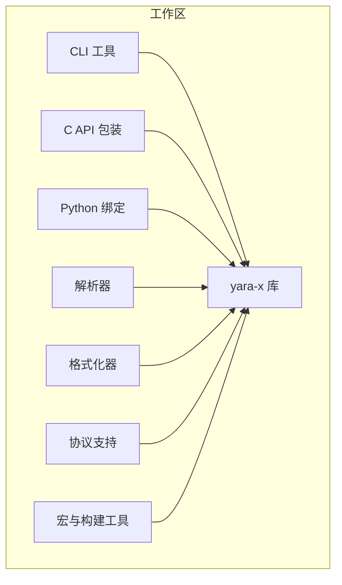
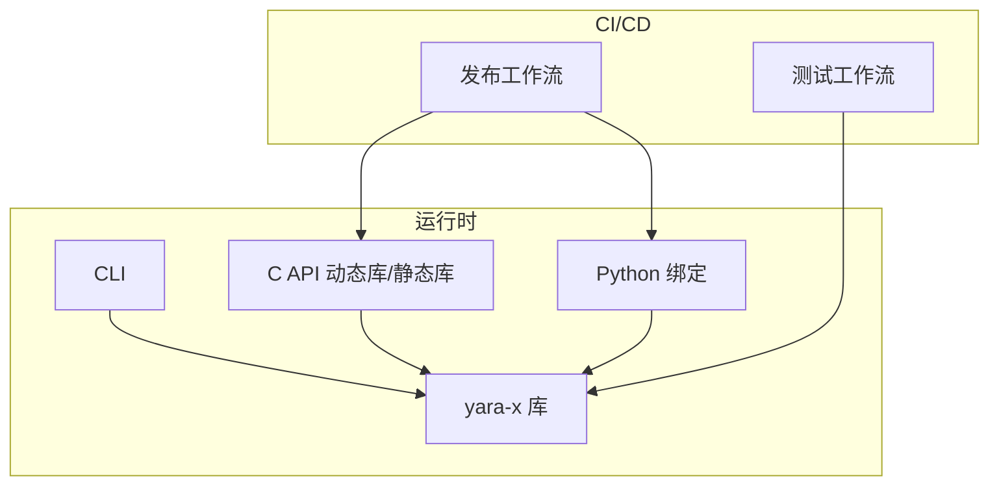
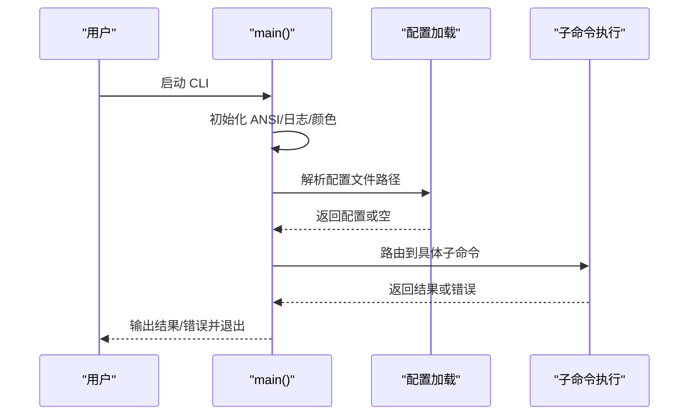
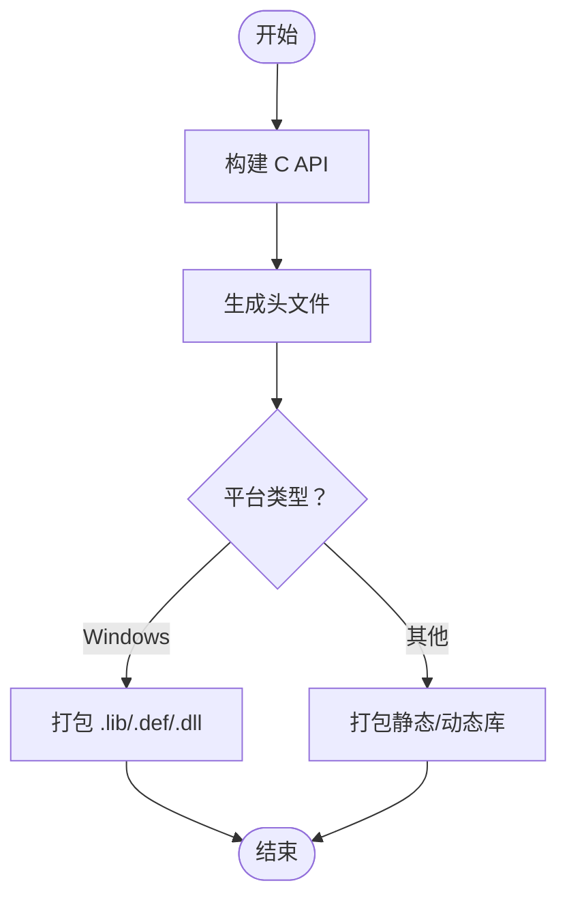
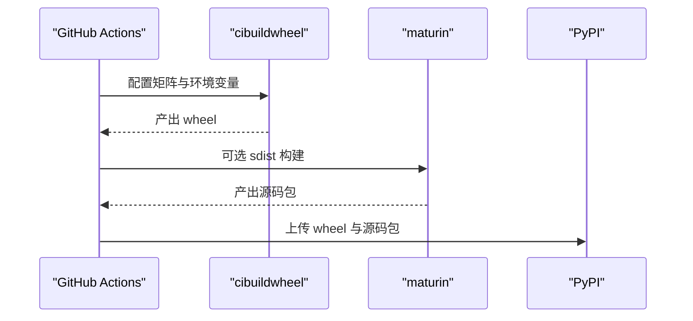
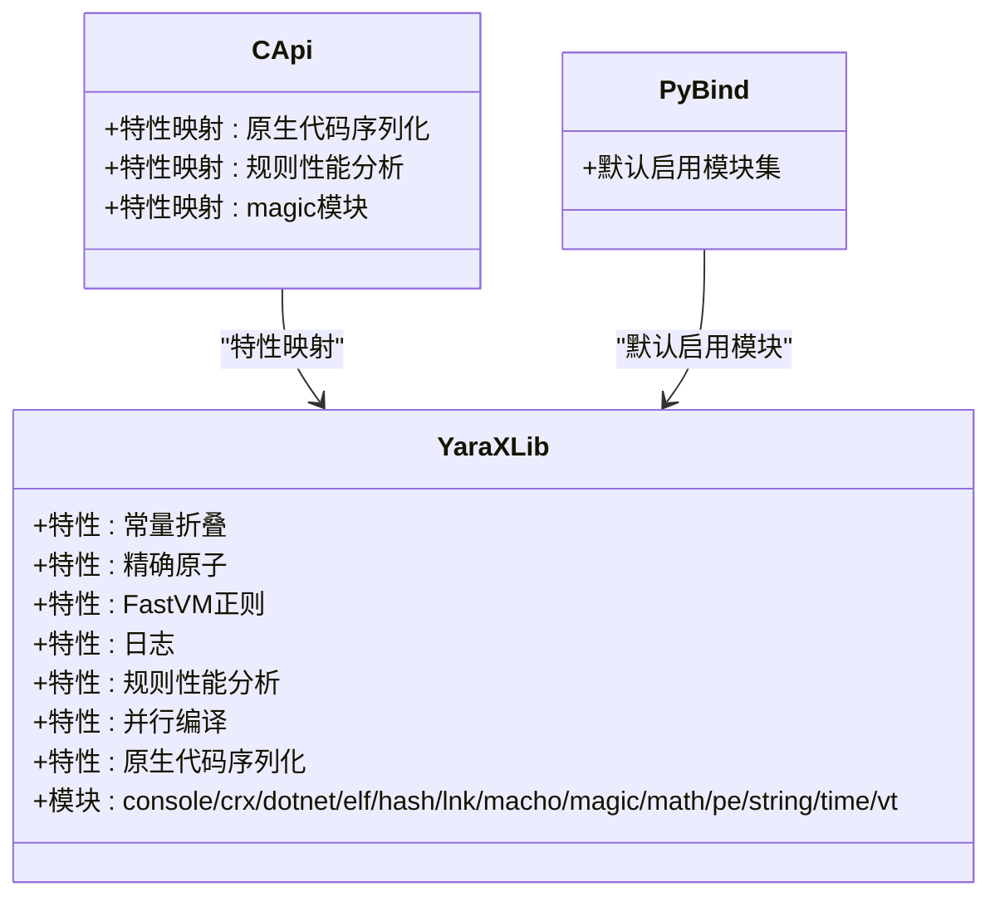
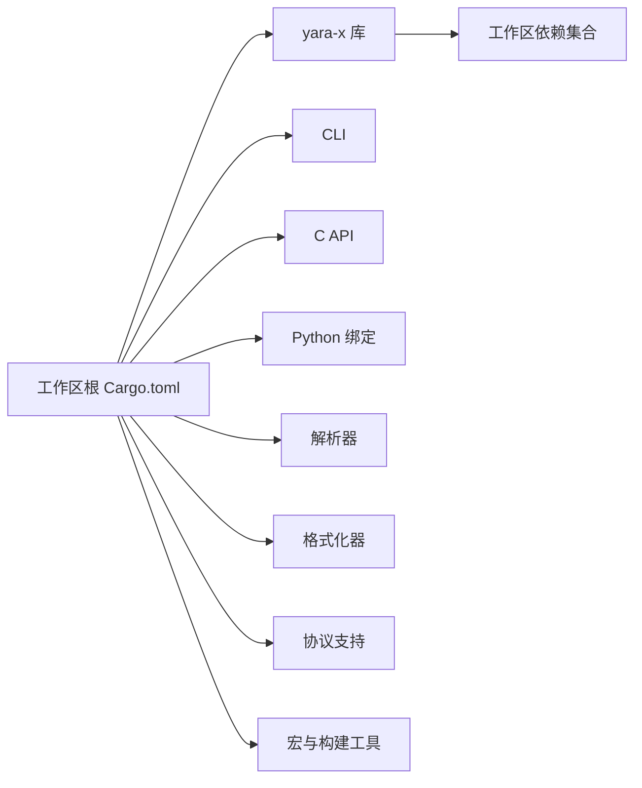

# 部署与运维

<cite>
**本文引用的文件**
- [Cargo.toml](file://yara-x/Cargo.toml)
- [README.md](file://yara-x/README.md)
- [.github/workflows/release.yaml](file://yara-x/.github/workflows/release.yaml)
- [.github/workflows/tests.yaml](file://yara-x/.github/workflows/tests.yaml)
- [.github/workflows/code_health.yaml](file://yara-x/.github/workflows/code_health.yaml)
- [cli/src/main.rs](file://yara-x/cli/src/main.rs)
- [lib/Cargo.toml](file://yara-x/lib/Cargo.toml)
- [capi/Cargo.toml](file://yara-x/capi/Cargo.toml)
- [py/Cargo.toml](file://yara-x/py/Cargo.toml)
</cite>

## 目录
1. [简介](#简介)
2. [项目结构](#项目结构)
3. [核心组件](#核心组件)
4. [架构总览](#架构总览)
5. [详细组件分析](#详细组件分析)
6. [依赖关系分析](#依赖关系分析)
7. [性能考量](#性能考量)
8. [故障排除指南](#故障排除指南)
9. [结论](#结论)
10. [附录](#附录)

## 简介
本指南面向运维与系统管理员，围绕 yara-x 在生产环境中的部署与运维展开，涵盖环境准备、服务配置、依赖管理、安全加固、CI/CD 集成（含自动化测试与发布）、监控与日志、备份与恢复、容量规划与扩展性等主题。文档基于仓库内实际的构建与工作流配置进行说明，并提供可操作的建议与最佳实践。

## 项目结构
yara-x 采用多 crate 工作区组织，核心模块包括：
- 核心库：yara-x（规则编译、扫描、模块化能力）
- CLI：命令行工具，提供检查、格式化、编译、扫描、转储等功能
- C API：对外提供静态/动态库与头文件，便于 C/C++/Go/Python 等语言绑定
- Python 绑定：通过 PyO3 提供 abi3 兼容的 cdylib 接口
- 解析器与格式化器：解析规则语法、格式化规则
- 协议与序列化：JSON/YAML/Protobuf 支持
- 宏与构建工具：生成模块注册代码、跨平台打包

图表来源
- [Cargo.toml:17-30](file://yara-x/Cargo.toml#L17-L30)
- [lib/Cargo.toml:1-30](file://yara-x/lib/Cargo.toml#L1-L30)
- [cli/src/main.rs:16-17](file://yara-x/cli/src/main.rs#L16-L17)

章节来源
- [Cargo.toml:17-30](file://yara-x/Cargo.toml#L17-L30)
- [README.md:1-69](file://yara-x/README.md#L1-L69)

## 核心组件
- 核心库（yara-x）：提供规则引擎、模块系统、WASM 执行后端、序列化与反序列化、可选的并行编译与原生代码嵌入等能力；通过特性开关控制模块与功能启用。
- CLI：提供规则检查、格式化、编译、扫描、转储、补全等子命令；支持从用户主目录加载配置文件。
- C API：导出静态/动态库与头文件，适配不同平台；支持规则序列化原生代码嵌入与规则性能分析特性。
- Python 绑定：通过 abi3 兼容策略在多种 Python 版本间复用；默认启用常用模块与优化特性。

章节来源
- [lib/Cargo.toml:30-224](file://yara-x/lib/Cargo.toml#L30-L224)
- [cli/src/main.rs:31-107](file://yara-x/cli/src/main.rs#L31-L107)
- [capi/Cargo.toml:14-46](file://yara-x/capi/Cargo.toml#L14-L46)
- [py/Cargo.toml:18-66](file://yara-x/py/Cargo.toml#L18-L66)

## 架构总览
下图展示生产环境中各组件的交互关系与数据流向：CLI 作为入口调用核心库；C API 与 Python 绑定分别面向外部系统集成；工作流负责构建、测试与发布。

图表来源
- [cli/src/main.rs:84-95](file://yara-x/cli/src/main.rs#L84-L95)
- [lib/Cargo.toml:226-285](file://yara-x/lib/Cargo.toml#L226-L285)
- [capi/Cargo.toml:44-46](file://yara-x/capi/Cargo.toml#L44-L46)
- [.github/workflows/tests.yaml:104-148](file://yara-x/.github/workflows/tests.yaml#L104-L148)
- [.github/workflows/release.yaml:67-102](file://yara-x/.github/workflows/release.yaml#L67-L102)

## 详细组件分析

### CLI 部署与配置
- 启动行为：初始化 ANSI 支持、条件启用日志、根据输出是否 TTY 关闭颜色、设置全局 panic 处理器确保线程异常时进程退出。
- 配置加载：优先使用命令行指定配置文件，否则尝试用户主目录下的默认配置文件；若配置无效则打印错误并退出。
- 子命令路由：根据子命令分发到对应执行函数，错误统一格式化输出并返回非零退出码。

图表来源
- [cli/src/main.rs:31-107](file://yara-x/cli/src/main.rs#L31-L107)

章节来源
- [cli/src/main.rs:31-107](file://yara-x/cli/src/main.rs#L31-L107)

### C API 部署与特性
- 构建产物：同时生成静态库与动态库，配合 cbindgen 自动生成头文件；Windows 平台额外生成 DEF/LIB/DLL 文件。
- 特性映射：C API 将核心库特性映射到 C 接口，如规则序列化原生代码嵌入、规则性能分析、magic 模块等。
- 使用场景：面向 C/C++/Go/Python 等语言的绑定与集成，支持多平台二进制交付。

图表来源
- [.github/workflows/release.yaml:72-95](file://yara-x/.github/workflows/release.yaml#L72-L95)
- [capi/Cargo.toml:40-65](file://yara-x/capi/Cargo.toml#L40-L65)

章节来源
- [.github/workflows/release.yaml:72-95](file://yara-x/.github/workflows/release.yaml#L72-L95)
- [capi/Cargo.toml:14-46](file://yara-x/capi/Cargo.toml#L14-L46)

### Python 绑定部署
- 构建方式：使用 cibuildwheel 与 maturin（可选）在多平台、多 Python 版本上构建 wheel；跳过不支持的架构组合。
- 测试：通过 pytest 运行测试；macOS arm64/universal2 的特定矩阵项被跳过。
- 发布：将构建产物上传至 PyPI。

图表来源
- [.github/workflows/release.yaml:168-196](file://yara-x/.github/workflows/release.yaml#L168-L196)
- [.github/workflows/release.yaml:265-270](file://yara-x/.github/workflows/release.yaml#L265-L270)

章节来源
- [.github/workflows/release.yaml:103-203](file://yara-x/.github/workflows/release.yaml#L103-L203)
- [.github/workflows/release.yaml:249-270](file://yara-x/.github/workflows/release.yaml#L249-L270)

### 核心库特性与模块
- 特性开关：常量折叠、精确原子、FastVM 正则、日志、规则性能分析、并行编译、原生代码序列化等。
- 模块系统：支持 console、crx、dotnet、elf、hash、lnk、macho、magic、math、pe、string、time、vt 等模块；可通过特性启用/禁用。
- 默认启用：除基础模块外，还默认启用若干模块以满足常见场景。

图表来源
- [lib/Cargo.toml:30-224](file://yara-x/lib/Cargo.toml#L30-L224)
- [capi/Cargo.toml:14-34](file://yara-x/capi/Cargo.toml#L14-L34)
- [py/Cargo.toml:18-50](file://yara-x/py/Cargo.toml#L18-L50)

章节来源
- [lib/Cargo.toml:30-224](file://yara-x/lib/Cargo.toml#L30-L224)
- [capi/Cargo.toml:14-34](file://yara-x/capi/Cargo.toml#L14-L34)
- [py/Cargo.toml:18-50](file://yara-x/py/Cargo.toml#L18-L50)

## 依赖关系分析
- 工作区统一版本与依赖：工作区根 Cargo.toml 统一声明版本、Rust 最低版本要求与依赖集合，成员 crate 通过 workspace 引用。
- 成员关系：CLI、C API、Python 绑定、解析器、格式化器、协议与宏等均作为工作区成员参与构建。
- 运行时依赖：核心库依赖 aho-corasick、regex、serde、wasmtime、protobuf 等；特性开启时引入 crypto、magic、quanta 等可选依赖。

图表来源
- [Cargo.toml:17-30](file://yara-x/Cargo.toml#L17-L30)
- [Cargo.toml:33-116](file://yara-x/Cargo.toml#L33-L116)
- [lib/Cargo.toml:226-285](file://yara-x/lib/Cargo.toml#L226-L285)

章节来源
- [Cargo.toml:17-30](file://yara-x/Cargo.toml#L17-L30)
- [Cargo.toml:33-116](file://yara-x/Cargo.toml#L33-L116)
- [lib/Cargo.toml:226-285](file://yara-x/lib/Cargo.toml#L226-L285)

## 性能考量
- 编译优化配置：工作区提供 release-lto 配置，启用链接时优化与单代码生成单元，适合生产发布二进制。
- 开发优化：针对解析器包启用 dev 优化级别，避免递归函数导致栈溢出问题。
- 并行编译：核心库支持 WASM 规则并行编译特性，可显著降低大规模规则编译时间，但需评估并发开销。
- 原生代码序列化：启用后可减少规则加载时的 JIT 时间，但会增大序列化体积；跨平台使用时会被忽略并重新生成。

章节来源
- [Cargo.toml:117-135](file://yara-x/Cargo.toml#L117-L135)
- [lib/Cargo.toml:75-81](file://yara-x/lib/Cargo.toml#L75-L81)
- [lib/Cargo.toml:63-73](file://yara-x/lib/Cargo.toml#L63-L73)

## 故障排除指南
- CLI 启动失败或无输出
  - 检查 ANSI 支持初始化与颜色关闭逻辑；确认 stdout 是否为 TTY。
  - 检查配置文件路径与权限，确认默认配置是否存在且可读。
  - 查看 panic 处理器是否触发（任何线程 panic 将导致进程退出）。
- 日志与调试
  - 启用 logging 特性以输出调试日志；启用 rules-profiling 获取扫描耗时统计。
  - 在 CI 中使用稳定的 Rust 工具链与目标三元组，避免平台差异导致的构建失败。
- Python 绑定
  - 若在 macOS arm64/universal2 上构建失败，检查矩阵中跳过的条件；确认 Python 版本与架构匹配。
  - 使用 pytest 运行测试，定位模块兼容性问题。
- C API
  - Windows 平台需安装额外的 CRT 静态特性；确认生成的 .lib/.def/.dll 是否完整。
  - 跨平台使用时，原生代码序列化会被忽略并重新生成，注意性能与兼容性权衡。

章节来源
- [cli/src/main.rs:31-107](file://yara-x/cli/src/main.rs#L31-L107)
- [lib/Cargo.toml:60-86](file://yara-x/lib/Cargo.toml#L60-L86)
- [.github/workflows/tests.yaml:129-148](file://yara-x/.github/workflows/tests.yaml#L129-L148)
- [.github/workflows/release.yaml:173-188](file://yara-x/.github/workflows/release.yaml#L173-L188)
- [.github/workflows/release.yaml:72-78](file://yara-x/.github/workflows/release.yaml#L72-L78)

## 结论
本指南基于仓库内的实际配置与工作流，给出了 yara-x 在生产环境中的部署与运维要点：明确的特性与模块体系、完善的 CI/CD 流水线、跨平台二进制与 Python 包发布、以及可扩展的日志与性能分析能力。结合本文的监控、日志、备份与容量规划建议，可帮助团队在高吞吐、多模块场景下稳定运行 yara-x。

## 附录

### 生产环境部署清单
- 系统要求
  - 操作系统：Linux、macOS、Windows（按需选择目标三元组）
  - Rust 工具链：MSRV 与稳定版本均受支持
  - 可选依赖：libmagic、protobuf 编译器（按需启用相关特性）
- 二进制与包
  - CLI：直接使用发布二进制或自行构建（推荐 release-lto）
  - C API：下载对应平台的静态/动态库与头文件
  - Python：从 PyPI 安装 abi3 兼容包
- 配置与启动
  - CLI 支持从用户主目录加载配置文件；确保路径存在且权限正确
  - 启用 logging 与 rules-profiling 特性以辅助排障
- 安全加固
  - 仅启用必要模块，避免不必要的依赖与功能暴露
  - 使用只读文件系统挂载规则与数据目录，限制写入
  - 对外接口（如 C API）限制访问范围，结合防火墙策略

章节来源
- [Cargo.toml:11-15](file://yara-x/Cargo.toml#L11-L15)
- [.github/workflows/tests.yaml:117-128](file://yara-x/.github/workflows/tests.yaml#L117-L128)
- [.github/workflows/release.yaml:67-95](file://yara-x/.github/workflows/release.yaml#L67-L95)
- [lib/Cargo.toml:60-86](file://yara-x/lib/Cargo.toml#L60-L86)

### CI/CD 集成策略
- 自动化测试
  - 覆盖 MSRV、稳定版、夜间版、macOS、32 位、Windows、无默认特性、protoc 等矩阵组合
  - 使用缓存加速依赖与构建过程
- 性能回归测试
  - 在启用 rules-profiling 的情况下运行扫描基准，记录耗时趋势
  - 对比不同特性组合（如 fast-regexp、exact-atoms、parallel-compilation）对性能的影响
- 发布流程
  - 基于标签触发，构建多平台二进制与 C API 包
  - Python 包通过 cibuildwheel 构建并上传至 PyPI
  - 发布前校验版本号一致性

章节来源
- [.github/workflows/tests.yaml:1-148](file://yara-x/.github/workflows/tests.yaml#L1-L148)
- [.github/workflows/release.yaml:1-270](file://yara-x/.github/workflows/release.yaml#L1-L270)

### 监控与日志配置
- 关键指标
  - 规则编译耗时、扫描耗时、内存占用、并发线程数
  - 模块命中率与错误率（如 magic、hash、pe 等）
- 日志
  - 启用 logging 与 rules-profiling，输出规则级耗时统计
  - 在容器或 systemd 环境中统一采集标准输出与错误输出
- 故障排除
  - 结合 panic 处理器与错误链路输出快速定位问题
  - 使用最小化配置复现问题，逐步启用模块验证影响范围

章节来源
- [lib/Cargo.toml:60-86](file://yara-x/lib/Cargo.toml#L60-L86)
- [cli/src/main.rs:31-107](file://yara-x/cli/src/main.rs#L31-L107)

### 备份与恢复、容量规划与扩展性
- 备份与恢复
  - 规则文件与序列化后的规则集定期备份；区分开发/预生产/生产三套策略
  - 原生代码序列化的规则在跨平台迁移时需重新生成，备份应包含可重建的规则源
- 容量规划
  - 依据规则数量与复杂度估算内存与 CPU 需求；启用并行编译与原生代码序列化以平衡启动时间与体积
  - 对热点模块（如 hash、pe、magic）进行资源预留
- 扩展性
  - 通过特性开关按需启用模块，避免过度依赖
  - 使用多实例横向扩展，结合负载均衡与健康检查

章节来源
- [lib/Cargo.toml:63-73](file://yara-x/lib/Cargo.toml#L63-L73)
- [lib/Cargo.toml:75-81](file://yara-x/lib/Cargo.toml#L75-L81)