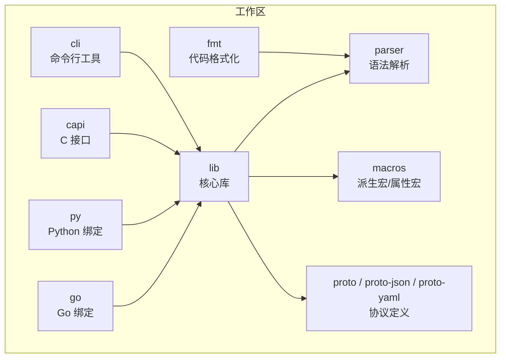
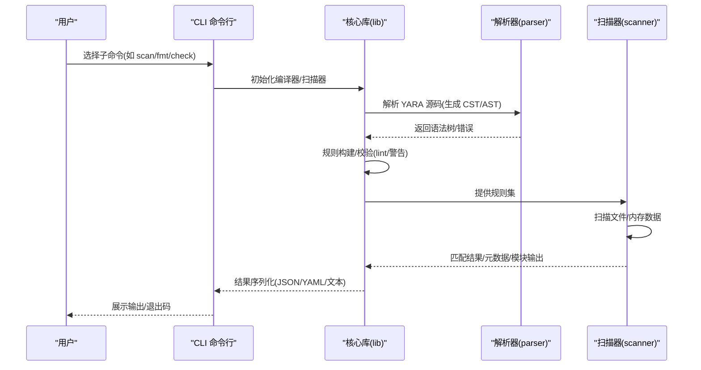
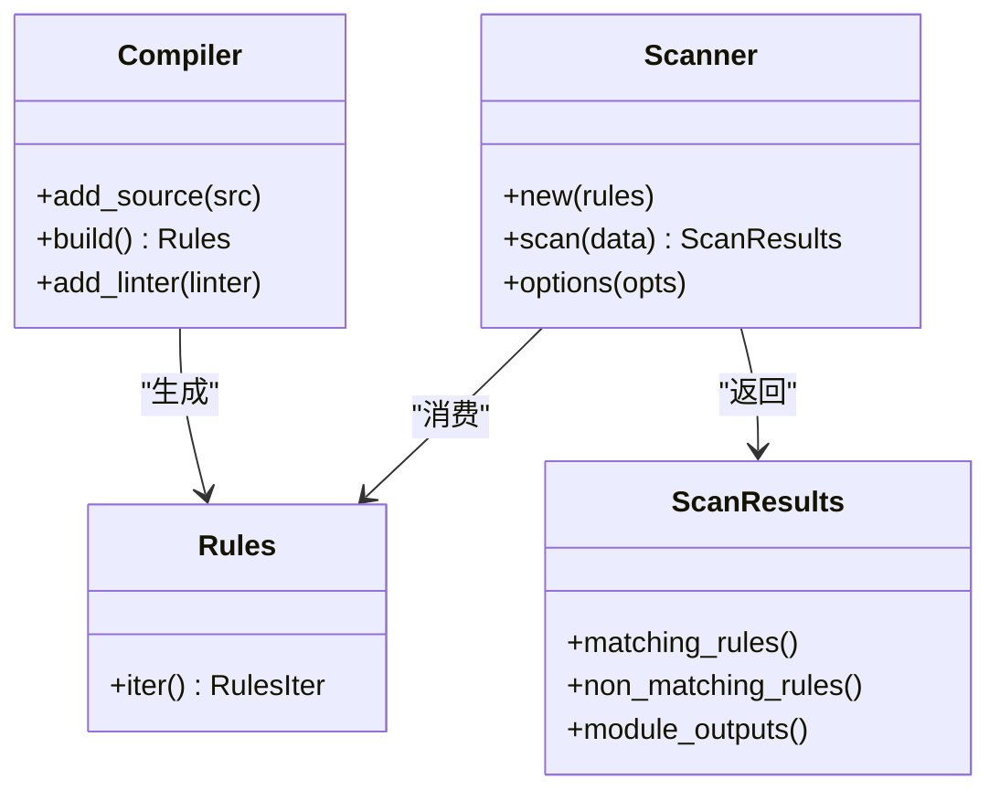
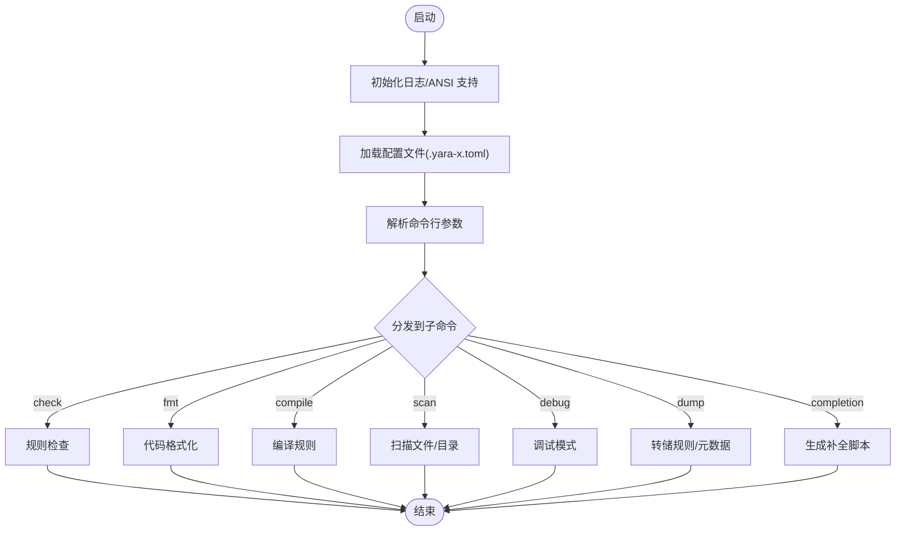
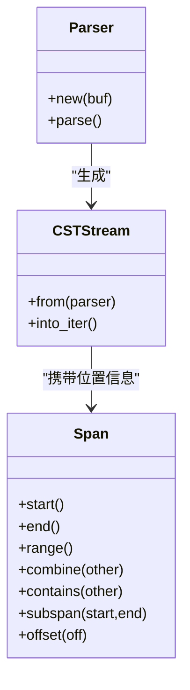
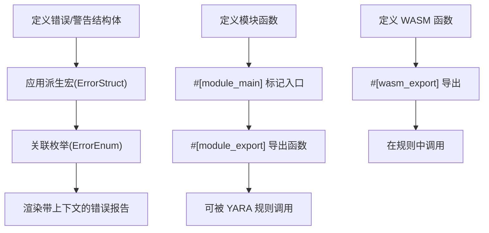
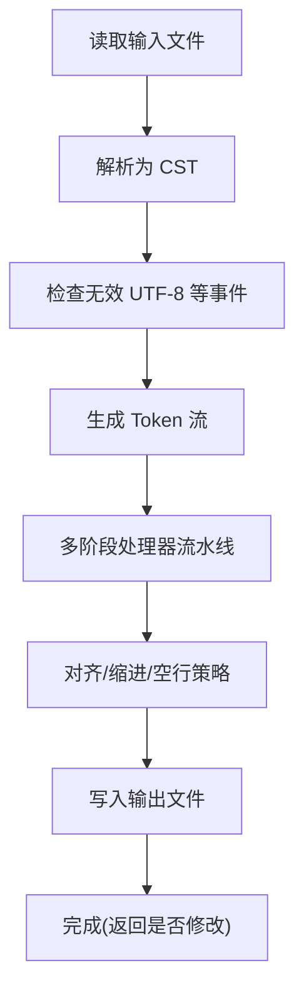
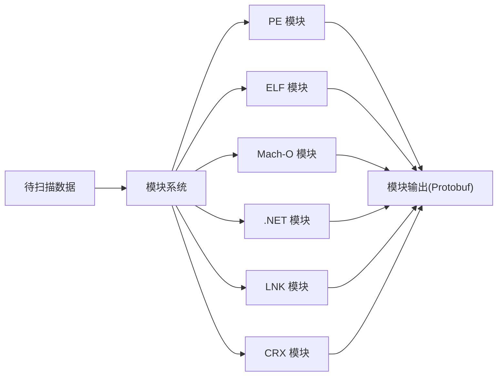
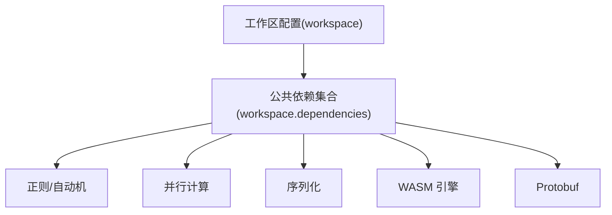

# 项目概述

<cite>
**本文引用的文件**
- [README.md](file://README.md)
- [Cargo.toml](file://Cargo.toml)
- [lib/src/lib.rs](file://lib/src/lib.rs)
- [cli/src/main.rs](file://cli/src/main.rs)
- [parser/src/lib.rs](file://parser/src/lib.rs)
- [macros/src/lib.rs](file://macros/src/lib.rs)
- [fmt/src/lib.rs](file://fmt/src/lib.rs)
- [site/content/docs/intro/yara_vs_yara-x.md](file://site/content/docs/intro/yara_vs_yara-x.md)
- [site/content/docs/intro/getting_started.md](file://site/content/docs/intro/getting_started.md)
- [site/content/docs/intro/installation.md](file://site/content/docs/intro/installation.md)
- [site/content/blog/introducing-yara-x/index.md](file://site/content/blog/introducing-yara-x/index.md)
- [site/content/blog/yara-x-is-stable/index.md](file://site/content/blog/yara-x-is-stable/index.md)
- [site/content/docs/modules/modules.md](file://site/content/docs/modules/modules.md)
- [site/content/docs/modules/macho.md](file://site/content/docs/modules/macho.md)
- [AUTHORS](file://AUTHORS)
</cite>

## 目录
1. [引言](#引言)
2. [项目结构](#项目结构)
3. [核心组件](#核心组件)
4. [架构总览](#架构总览)
5. [详细组件分析](#详细组件分析)
6. [依赖关系分析](#依赖关系分析)
7. [性能考量](#性能考量)
8. [故障排查指南](#故障排查指南)
9. [结论](#结论)
10. [附录](#附录)

## 引言
YARA-X 是对经典 YARA 工具的一次全新实现，目标是“更快、更安全、更易用”，并最终成为恶意软件研究人员默认的规则匹配工具。它在保持与现有 YARA 规则高度兼容的同时，通过现代化设计与工程实践，在错误报告、命令行体验、解析器可复用性、整体性能等方面显著提升，并在生产环境中经过大规模扫描验证。

- 项目愿景：成为规则驱动的模式匹配基础设施，支撑威胁狩猎、自动化分析与可扩展检测管线。
- 当前状态：已达到稳定版本里程碑，官方宣布原版 YARA 进入维护模式，后续创新全部聚焦于 YARA-X。
- 社区与企业支持：由 VirusTotal 主导，作者列表包含多家企业与个人贡献者，文档与博客持续更新。

**章节来源**
- [README.md:1-69](file://README.md#L1-L69)
- [site/content/blog/yara-x-is-stable/index.md:1-47](file://site/content/blog/yara-x-is-stable/index.md#L1-L47)
- [site/content/blog/introducing-yara-x/index.md:27-50](file://site/content/blog/introducing-yara-x/index.md#L27-L50)
- [AUTHORS:1-14](file://AUTHORS#L1-L14)

## 项目结构
YARA-X 采用多 crate 工作区组织，围绕“编译器-扫描器-模块系统-格式化-解析器-宏工具-跨语言绑定”的分层设计展开，既保证了内部解耦，也便于生态扩展与多语言集成。

**图表来源**
- [Cargo.toml:17-30](file://Cargo.toml#L17-L30)
- [Cargo.toml:18-29](file://Cargo.toml#L18-L29)

**章节来源**
- [Cargo.toml:17-30](file://Cargo.toml#L17-L30)

## 核心组件
- 编译器与规则集：负责将 YARA 源码编译为可执行的规则集，支持 lint、警告与错误类型体系。
- 扫描器：基于编译后的规则集进行文件或内存数据扫描，提供匹配结果、元数据与模块输出。
- 解析器：生成 CST/AST，支持代码格式化、文档生成、静态分析等上层工具链。
- 宏工具：提供错误/警告结构体派生、模块主函数标记、WASM 导出等开发辅助能力。
- 格式化器：类 rustfmt 风格的 YARA 规则自动格式化，提升团队一致性。
- 模块系统：内置多种文件格式解析模块（如 PE、ELF、Mach-O、LNK、CRX、.NET 等），暴露字段与函数供规则使用。
- 跨语言绑定：提供 C、Go、Python 接口，便于嵌入到不同生态。

**章节来源**
- [lib/src/lib.rs:1-178](file://lib/src/lib.rs#L1-L178)
- [parser/src/lib.rs:1-142](file://parser/src/lib.rs#L1-L142)
- [macros/src/lib.rs:1-303](file://macros/src/lib.rs#L1-L303)
- [fmt/src/lib.rs:1-800](file://fmt/src/lib.rs#L1-L800)
- [site/content/docs/modules/modules.md:1-31](file://site/content/docs/modules/modules.md#L1-L31)

## 架构总览
下图展示了从命令行到核心引擎、再到模块系统的端到端调用路径与职责划分。

**图表来源**
- [cli/src/main.rs:31-108](file://cli/src/main.rs#L31-L108)
- [lib/src/lib.rs:14-72](file://lib/src/lib.rs#L14-L72)
- [parser/src/lib.rs:1-142](file://parser/src/lib.rs#L1-142)

## 详细组件分析

### 核心库（lib）：编译器与扫描器
- 设计要点
  - 编译器负责将源码转为规则集；扫描器基于规则集进行匹配，支持并发与模块输出。
  - 错误/警告/警告码体系完善，便于规则质量控制与迁移。
  - 版本常量与清理接口，支持动态卸载场景下的资源回收。
- 关键能力
  - 规则构建、匹配、元数据访问、模块输出聚合。
  - 可选的规则剖析数据收集，用于性能优化与问题定位。

**图表来源**
- [lib/src/lib.rs:48-72](file://lib/src/lib.rs#L48-L72)

**章节来源**
- [lib/src/lib.rs:1-178](file://lib/src/lib.rs#L1-L178)

### 命令行工具（cli）
- 功能特性
  - 彩色输出、自动补全、配置文件加载、错误统一处理与进程级崩溃策略。
  - 子命令覆盖检查、格式化、编译、扫描、调试、转储、补全等常用任务。
- 用户体验
  - 在非 TTY 环境自动禁用颜色；统一错误打印；主线程 panic 即时退出，避免静默失败。

**图表来源**
- [cli/src/main.rs:31-108](file://cli/src/main.rs#L31-L108)

**章节来源**
- [cli/src/main.rs:1-108](file://cli/src/main.rs#L1-L108)

### 解析器（parser）：CST/AST 与跨度管理
- 设计理念
  - 同时支持 CST（保留原始细节）与 AST（语义抽象），满足格式化、文档生成、静态分析等需求。
  - 提供 Span 结构描述源码位置范围，支持组合、包含、偏移等操作。
- 应用价值
  - 为格式化器提供稳定的输入流；为上层工具复用解析逻辑奠定基础。

**图表来源**
- [parser/src/lib.rs:1-142](file://parser/src/lib.rs#L1-L142)

**章节来源**
- [parser/src/lib.rs:1-142](file://parser/src/lib.rs#L1-L142)

### 宏工具（macros）：错误/警告与模块/WASM 导出
- 错误结构体派生宏：统一错误/警告定义、标题、代码与标注位置。
- 模块主函数与导出宏：声明模块入口与对外函数，支持重载与命名导出。
- WASM 导出宏：声明可从 WASM 调用的函数签名与可见性。

**图表来源**
- [macros/src/lib.rs:104-303](file://macros/src/lib.rs#L104-L303)

**章节来源**
- [macros/src/lib.rs:1-303](file://macros/src/lib.rs#L1-L303)

### 代码格式化（fmt）
- 能力概览
  - 自动插入换行、对齐元数据与字符串定义、控制缩进与空行策略、处理注释与尾随空白。
  - 基于解析器的 CST 流进行无损格式化，支持自定义配置。
- 使用场景
  - 团队协作中的风格统一、CI 中的格式检查与自动修复。

**图表来源**
- [fmt/src/lib.rs:369-418](file://fmt/src/lib.rs#L369-L418)

**章节来源**
- [fmt/src/lib.rs:1-800](file://fmt/src/lib.rs#L1-L800)

### 模块系统（modules）与生态
- 模块能力
  - 通过模块扩展规则表达力，例如解析 PE/ELF/Mach-O/LNK/CRX/.NET 等格式，暴露字段与函数。
  - 内置模块集合可通过统一入口批量调用或单独调用。
- 生态意义
  - 将“二进制特征”上升到“结构化属性”，使规则更具针对性与可维护性。

**图表来源**
- [site/content/docs/modules/modules.md:21-31](file://site/content/docs/modules/modules.md#L21-L31)
- [site/content/docs/modules/macho.md:21-78](file://site/content/docs/modules/macho.md#L21-L78)
- [lib/src/lib.rs:61](file://lib/src/lib.rs#L61)

**章节来源**
- [site/content/docs/modules/modules.md:1-31](file://site/content/docs/modules/modules.md#L1-L31)
- [site/content/docs/modules/macho.md:1-78](file://site/content/docs/modules/macho.md#L1-L78)

## 依赖关系分析
- 工作区成员与依赖
  - 工作区统一管理版本、关键字、许可证与 Rust 版本要求。
  - 依赖集中声明于 workspace.dependencies，涵盖正则、加密、并行、序列化、protobuf、WASM 引擎等。
- 性能与可靠性
  - 并行计算（Rayon）、高性能正则（regex-automata）、WASM 执行引擎（wasmtime）等为复杂规则与模块提供支撑。
  - 开发配置针对解析器启用优化级别，避免递归导致的栈溢出风险。

**图表来源**
- [Cargo.toml:33-116](file://Cargo.toml#L33-L116)

**章节来源**
- [Cargo.toml:17-135](file://Cargo.toml#L17-L135)

## 性能考量
- 与 YARA 的对比
  - 在正则与复杂循环规则上，YARA-X 明显更快；YARA 在纯文本/简单十六进制模式上仍具备更高原始扫描速度。
  - 复杂混合规则场景下，YARA-X 的整体性能通常更优，因为其擅长处理“慢点”规则。
- 实践建议
  - 对于大量混合规则的扫描任务，优先采用 YARA-X。
  - 对于极少数高度优化的纯文本/简单十六进制规则，可按需评估迁移成本。
- 工程优化
  - 解析器与扫描器分离，利于缓存规则集、并行化扫描与模块输出聚合。
  - WASM 引擎与模块化设计，便于扩展新格式与功能。

**章节来源**
- [site/content/docs/intro/yara_vs_yara-x.md:58-107](file://site/content/docs/intro/yara_vs_yara-x.md#L58-L107)
- [site/content/blog/smarter-not-always-better/index.md:48-98](file://site/content/blog/smarter-not-always-better/index.md#L48-L98)

## 故障排查指南
- 常见问题与定位
  - 规则错误与警告：利用完善的错误码与上下文标注，快速定位重复标签、参数错误等问题。
  - CLI 行为异常：确认配置文件加载、终端 TTY 状态、颜色输出开关；必要时关闭颜色以便重定向到文件。
  - 模块输出不一致：检查模块启用状态与数据格式（JSON/YAML），确保模块入口与导出函数签名正确。
- 建议流程
  - 先用 check/fmt 子命令进行静态检查与格式化；
  - 使用 debug 子命令查看扫描上下文与模块输出；
  - 若涉及模块开发，借助宏工具生成标准错误/警告结构体与导出函数。

**章节来源**
- [cli/src/main.rs:31-108](file://cli/src/main.rs#L31-L108)
- [macros/src/lib.rs:104-303](file://macros/src/lib.rs#L104-L303)
- [site/content/docs/intro/yara_vs_yara-x.md:131-144](file://site/content/docs/intro/yara_vs_yara-x.md#L131-L144)

## 结论
YARA-X 以现代工程方法重构了规则驱动的模式匹配系统，兼顾性能、安全性与可维护性。它不仅在 CLI、解析器复用、错误报告与模块生态方面显著优于原版 YARA，还在稳定性与生产可用性上取得长足进展。随着原版 YARA 进入维护模式，YARA-X 正逐步成为恶意软件研究与自动化分析的首选平台。

- 价值主张
  - 更快：复杂规则与混合规则场景下整体性能更优。
  - 更安全：Rust 语言带来的内存与并发安全。
  - 更易用：更好的错误提示、彩色 CLI、自动补全、格式化工具链。
- 技术路线
  - 分层架构 + 模块化设计 + 跨语言绑定，支撑从单机扫描到大规模检测管线。
- 生态演进
  - 模块持续扩展，规则编写与维护体验不断优化，社区与企业支持稳定增长。

**章节来源**
- [site/content/blog/yara-x-is-stable/index.md:21-47](file://site/content/blog/yara-x-is-stable/index.md#L21-L47)
- [site/content/blog/introducing-yara-x/index.md:75-111](file://site/content/blog/introducing-yara-x/index.md#L75-L111)
- [site/content/docs/intro/yara_vs_yara-x.md:21-144](file://site/content/docs/intro/yara_vs_yara-x.md#L21-L144)

## 附录

### 初学者入门：什么是 YARA 规则匹配？
- 基本概念
  - 通过“字符串模式 + 条件表达式”的方式描述目标对象（如文件）的特征，当条件为真时判定命中。
  - 支持文本、十六进制、正则、大小写不敏感、通配符等多种模式。
- YARA-X 的改进
  - 更清晰的错误提示与上下文定位；
  - 更丰富的 CLI 输出与模块化文件解析能力；
  - 更好的性能表现，尤其在复杂规则与混合规则场景。

**章节来源**
- [site/content/docs/intro/getting_started.md:22-56](file://site/content/docs/intro/getting_started.md#L22-L56)
- [README.md:14-42](file://README.md#L14-L42)

### 安装与起步
- 官方发布二进制适用于 Linux/macOS/Windows；
- macOS 也可通过包管理器安装；
- 本地构建需准备 Rust 环境，随后安装 CLI 子命令即可使用。

**章节来源**
- [site/content/docs/intro/installation.md:21-48](file://site/content/docs/intro/installation.md#L21-L48)